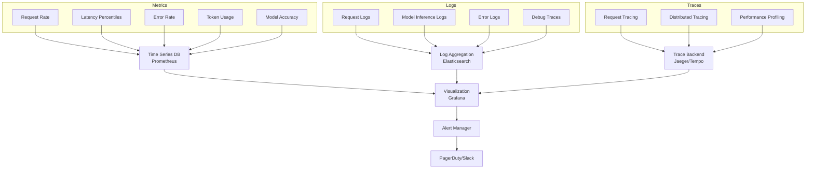

# Production AI Observability: Monitoring, Logging, and Debugging

## Introduction: You Can't Improve What You Can't Measure

Production AI systems require comprehensive observability to ensure reliability, performance, and quality. This guide covers the complete observability stack for AI applications.

## The Three Pillars of Observability



## Complete Monitoring Implementation

```python
from prometheus_client import Counter, Histogram, Gauge
import logging
from opentelemetry import trace
from opentelemetry.exporter.jaeger import JaegerExporter
from opentelemetry.sdk.trace import TracerProvider
from opentelemetry.sdk.trace.export import BatchSpanProcessor

# Metrics
request_count = Counter(
    'ai_requests_total',
    'Total AI requests',
    ['endpoint', 'model', 'status']
)

request_latency = Histogram(
    'ai_request_duration_seconds',
    'AI request latency',
    ['endpoint', 'model'],
    buckets=[0.1, 0.5, 1.0, 2.0, 5.0, 10.0, 30.0]
)

token_usage = Counter(
    'ai_tokens_used_total',
    'Total tokens used',
    ['model', 'operation']
)

model_load = Gauge(
    'ai_model_memory_bytes',
    'Model memory usage',
    ['model']
)

# Logging
logger = logging.getLogger(__name__)

# Tracing
trace.set_tracer_provider(TracerProvider())
tracer = trace.get_tracer(__name__)

jaeger_exporter = JaegerExporter(
    agent_host_name='localhost',
    agent_port=6831,
)

trace.get_tracer_provider().add_span_processor(
    BatchSpanProcessor(jaeger_exporter)
)

class AIObservability:
    """Complete observability for AI systems."""
    
    @staticmethod
    def track_request(endpoint: str, model: str):
        """Track AI request."""
        with tracer.start_as_current_span("ai_request") as span:
            span.set_attribute("endpoint", endpoint)
            span.set_attribute("model", model)
            
            start_time = time.time()
            try:
                # Process request
                result = process_ai_request()
                
                # Record metrics
                request_count.labels(
                    endpoint=endpoint,
                    model=model,
                    status='success'
                ).inc()
                
                latency = time.time() - start_time
                request_latency.labels(
                    endpoint=endpoint,
                    model=model
                ).observe(latency)
                
                return result
                
            except Exception as e:
                request_count.labels(
                    endpoint=endpoint,
                    model=model,
                    status='error'
                ).inc()
                
                logger.error(
                    f"Request failed: {str(e)}",
                    extra={
                        'endpoint': endpoint,
                        'model': model,
                        'error': str(e)
                    }
                )
                raise
```

---

*Part 5 of AI Architect Series - Complete*
