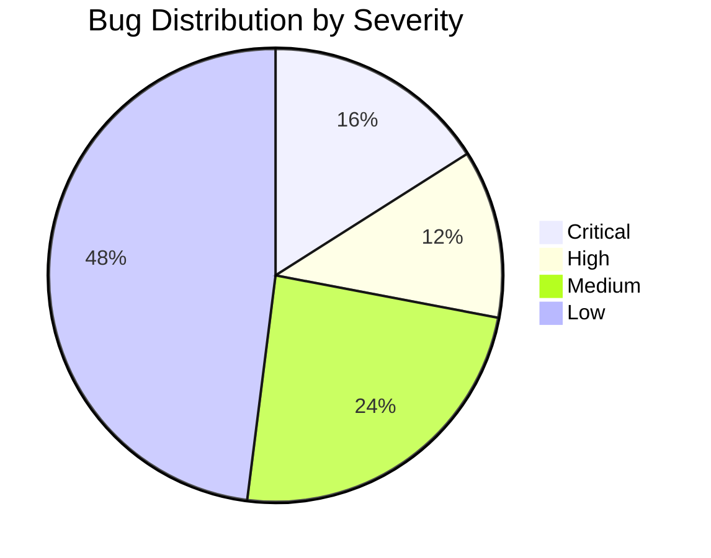
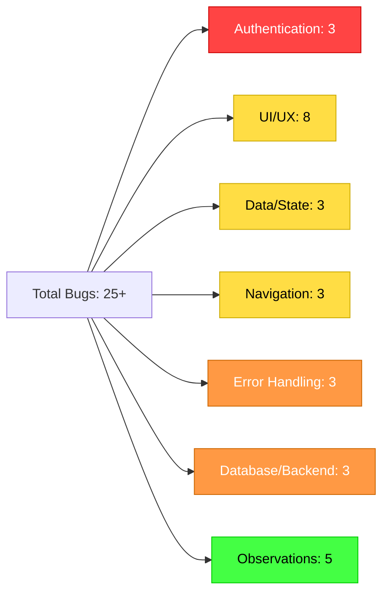
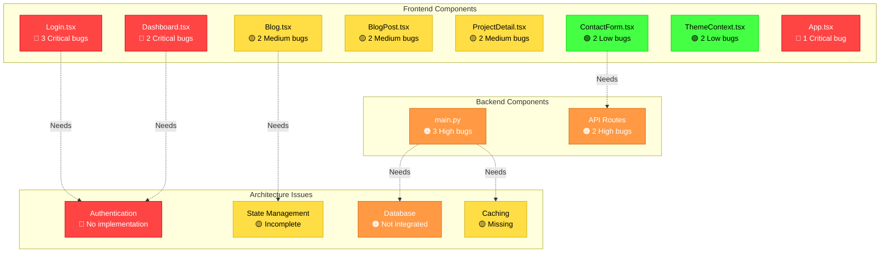
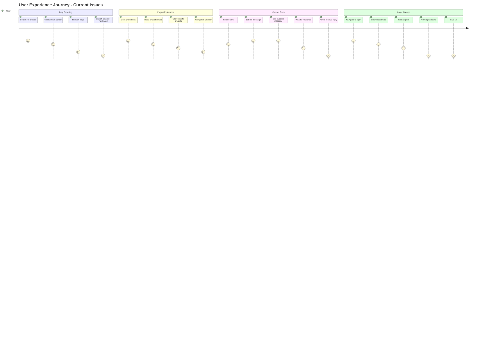
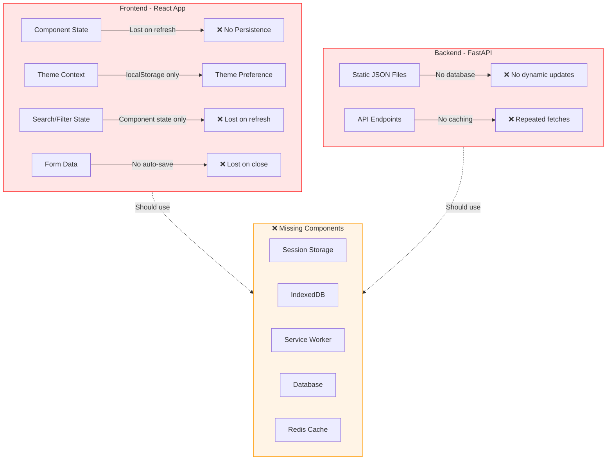
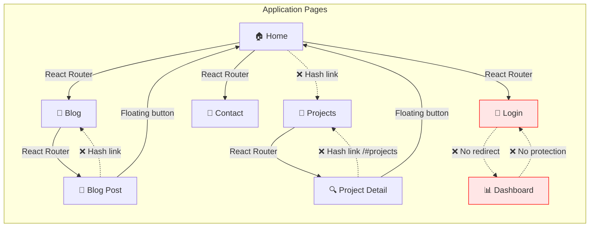
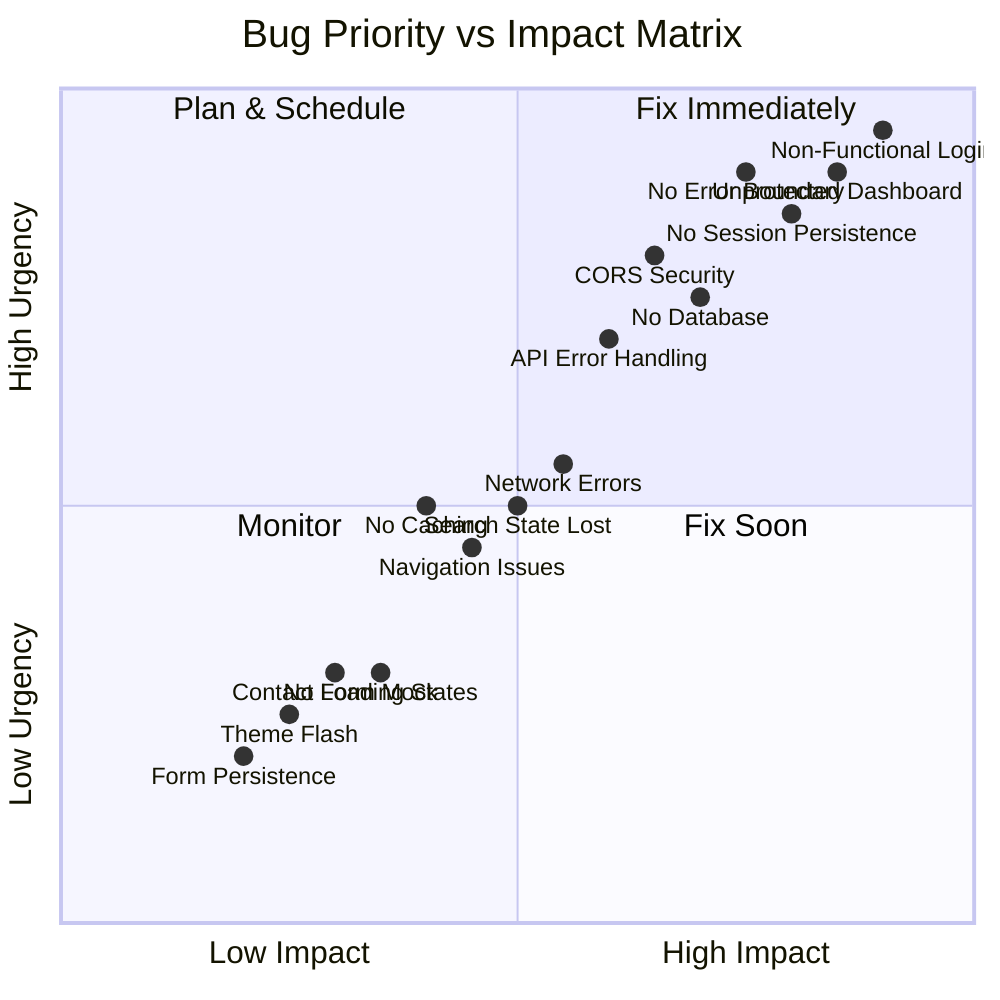

# Portfolio Website - Bug Analysis Report

**Analysis Date:** February 6, 2026  
**Analyzed By:** Senior Developer & Architect (SDE, AI, Data Engineer)  
**Project:** Abhishek Mane Portfolio Website

---

## Executive Summary

This document provides a comprehensive analysis of bugs and issues identified across the portfolio website, categorized by functionality, user experience, and technical implementation. The analysis focuses on UI/UX bugs, authentication flows, data persistence, navigation issues, error handling, and overall user experience.

### 📊 Bug Overview



### 🎯 Bug Categories



### 📈 Detailed Statistics

| Category | Total | Critical | High | Medium | Low | Impact Score |
|----------|-------|----------|------|--------|-----|--------------|
| 🔐 Authentication | 3 | 3 | 0 | 0 | 0 | ⚠️ **95%** |
| 🎨 UI/UX | 8 | 0 | 0 | 2 | 6 | 📊 **45%** |
| 💾 Data/State | 3 | 0 | 0 | 1 | 2 | 📊 **40%** |
| 🔄 Navigation | 3 | 0 | 0 | 2 | 1 | 📊 **50%** |
| ⚠️ Error Handling | 3 | 1 | 0 | 2 | 0 | ⚠️ **75%** |
| 🗄️ Database/Backend | 3 | 0 | 3 | 0 | 0 | ⚠️ **80%** |
| 🔍 Observations | 5 | 0 | 0 | 0 | 5 | 📊 **20%** |
| **TOTAL** | **28** | **4** | **3** | **7** | **14** | **58%** |

> **Impact Score Legend:**  
> 🔴 **80-100%** = Critical Impact | 🟠 **60-79%** = High Impact | 🟡 **40-59%** = Medium Impact | 🟢 **0-39%** = Low Impact

### 🗺️ Component-Level Bug Distribution



---


### Current vs Expected Authentication Flow

```mermaid
flowchart TB
    subgraph Current["❌ Current Broken Flow"]
        A1[User visits /login] --> A2[Fills form]
        A2 --> A3[Clicks Sign In]
        A3 --> A4[Nothing happens]
        A4 --> A5[User confused]
        A6[User manually goes to /dashboard] --> A7[Dashboard accessible to anyone]
        A8[User refreshes page] --> A9[No session - lost state]
    end
    
    subgraph Expected["✅ Expected Working Flow"]
        B1[User visits /login] --> B2[Fills form]
        B2 --> B3[Clicks Sign In]
        B3 --> B4[Validates credentials]
        B4 -->|Valid| B5[Store session/token]
        B4 -->|Invalid| B6[Show error message]
        B5 --> B7[Redirect to /dashboard]
        B7 --> B8[Protected route checks auth]
        B8 -->|Authenticated| B9[Show dashboard]
        B8 -->|Not authenticated| B10[Redirect to /login]
        B11[User refreshes] --> B12[Session persists]
    end
    
    style Current fill:#ffe6e6,stroke:#ff0000
    style Expected fill:#e6ffe6,stroke:#00cc00
```




### BUG-AUTH-001: Non-Functional Login Page
**Severity:** CRITICAL  
**Component:** `frontend-vite/src/pages/Login.tsx`

**Issue:**
- Login form is purely presentational with NO authentication logic
- Form submission does nothing (no `onSubmit` handler)
- No API integration for user authentication
- No state management for user sessions
- No validation or error handling

**User Experience Impact:**
- User fills out login form → clicks "Sign In" → nothing happens
- No feedback, no error messages, no loading states
- Creates confusion and appears broken

**Expected Behavior:**
- Form should validate credentials
- Should call authentication API
- Should store session/token
- Should redirect to dashboard on success
- Should show error messages on failure

---

### BUG-AUTH-002: Unprotected Dashboard Route
**Severity:** CRITICAL  
**Component:** `frontend-vite/src/App.tsx`, `frontend-vite/src/pages/Dashboard.tsx`

**Issue:**
- Dashboard route (`/dashboard`) is publicly accessible
- No authentication check or protected route wrapper
- Anyone can navigate to `/dashboard` without logging in
- No session validation

**User Experience Impact:**
- Unauthorized users can access dashboard
- No security boundary between public and private content
- After "login" (which doesn't work), users can manually navigate to `/dashboard` but there's no actual authentication

**Expected Behavior:**
- Dashboard should only be accessible after successful authentication
- Should redirect to `/login` if user is not authenticated
- Should validate session/token on page load

---

### BUG-AUTH-003: No Session Persistence
**Severity:** HIGH  
**Component:** Global state management

**Issue:**
- No authentication state management (no Context, Redux, or similar)
- No localStorage/sessionStorage for auth tokens
- No session persistence across page refreshes
- User would need to "login" on every page refresh (if login worked)

**User Experience Impact:**
- After refresh → user loses authentication state
- No "remember me" functionality
- Poor user experience requiring repeated logins

**Expected Behavior:**
- Auth state should persist in localStorage/sessionStorage
- Should validate token on app initialization
- Should maintain logged-in state across refreshes

---

## 🎨 UI/UX Bugs

### User Journey Pain Points




### BUG-UX-001: Missing Back Navigation in ProjectDetail
**Severity:** MEDIUM  
**Component:** `frontend-vite/src/pages/ProjectDetail.tsx`

**Issue:**
- While there IS a "Back to Projects" link (line 47-53), it uses a hash link `/#projects`
- This navigation pattern is inconsistent and may not work properly with React Router
- No breadcrumb navigation showing current location
- Floating "Home" button is present but "Back to Projects" might not scroll to the right section

**User Experience Impact:**
- User clicks "Back to Projects" → may not navigate correctly
- Inconsistent navigation experience
- User might get lost in deep project pages

**Expected Behavior:**
- Should use proper React Router navigation
- Should scroll to projects section or navigate to dedicated projects page
- Should have clear breadcrumb trail

---

### BUG-UX-002: No Loading States in Contact Form
**Severity:** LOW  
**Component:** `frontend-vite/src/components/contact/ContactForm.tsx`

**Issue:**
- While the form HAS loading states (`isSubmitting`), the actual email sending is mocked
- Lines 40-49 show TODO comments for EmailJS integration
- Form appears to work but doesn't actually send emails
- Success message is misleading

**User Experience Impact:**
- User fills form → clicks send → sees "success" message
- Email is NEVER actually sent
- User expects response but will never receive one
- Creates false expectations

**Expected Behavior:**
- Should integrate with actual email service (EmailJS, SendGrid, etc.)
- Should show real success/failure based on actual API response
- Should handle network errors gracefully

---

### BUG-UX-003: Search/Filter State Lost on Page Refresh
**Severity:** MEDIUM  
**Component:** `frontend-vite/src/pages/Blog.tsx`

**Issue:**
- Search query and category filter are stored in component state only
- No URL query parameters for search/filter
- State is lost on page refresh
- Cannot share filtered blog URLs

**User Experience Impact:**
- User searches for "AI" → finds articles → refreshes page → search is cleared
- Cannot bookmark or share filtered results
- Poor discoverability and sharing

**Expected Behavior:**
- Search and filter should be reflected in URL query params
- Should persist across page refreshes
- Should allow sharing of filtered views
- Example: `/blog?search=AI&category=Machine%20Learning`

---

### BUG-UX-004: No Error State for Missing Blog Posts
**Severity:** LOW  
**Component:** `frontend-vite/src/pages/BlogPost.tsx`

**Issue:**
- When blog post is not found, it redirects to `/blog` (line 34-36)
- No error message or notification to user
- Silent failure - user doesn't know why they were redirected

**User Experience Impact:**
- User clicks broken link → suddenly on blog page
- No explanation of what happened
- Confusing experience

**Expected Behavior:**
- Should show a 404 page with helpful message
- Should suggest related posts
- Should provide clear navigation options

---

### BUG-UX-005: No Error State for Missing Projects
**Severity:** LOW  
**Component:** `frontend-vite/src/pages/ProjectDetail.tsx`

**Issue:**
- Similar to blog posts, redirects to `/#projects` when project not found (line 17-19)
- No user feedback about why redirect happened
- Silent failure

**User Experience Impact:**
- User clicks invalid project link → redirected without explanation
- Confusing and unprofessional

**Expected Behavior:**
- Should show 404 page with project suggestions
- Should explain that project doesn't exist
- Should provide navigation to all projects

---

### BUG-UX-006: Theme Flash on Page Load
**Severity:** LOW  
**Component:** `frontend-vite/src/context/ThemeContext.tsx`

**Issue:**
- Theme context returns `null` until mounted (line 38-40)
- This causes a flash of unstyled content or wrong theme
- Theme is applied after component mounts, not during SSR/initial render

**User Experience Impact:**
- User sees brief flash of wrong theme on page load
- Jarring visual experience
- Unprofessional appearance

**Expected Behavior:**
- Should read theme from localStorage during SSR/initial render
- Should apply theme class to HTML element before React hydration
- Should eliminate theme flash

---

### BUG-UX-007: No Scroll Restoration on Navigation
**Severity:** MEDIUM  
**Component:** React Router configuration

**Issue:**
- When navigating between pages, scroll position is not reset to top
- BlogPost component manually scrolls to top (line 16-18)
- But other pages don't have this logic
- Inconsistent behavior

**User Experience Impact:**
- User scrolls down on Blog page → clicks project → lands mid-page
- Confusing navigation experience
- User has to manually scroll to top

**Expected Behavior:**
- Should automatically scroll to top on route change
- Should be handled globally in router configuration
- Should be consistent across all pages

---

### BUG-UX-008: No Loading State for Blog Content
**Severity:** LOW  
**Component:** `frontend-vite/src/pages/BlogPost.tsx`

**Issue:**
- Blog content is loaded synchronously from static data
- No loading skeleton or spinner
- If content was fetched from API, there would be no loading state

**User Experience Impact:**
- If blog content is large or fetched from API, user sees blank page
- No indication that content is loading
- Poor perceived performance

**Expected Behavior:**
- Should show loading skeleton while content loads
- Should handle async content loading gracefully
- Should show progress indicator

---

## 💾 Data Persistence & State Management Bugs

### Current Data Architecture Issues




### BUG-DATA-001: No Data Caching Strategy
**Severity:** MEDIUM  
**Component:** Global architecture

**Issue:**
- Blog posts, projects, and portfolio data are imported statically
- No caching mechanism for API responses
- No offline support
- Every page load re-imports all data

**User Experience Impact:**
- Slower page loads
- No offline functionality
- Unnecessary data re-fetching

**Expected Behavior:**
- Should implement caching strategy (Service Worker, localStorage)
- Should cache API responses
- Should support offline viewing of previously loaded content

---

### BUG-DATA-002: Theme Preference Not Synced Across Tabs
**Severity:** LOW  
**Component:** `frontend-vite/src/context/ThemeContext.tsx`

**Issue:**
- Theme is stored in localStorage but not synced across tabs
- Changing theme in one tab doesn't update other tabs
- No `storage` event listener

**User Experience Impact:**
- User changes theme in Tab A → Tab B still shows old theme
- Inconsistent experience across tabs
- User has to manually refresh other tabs

**Expected Behavior:**
- Should listen to `storage` events
- Should sync theme changes across all open tabs
- Should provide consistent experience

---

### BUG-DATA-003: No Form Data Persistence in Contact Form
**Severity:** LOW  
**Component:** `frontend-vite/src/components/contact/ContactForm.tsx`

**Issue:**
- If user fills out contact form and accidentally refreshes, all data is lost
- No draft saving to localStorage
- No "Are you sure you want to leave?" warning

**User Experience Impact:**
- User spends time writing message → accidentally closes tab → loses everything
- Frustrating experience
- User may not re-submit

**Expected Behavior:**
- Should auto-save draft to localStorage
- Should restore draft on page load
- Should warn user before leaving with unsaved changes

---

## 🔄 Navigation & Routing Bugs

### Navigation Flow Issues




### BUG-NAV-001: Inconsistent Navigation Patterns
**Severity:** MEDIUM  
**Component:** Multiple pages

**Issue:**
- ProjectDetail uses hash links (`/#projects`)
- BlogPost uses proper React Router links (`/blog`)
- Mixed navigation patterns throughout app
- Some links use `Link` component, others use `a` tags with hash

**User Experience Impact:**
- Inconsistent navigation behavior
- Some navigations trigger full page reload
- Others use client-side routing
- Unpredictable user experience

**Expected Behavior:**
- Should use consistent React Router navigation
- Should avoid hash links
- Should use `Link` component everywhere

---

### BUG-NAV-002: No Active Link Highlighting
**Severity:** LOW  
**Component:** Navigation components

**Issue:**
- No visual indication of current page in navigation
- User can't tell which page they're on
- No active state styling

**User Experience Impact:**
- User navigates to Blog → no visual feedback in nav
- Harder to orient within the site
- Poor navigation UX

**Expected Behavior:**
- Should highlight active navigation link
- Should use `NavLink` with `activeClassName`
- Should provide clear visual feedback

---

### BUG-NAV-003: Floating Home Button Overlaps Content
**Severity:** LOW  
**Component:** `frontend-vite/src/pages/ProjectDetail.tsx`, `frontend-vite/src/pages/BlogPost.tsx`

**Issue:**
- Floating home button is fixed at `bottom-8 right-8`
- May overlap with page content on small screens
- No responsive positioning
- May interfere with scroll-to-top button

**User Experience Impact:**
- On mobile, button may cover important content
- Buttons may overlap each other
- Poor mobile experience

**Expected Behavior:**
- Should adjust position on mobile
- Should not overlap with content
- Should stack buttons properly

---

## ⚠️ Error Handling Bugs

### BUG-ERR-001: No Global Error Boundary
**Severity:** HIGH  
**Component:** `frontend-vite/src/App.tsx`

**Issue:**
- No React Error Boundary component
- Unhandled errors crash entire app
- No graceful error recovery
- No error logging

**User Experience Impact:**
- Any JavaScript error → white screen of death
- User sees blank page with no explanation
- No way to recover without refresh
- Poor reliability

**Expected Behavior:**
- Should wrap app in Error Boundary
- Should show friendly error page
- Should log errors to monitoring service
- Should allow user to recover

---

### BUG-ERR-002: No Network Error Handling
**Severity:** MEDIUM  
**Component:** `frontend-vite/src/components/contact/ContactForm.tsx`

**Issue:**
- Contact form has try-catch but email service is mocked
- No handling of actual network errors
- No retry mechanism
- Generic error message

**User Experience Impact:**
- Network fails → generic error message
- User doesn't know if it's their connection or server issue
- No guidance on what to do next

**Expected Behavior:**
- Should detect network errors specifically
- Should provide helpful error messages
- Should offer retry option
- Should handle different error types differently

---

### BUG-ERR-003: No Validation Feedback on Login Form
**Severity:** MEDIUM  
**Component:** `frontend-vite/src/pages/Login.tsx`

**Issue:**
- No form validation at all
- No error messages for invalid input
- No client-side validation
- No visual feedback

**User Experience Impact:**
- User enters invalid email → no feedback
- User submits empty form → nothing happens
- Confusing and unprofessional

**Expected Behavior:**
- Should validate email format
- Should require password
- Should show inline error messages
- Should disable submit until valid

---

## 📊 Data Visualization & Charts Bugs

### BUG-VIZ-001: No Charts or Graphs Present
**Severity:** N/A  
**Component:** Dashboard, Portfolio

**Issue:**
- Dashboard shows placeholder cards only
- No actual data visualization
- No charts, graphs, or analytics
- Purely static content

**User Experience Impact:**
- Dashboard is non-functional
- No value provided to user
- Misleading labels (e.g., "Analytics" card)

**Expected Behavior:**
- Should implement actual analytics
- Should show meaningful data visualizations
- Should provide value to logged-in users

---

## 🗄️ Database & Backend Bugs

### BUG-DB-001: No Database Integration
**Severity:** HIGH  
**Component:** Backend

**Issue:**
- Backend only serves static JSON data
- No database connection
- No dynamic content management
- No way to update portfolio without code changes

**User Experience Impact:**
- Portfolio owner can't update content without deploying code
- No CMS functionality
- No dynamic data

**Expected Behavior:**
- Should integrate with database (PostgreSQL, MongoDB, etc.)
- Should provide API for CRUD operations
- Should allow content management

---

### BUG-DB-002: No API Error Handling in Backend
**Severity:** MEDIUM  
**Component:** `backend/main.py`

**Issue:**
- No try-catch around file reading (line 62-64)
- If `resume.json` is missing or corrupted, server crashes
- No error responses
- No logging

**User Experience Impact:**
- If data file is missing → server error
- No graceful degradation
- Poor reliability

**Expected Behavior:**
- Should handle file read errors
- Should return appropriate HTTP error codes
- Should log errors
- Should have fallback data

---

### BUG-DB-003: CORS Configuration Too Permissive
**Severity:** HIGH (Security)  
**Component:** `backend/main.py`

**Issue:**
- CORS allows all origins (`allow_origins=["*"]`)
- Security vulnerability in production
- Comment says "Adjust this in production" but no environment-based config

**User Experience Impact:**
- Security risk
- Any website can make requests to API
- Potential for abuse

**Expected Behavior:**
- Should restrict CORS to specific domains
- Should use environment variables for configuration
- Should have different settings for dev/prod

---

## 🔍 Additional Observations

### OBS-001: No Analytics Integration
**Component:** Global

**Issue:**
- No Google Analytics, Plausible, or similar
- No tracking of user behavior
- No insights into popular content
- No conversion tracking

---

### OBS-002: No SEO Optimization Beyond Basics
**Component:** All pages

**Issue:**
- Basic meta tags present but incomplete
- No Open Graph images
- No Twitter Card meta tags
- No structured data (JSON-LD)
- No sitemap.xml
- No robots.txt

---

### OBS-003: No Accessibility Testing
**Component:** All components

**Issue:**
- No ARIA labels on interactive elements
- No keyboard navigation testing
- No screen reader optimization
- Color contrast not verified
- No focus management

---

### OBS-004: No Performance Optimization
**Component:** Global

**Issue:**
- No code splitting
- No lazy loading of routes
- No image optimization
- No bundle size optimization
- All data loaded upfront

---

### OBS-005: No Testing Infrastructure
**Component:** Global

**Issue:**
- No unit tests
- No integration tests
- No E2E tests
- No test coverage
- No CI/CD pipeline

---

## 📋 Bug Priority Matrix

### Visual Priority Heatmap



### Priority Breakdown

| Priority | Count | Bugs | Timeline |
|----------|-------|------|----------|
| 🔴 **Critical** | 4 | Auth issues, Error boundary | Week 1 |
| 🟠 **High** | 3 | Database, CORS, API errors | Week 2 |
| 🟡 **Medium** | 6 | UX improvements, Navigation | Week 3 |
| 🟢 **Low** | 12 | Polish, Nice-to-haves | Week 4+ |


### Critical (Fix Immediately)
1. BUG-AUTH-001: Non-Functional Login Page
2. BUG-AUTH-002: Unprotected Dashboard Route
3. BUG-AUTH-003: No Session Persistence
4. BUG-ERR-001: No Global Error Boundary

### High (Fix Soon)
1. BUG-DB-001: No Database Integration
2. BUG-DB-003: CORS Configuration Too Permissive
3. BUG-DB-002: No API Error Handling

### Medium (Fix When Possible)
1. BUG-UX-003: Search/Filter State Lost on Refresh
2. BUG-UX-007: No Scroll Restoration
3. BUG-NAV-001: Inconsistent Navigation Patterns
4. BUG-DATA-001: No Data Caching Strategy
5. BUG-ERR-002: No Network Error Handling
6. BUG-ERR-003: No Validation on Login Form

### Low (Nice to Have)
1. BUG-UX-002: Contact Form Not Actually Sending Emails
2. BUG-UX-004: No Error State for Missing Blog Posts
3. BUG-UX-005: No Error State for Missing Projects
4. BUG-UX-006: Theme Flash on Page Load
5. BUG-UX-008: No Loading State for Blog Content
6. BUG-DATA-002: Theme Not Synced Across Tabs
7. BUG-DATA-003: No Form Data Persistence
8. BUG-NAV-002: No Active Link Highlighting
9. BUG-NAV-003: Floating Button Overlaps

---

## 🎯 Recommended Action Plan

### Implementation Roadmap

```mermaid
gantt
    title Bug Fix Implementation Timeline
    dateFormat YYYY-MM-DD
    section Critical Fixes
    Authentication System           :crit, auth, 2026-02-07, 3d
    Route Protection                :crit, routes, 2026-02-09, 2d
    Session Management              :crit, session, 2026-02-10, 2d
    Error Boundaries                :crit, errors, 2026-02-11, 1d
    
    section High Priority
    Database Integration            :high, db, 2026-02-12, 4d
    CORS Configuration              :high, cors, 2026-02-14, 1d
    Backend Error Handling          :high, backend, 2026-02-15, 2d
    Email Service Integration       :high, email, 2026-02-16, 2d
    
    section UX Improvements
    URL Query Parameters            :medium, url, 2026-02-17, 2d
    Navigation Consistency          :medium, nav, 2026-02-18, 2d
    Loading States                  :medium, loading, 2026-02-19, 2d
    Scroll Restoration              :medium, scroll, 2026-02-20, 1d
    
    section Polish
    Analytics Integration           :low, analytics, 2026-02-21, 2d
    SEO Improvements                :low, seo, 2026-02-22, 2d
    Accessibility Features          :low, a11y, 2026-02-23, 3d
    Performance Optimization        :low, perf, 2026-02-24, 3d
    Testing Infrastructure          :low, tests, 2026-02-25, 3d
```


### Phase 1: Critical Fixes (Week 1)
1. Implement proper authentication system
2. Add route protection
3. Add session management
4. Implement error boundaries

### Phase 2: High Priority (Week 2)
1. Set up database integration
2. Fix CORS configuration
3. Add backend error handling
4. Implement actual email sending

### Phase 3: UX Improvements (Week 3)
1. Add URL query params for filters
2. Fix navigation consistency
3. Add loading states
4. Implement scroll restoration

### Phase 4: Polish & Optimization (Week 4)
1. Add analytics
2. Improve SEO
3. Add accessibility features
4. Optimize performance
5. Add testing infrastructure

---

**End of Report**
