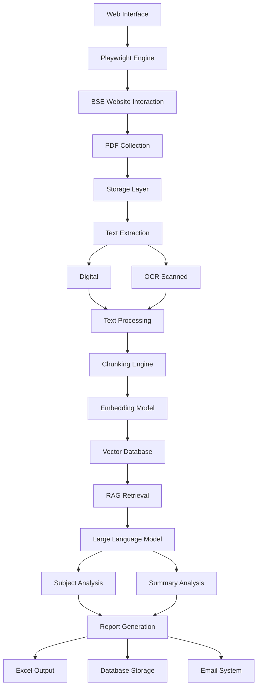

# BSE India PDF Processing System - Project Documentation

## Table of Contents
1. [Executive Summary](#executive-summary)
2. [System Overview](#system-overview)
3. [Key Features](#key-features)
4. [Technology Stack](#technology-stack)
5. [System Architecture](#system-architecture)
6. [Processing Pipeline](#processing-pipeline)
7. [Database Structure](#database-structure)
8. [Directory Structure](#directory-structure)
9. [Deployment and Operations](#deployment-and-operations)
10. [Security and Privacy](#security-and-privacy)

## Executive Summary

The BSE India PDF Processing System is an intelligent automation platform that processes corporate announcements from the Bombay Stock Exchange (BSE). The system automates the entire workflow of downloading PDF documents, extracting textual content, performing advanced analysis using artificial intelligence technologies, and generating structured reports with actionable insights.

This solution enables organizations to efficiently monitor and analyze corporate communications from publicly listed companies, providing valuable business intelligence for decision-making processes.

## System Overview

The system performs a complete end-to-end workflow that:

1. Downloads PDFs from BSE corporate announcement pages
2. Extracts text content using both digital extraction and OCR fallback methods
3. Analyzes content using Retrieval-Augmented Generation (RAG) and Large Language Model (LLM) technologies
4. Generates structured Excel reports with summaries and insights
5. Stores processed data in multiple databases for querying and analysis
6. Sends email notifications with reports and summaries
7. Provides comprehensive monitoring through a web-based API interface

## Key Features

### PDF Download Engine
- Browser automation for realistic interaction with BSE website
- Multiple selector strategies for robust button clicking
- Duplicate detection to avoid downloading the same PDF twice
- Organized file storage in date-based directory structure

### Text Extraction System
- Dual extraction method (digital extraction + OCR fallback)
- Text cleaning and preprocessing
- Chunking algorithm for optimal AI processing
- Metadata storage in SQLite databases

### AI Analysis Engine
- Retrieval-Augmented Generation (RAG) for contextual understanding
- Large Language Model for natural language processing
- Subject line generation from document content
- Comprehensive summary generation from extended content

### Report Generation System
- Professional Excel report creation with formatting
- Multi-sheet organization (daily, weekly, monthly)
- Trend analysis and chart generation
- Database synchronization with Master database

### Web API Interface
- RESTful API for accessing system data and monitoring
- Real-time performance metrics and statistics
- Health check and system status endpoints
- CORS support for web client access

## Technology Stack

- **Core Language**: Python
- **Browser Automation**: Playwright
- **PDF Processing**: PyPDF2, Tesseract OCR
- **Vector Database**: ChromaDB
- **Text Embedding**: Sentence Transformers
- **Large Language Model**: Proprietary LLM framework
- **Database**: SQLite
- **Web Framework**: FastAPI
- **Excel Generation**: OpenPyXL
- **Console Interface**: Rich

## System Architecture



## Processing Pipeline

The system follows a structured 6-phase pipeline to process corporate announcements:

### Phase 1: Initialization and Setup
- Initialize all system components and load configurations
- Set up logging and observability tracking
- Prepare the environment for processing

### Phase 2: PDF Download and Collection
- Launch browser automation for each entity
- Navigate to the entity's BSE announcement page
- Download PDF files and store in organized folder structure

### Phase 3: Text Extraction and Vector Storage
- Extract text content from PDFs using dual methods
- Chunk text into manageable pieces for AI processing
- Convert text chunks into numerical embeddings
- Store embeddings and metadata in vector database

### Phase 4: AI Analysis and RAG Processing
- Analyze document content using Retrieval-Augmented Generation
- Generate subject lines from document content
- Create comprehensive summaries using Large Language Models
- Clean and format AI-generated outputs

### Phase 5: Report Generation and Data Persistence
- Create/update Excel reports with daily, weekly, and monthly sheets
- Generate trend analysis charts and visualizations
- Update multiple SQLite databases with processed information
- Export trend charts as PNG images

### Phase 6: Notification and Completion
- Generate comprehensive completion dashboard with statistics
- Send email notifications with reports and summaries
- Display success/failure counts for all operations

## Database Structure

### Database Files
- **observability.db**: Tracks all system operations for monitoring and debugging
- **master.db**: Stores processed business data
- **pdf_processing.db**: Tracks detailed PDF processing information
- **vector_store.db**: Manages vector database metadata

### Key Tables
- **DailyLogs**: Daily sheet data from Excel reports
- **logs**: General application logging
- **metrics**: Performance metrics tracking
- **errors**: Error tracking and monitoring
- **documents**: PDF metadata
- **document_texts**: Raw and cleaned text
- **summaries**: Document summaries with model information

## Directory Structure

```
bse_pdf_rag/
├── 📁 config/                 # Configuration and feature flags
├── 📁 core/                   # Main application logic and orchestration
├── 📁 data_processing/        # PDF handling, text extraction, and RAG analysis
├── 📁 data_storage/           # Database management
├── 📁 reporting/              # Excel generation and email notifications
├── 📁 api/                    # FastAPI web interface
├── 📁 utils/                  # Utility functions
├── 📁 db/                     # Database files and PDF storage
├── 📁 data/                   # Input data files
├── 📁 output/                 # Generated reports
├── 📁 logs/                   # Application logs
├── 📁 daily_logs_converter/   # Excel to database converter
├── 📁 postgresql_converter/   # PostgreSQL migration tools
└── main.py                    # Main application entry point
```

## Deployment and Operations

### System Requirements

#### Hardware
- Modern CPU with multiple cores
- Minimum 8GB RAM (16GB recommended)
- Sufficient disk space for PDF storage and databases

#### Software
- Python 3.8+
- Playwright browser dependencies
- Tesseract OCR engine
- Required Python packages (see requirements.txt)

#### Network
- Internet access for BSE website access
- SMTP access for email notifications
- Internal network access for database operations

### Running the System

```bash
# Main process
python main.py

# Web API
python api/main.py
# Or with uvicorn:
uvicorn bse_pdf_rag.api.main:app --host 0.0.0.0 --port 8000

# Daily sync
python run_daily_postgresql_sync.py
```

### Maintenance
- Monitor disk space usage
- Check email delivery logs
- Review error reports
- Update models when needed
- Archive old log files
- Clean up temporary files
- Optimize database performance

## Security and Privacy

- All processing is done locally
- No external APIs are called for sensitive operations
- PDFs are stored locally and not transmitted externally
- Email sending uses internal SMTP configuration
- Database access is controlled through application code
- Data protection measures for stored logs and recipient information


This system provides a complete solution for automated BSE announcement processing with enterprise-grade reliability, comprehensive monitoring, and professional reporting capabilities.