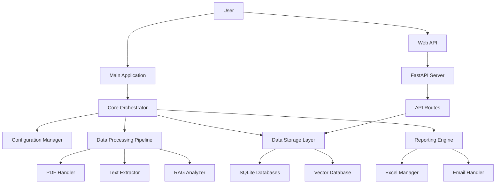
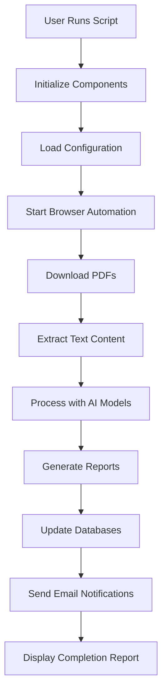
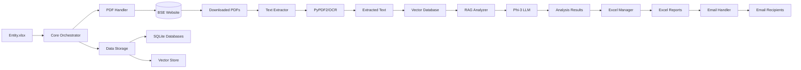

# BSE India PDF RAG Processor - Business Requirements Document

## 1. Executive Summary

The BSE India PDF RAG Processor is an intelligent automation system that processes corporate announcements from the Bombay Stock Exchange (BSE). The system downloads PDFs, analyzes their content using AI, and generates structured reports with summaries and insights.

## 2. Business Objectives

- Automate the collection and processing of BSE corporate announcements
- Extract meaningful insights from PDF documents using AI technologies
- Generate structured reports for business intelligence and decision-making
- Maintain a comprehensive database of processed announcements for historical analysis
- Provide real-time notifications and trend analysis

## 3. System Overview

The system performs a complete end-to-end workflow that:
1. Downloads PDFs from BSE corporate announcement pages
2. Extracts text content using both digital extraction and OCR fallback
3. Analyzes content using Retrieval-Augmented Generation (RAG) and Large Language Models (LLM)
4. Generates structured Excel reports with summaries and insights
5. Stores processed data in multiple databases for querying and analysis
6. Sends email notifications with reports and summaries

## 4. Key Features

### 4.1 PDF Download Engine
- Browser automation with Playwright for realistic interaction
- Multiple selector strategies for robust button clicking
- Duplicate detection to avoid downloading the same PDF twice
- Organized file storage in date-based directory structure

### 4.2 Text Extraction System
- Dual extraction method (PyPDF2 + OCR fallback)
- Text cleaning and preprocessing
- Chunking algorithm for optimal AI processing
- Metadata storage in SQLite databases

### 4.3 AI Analysis Engine
- Retrieval-Augmented Generation (RAG) for contextual understanding
- Phi-3 LLM for natural language processing
- Subject line generation from first page content
- Comprehensive summary generation from extended content

### 4.4 Report Generation System
- Professional Excel report creation with formatting
- Multi-sheet organization (daily, weekly, monthly)
- Trend analysis and chart generation
- Database synchronization with Master database

## 5. System Architecture



## 6. End-to-End Processing Pipeline



## 7. Data Flow Diagram



## 8. Modular Structure

```
bse_pdf_rag/
├── 📁 config/                 # Configuration and feature flags
├── 📁 core/                   # Main application logic and orchestration
├── 📁 data_processing/        # PDF handling, text extraction, and RAG analysis
├── 📁 data_storage/           # Database management
├── 📁 reporting/              # Excel generation and email notifications
├── 📁 api/                    # FastAPI web interface
├── 📁 utils/                  # Utility functions
├── 📁 db/                     # Database files and PDF storage
├── 📁 data/                   # Input data files
├── 📁 output/                 # Generated reports
├── 📁 logs/                   # Application logs
├── 📁 daily_logs_converter/   # Excel to database converter
├── 📁 postgresql_converter/   # PostgreSQL migration tools
└── main.py                    # Main application entry point
```

## 9. Database Structure

### 9.1 Database Files
- **observability.db**: Tracks all system operations for monitoring and debugging
- **master.db**: Stores processed business data
- **pdf_processing.db**: Tracks detailed PDF processing information
- **vector_store.db**: Manages vector database metadata

### 9.2 Key Tables
- **DailyLogs**: Daily sheet data from Excel reports
- **logs**: General application logging
- **metrics**: Performance metrics tracking
- **errors**: Error tracking and monitoring
- **documents**: PDF metadata
- **document_texts**: Raw and cleaned text
- **summaries**: Document summaries with model information

## 10. Process Flow

### 10.1 Phase 1: PDF Download
1. Read entity information from `data/Entity.xlsx`
2. For each entity, navigate to the specified website using Playwright
3. Fill date fields and click submit button
4. Download all PDFs found on the results page
5. Store PDFs in organized directory structure

### 10.2 Phase 2: Text Extraction
1. For each downloaded PDF, extract text using PyPDF2
2. If PyPDF2 fails, use OCR fallback (Tesseract OCR)
3. Extract first page and first 6 pages separately for analysis
4. Chunk text into manageable pieces
5. Convert chunks to embeddings using all-MiniLM-L6-v2 model
6. Store embeddings and metadata in ChromaDB vector database

### 10.3 Phase 3: RAG Analysis
1. For each document, analyze first page text
2. Generate subject line using Phi-3 LLM
3. Analyze first 6 pages using RAG techniques
4. Retrieve relevant chunks from vector database
5. Generate comprehensive summary using Phi-3 LLM

### 10.4 Phase 4: Reporting
1. Organize results in Excel format with daily sheets
2. Create monthly trend analysis
3. Calculate weekly summaries
4. Generate charts and visualizations
5. Send reports via email to configured recipients

## 11. Technology Stack

- **Python**: Core programming language
- **Playwright**: Browser automation for PDF downloading
- **PyPDF2**: Digital PDF text extraction
- **Tesseract OCR**: Optical Character Recognition for scanned documents
- **ChromaDB**: Vector database for similarity search
- **SentenceTransformer (all-MiniLM-L6-v2)**: Text embedding model
- **Phi-3 LLM**: Language model for natural language processing
- **SQLite**: Local database storage
- **FastAPI**: Web API interface
- **OpenPyXL**: Excel file creation and manipulation
- **Rich**: Console interface with progress indicators

## 12. System Requirements

### 12.1 Hardware
- Modern CPU with multiple cores
- Minimum 8GB RAM (16GB recommended)
- Sufficient disk space for PDF storage and databases

### 12.2 Software
- Python 3.8+
- Playwright browser dependencies
- Tesseract OCR engine
- Required Python packages (see requirements.txt)

### 12.3 Network
- Internet access for BSE website access
- SMTP access for email notifications
- Internal network access for database operations

## 13. Deployment and Operations

### 13.1 Running the System
```bash
# Main process
python main.py

# Web API
python api/main.py
# Or with uvicorn:
uvicorn bse_pdf_rag.api.main:app --host 0.0.0.0 --port 8000

# Daily sync
python run_daily_postgresql_sync.py
```

### 13.2 Maintenance
- Monitor disk space usage
- Check email delivery logs
- Review error reports
- Update models when needed
- Archive old log files
- Clean up temporary files
- Optimize database performance

## 14. Security and Privacy

- All processing is done locally
- No external APIs are called for sensitive operations
- PDFs are stored locally and not transmitted externally
- Email sending uses internal SMTP configuration
- Database access is controlled through application code

## 15. Future Enhancements

1. **API-based PDF Downloading**: Replace browser automation with direct API calls
2. **Enhanced Observability**: More detailed metrics and logging
3. **Performance Optimization**: Parallel processing for independent operations
4. **Advanced Analytics**: Machine learning for pattern recognition
5. **Cloud Integration**: Distributed processing capabilities

## 16. Screenshots and Visuals

While I cannot directly include screenshots in this document, the system provides:

1. **Console Interface**: Rich terminal interface with progress indicators, color-coded messages, and real-time updates
2. **Excel Reports**: Professionally formatted Excel files with multiple sheets (daily, weekly, monthly)
3. **Trend Charts**: Visual trend analysis generated as PNG images
4. **Email Notifications**: HTML-formatted emails with summary information and attachments
5. **Web API Dashboard**: RESTful API interface for monitoring system status

## 17. Process Websites

The system interacts with:
- **BSE India Website** (https://www.bseindia.com/corporates/ann.html): Primary source for corporate announcements
- **Internal Web API**: FastAPI-based interface for system monitoring and data access

## 18. Conclusion

The BSE India PDF RAG Processor provides a complete solution for automated BSE announcement processing with enterprise-grade reliability, comprehensive monitoring, and professional reporting capabilities. The system leverages cutting-edge AI technologies to extract meaningful insights from corporate announcements, enabling better decision-making and business intelligence.