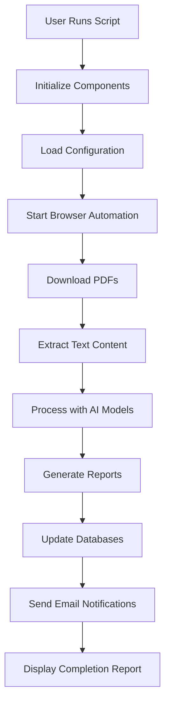

# BSE PDF RAG Processor - Phase-wise Flow

## Overview
The BSE PDF RAG Processor follows a structured 6-phase pipeline to process corporate announcements from the Bombay Stock Exchange. Each phase performs specific operations that build upon the previous phase's output.

## Phase 1: Initialization and Setup

### Purpose
Initialize all system components, load configurations, and prepare the environment for processing.

### Steps
1. Initialize databases (observability, master, vector)
2. Load configuration settings from settings.py
3. Set up logging and observability tracking
4. Initialize modular components (PDF handler, text extractor, Excel manager, etc.)
5. Load embedding model for vector database
6. Read entity information from data/Entity.xlsx

### Components Involved
- Core Orchestrator
- Configuration Manager
- Database Connections
- Logging System

## Phase 2: PDF Download and Collection

### Purpose
Download corporate announcement PDFs from BSE website for each entity.

### Steps
1. Launch browser automation (Playwright) for each entity
2. Navigate to the entity's BSE announcement page
3. Fill in date ranges (yesterday by default)
4. Submit search form using robust click strategies
5. Extract all PDF links from search results
6. Download PDF files using HTTP requests
7. Store PDFs in organized folder structure
8. Log all download attempts with success/failure status

### Components Involved
- PDF Handler
- Playwright Browser Automation
- HTTP Client
- File System Manager
- Observability Database

## Phase 3: Text Extraction and Vector Storage

### Purpose
Extract text content from PDFs and store in vector database for AI analysis.

### Steps
1. Attempt fast text extraction using PyPDF2 for digital PDFs
2. Fall back to OCR (Optical Character Recognition) for scanned documents
3. Extract first page and first 6 pages separately for analysis
4. Chunk text into manageable pieces for AI processing
5. Convert text chunks into numerical embeddings using sentence-transformers
6. Store embeddings and metadata in ChromaDB vector database
7. Log all extraction attempts with detailed error information

### Components Involved
- Text Extractor
- OCR Processor
- PyPDF2 Library
- Sentence Transformer Model
- ChromaDB Vector Database
- Observability Database

## Phase 4: AI Analysis and RAG Processing

### Purpose
Analyze document content using Retrieval-Augmented Generation (RAG) techniques.

### Steps
1. Load the Phi-3 language model
2. For each document:
   - Generate subject line by analyzing the first page
   - Use RAG to analyze extended content from first 6 pages
   - Retrieve relevant text chunks from vector database
   - Generate comprehensive summaries using Phi-3 LLM
3. Clean and format AI-generated outputs
4. Log all analysis attempts with timing information

### Components Involved
- RAG Analyzer
- Phi-3 Language Model
- ChromaDB Vector Database
- Prompt Engineering System
- Observability Database

## Phase 5: Report Generation and Data Persistence

### Purpose
Create structured reports and persist processed data in databases.

### Steps
1. Create/update Excel reports with daily, weekly, and monthly sheets
2. Apply professional formatting with fonts, colors, and borders
3. Generate trend analysis charts and visualizations
4. Update multiple SQLite databases:
   - Observability Database (system operations tracking)
   - Master Database (processed business data)
   - PDF Processing Database (detailed PDF information)
   - Vector Store Database (metadata)
5. Export trend charts as PNG images

### Components Involved
- Excel Manager
- OpenPyXL Library
- Chart Generation System
- Multiple SQLite Databases
- File System Manager

## Phase 6: Notification and Completion

### Purpose
Notify stakeholders of completion and provide summary information.

### Steps
1. Generate comprehensive completion dashboard with statistics
2. Calculate and display performance metrics and timing information
3. Show file locations and output paths
4. Send email notifications with reports and summaries
5. Send admin logs for system monitoring
6. Display success/failure counts for all operations

### Components Involved
- Email Handler
- Reporting System
- Observability Database
- File System Manager

## Data Flow Diagram

