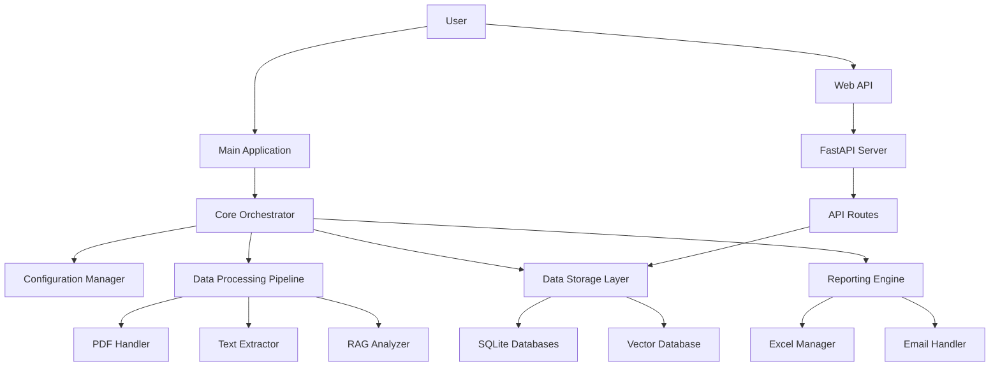
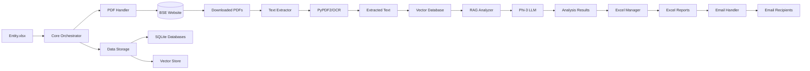

# BSE India PDF RAG Processor - Complete Architecture

## Overview

The BSE India PDF RAG Processor is a comprehensive system designed to automatically process corporate announcements from the Bombay Stock Exchange (BSE). The system downloads PDFs, extracts text content, analyzes the information using Retrieval-Augmented Generation (RAG) and Large Language Models (LLM), and generates structured reports with summaries and insights.

## System Architecture



## Modular Structure

The system follows a clean, modular architecture with clearly separated concerns:

```
bse_pdf_rag/
├── 📁 config/                 # Configuration and feature flags
├── 📁 core/                   # Main application logic and orchestration
├── 📁 data_processing/        # PDF handling, text extraction, and RAG analysis
├── 📁 data_storage/           # Database management
├── 📁 reporting/              # Excel generation and email notifications
├── 📁 api/                    # FastAPI web interface
├── 📁 utils/                  # Utility functions
├── 📁 db/                     # Database files and PDF storage
├── 📁 data/                   # Input data files
├── 📁 output/                 # Generated reports
├── 📁 logs/                   # Application logs
├── 📁 daily_logs_converter/   # Excel to database converter
├── 📁 postgresql_converter/   # PostgreSQL migration tools
└── main.py                    # Main application entry point
```

## End-to-End Pipeline

### Phase 1: Initialization and Configuration

1. **Application Startup**
   - The system starts by executing `main.py`
   - Configuration is loaded from `config/settings.py`
   - Feature flags determine which components to enable
   - All necessary directories are created if they don't exist

2. **Component Initialization**
   - Core orchestrator initializes all modular components
   - Vector database (ChromaDB) is initialized
   - Models are loaded (embedding model and Phi-3 LLM)
   - Database connections are established
   - Excel manager prepares output files

### Phase 2: Data Loading

1. **Entity Data Loading**
   - Reads entity information from `data/Entity.xlsx`
   - Each row contains an entity name and website URL
   - Validates required columns: "Entity" and "Website"

### Phase 3: PDF Download (Bulk Processing)

1. **PDF Download Process**
   - For each entity, the system navigates to the specified website
   - Date range is set using configured FROM_DATE and TO_DATE
   - Uses Playwright browser automation to interact with the website
   - Fills date fields and clicks submit button
   - Downloads all PDFs found on the results page
   - Stores PDFs in organized directory structure: `db/pdfs/YYYY/MM_MonthName/daily_pdfs/DD-MM-YYYY/`

2. **Download Tracking**
   - All download attempts are logged in observability database
   - Success/failure status is recorded
   - File sizes and download times are tracked

### Phase 4: Text Extraction and Vector Storage

1. **Text Extraction**
   - For each downloaded PDF, text is extracted using PyPDF2
   - If PyPDF2 fails, OCR fallback is used (Tesseract OCR)
   - First page and first 6 pages are extracted separately for analysis
   - Extraction results are logged in observability database

2. **Vector Database Storage**
   - Extracted text is chunked into manageable pieces
   - Each chunk is converted to embeddings using all-MiniLM-L6-v2 model
   - Chunks and embeddings are stored in ChromaDB vector database
   - Metadata (PDF URL, file info, etc.) is stored in SQLite database

### Phase 5: RAG Analysis

1. **Subject Generation**
   - For each document, the first page text is analyzed
   - Phi-3 LLM generates a subject line describing the announcement
   - Results are logged in observability database

2. **Summary Generation**
   - First 6 pages of text are analyzed using RAG techniques
   - Relevant chunks are retrieved from vector database
   - Phi-3 LLM generates a comprehensive summary
   - Results are logged in observability database

### Phase 6: Reporting and Output

1. **Excel Report Generation**
   - Results are organized in Excel format with daily sheets
   - Each entity gets a row with PDF URL, subject, and summary
   - Monthly trend analysis is generated
   - Weekly summaries are calculated
   - Charts and visualizations are created

2. **Email Notifications**
   - Reports are emailed to configured recipients
   - Summary information is included in email body
   - Trend charts are attached as images
   - Log files are sent to administrators

### Phase 7: Data Persistence

1. **Database Storage**
   - Processed data is stored in multiple SQLite databases:
     - `observability.db`: Tracks all system operations
     - `master.db`: Stores processed daily logs
     - `pdf_processing.db`: Tracks PDF processing details
     - `vector_store.db`: Stores vector database metadata

2. **Backup and Replication**
   - Master database is copied to additional location if configured
   - All operations are timestamped for audit purposes

## Component Details

### Core Orchestrator (`core/orchestrator.py`)

The orchestrator is the central controller that manages the entire workflow:

1. **Initialization**
   - Sets up logging and configuration
   - Initializes all modular components
   - Creates necessary directories

2. **Workflow Management**
   - Coordinates between different phases
   - Handles errors and exceptions
   - Manages progress tracking and reporting
   - Controls timing and synchronization

3. **Resource Management**
   - Manages database connections
   - Controls model loading and unloading
   - Handles memory cleanup

### Configuration Manager (`config/settings.py`)

Manages all system configuration through feature flags:

1. **Feature Flags**
   - `USE_PLAYWRIGHT`: Enable/disable Playwright for PDF downloading
   - `USE_EMAIL_NOTIFICATIONS`: Enable/disable email notifications
   - `USE_OCR_FALLBACK`: Enable/disable OCR as text extraction fallback
   - `USE_RAG_EVALUATION`: Enable/disable RAG evaluation
   - `USE_POSTGRESQL`: Enable/disable PostgreSQL instead of SQLite

2. **Path Configuration**
   - Database file locations
   - Model file paths
   - Input/output directory paths
   - Log file locations

3. **Processing Parameters**
   - Date ranges for PDF downloading
   - Page limits for text extraction
   - Chunk sizes for vector storage
   - Model parameters

### PDF Handler (`data_processing/pdf_handler.py`)

Responsible for downloading PDFs from BSE website:

1. **Browser Automation**
   - Uses Playwright to control Chromium browser
   - Navigates to entity websites
   - Interacts with date selection controls
   - Clicks submit buttons with multiple fallback strategies

2. **Download Management**
   - Creates organized directory structure for PDF storage
   - Downloads PDFs using HTTP requests
   - Validates PDF file integrity
   - Handles download failures and retries

3. **Error Handling**
   - Manages browser timeouts
   - Handles website structure changes
   - Logs download failures with detailed error information

### Text Extractor (`data_processing/text_extractor.py`)

Extracts text content from PDF files:

1. **Primary Extraction**
   - Uses PyPDF2 for fast text extraction
   - Extracts first page and first 6 pages separately
   - Handles different PDF formats and encodings

2. **OCR Fallback**
   - Uses Tesseract OCR when PyPDF2 fails
   - Processes PDFs with image-only content
   - Handles scanned documents and poor quality PDFs

3. **Text Processing**
   - Cleans extracted text
   - Removes unnecessary whitespace and formatting
   - Prepares text for vector storage and analysis

### RAG Analyzer (`data_processing/rag_analyzer.py`)

Performs intelligent analysis using Retrieval-Augmented Generation:

1. **Vector Retrieval**
   - Queries vector database for relevant document chunks
   - Uses embedding similarity for content matching
   - Retrieves contextually relevant information

2. **LLM Processing**
   - Uses Phi-3 LLM for natural language understanding
   - Generates subject lines from first page content
   - Creates comprehensive summaries from extended content
   - Handles prompt engineering and response formatting

3. **Analysis Tracking**
   - Logs all RAG operations
   - Records processing times and resource usage
   - Tracks analysis success/failure rates

### Data Storage Layer (`data_storage/`)

Manages all data persistence operations:

1. **Observability Database** (`observability_db.py`)
   - Tracks all system operations and events
   - Logs PDF processing, text extraction, and RAG analysis
   - Records performance metrics and error information
   - Provides audit trail for all operations

2. **Master Database** (`master_db.py`)
   - Stores processed daily logs and results
   - Maintains long-term data for analysis
   - Provides query interface for reports and summaries

3. **PDF Processing Database** (`pdf_processing_db.py`)
   - Tracks detailed PDF processing information
   - Stores text extraction results
   - Records RAG analysis outputs

4. **Vector Database** (`vector_db.py`)
   - Manages ChromaDB vector storage
   - Handles document chunking and embedding
   - Provides similarity search capabilities

### Reporting Engine (`reporting/`)

Generates output reports and handles notifications:

1. **Excel Manager** (`excel_manager.py`)
   - Creates and manages Excel output files
   - Organizes data in daily, weekly, and monthly sheets
   - Generates trend analysis and charts
   - Formats output for easy consumption

2. **Email Handler** (`email_handler.py`)
   - Sends reports and notifications via email
   - Manages recipient lists from configuration
   - Attaches reports and charts to emails
   - Handles email sending errors and retries

### Web API (`api/`)

Provides web-based access to system data and monitoring:

1. **FastAPI Server** (`api/main.py`)
   - Serves RESTful API endpoints
   - Provides documentation via Swagger UI
   - Handles CORS for web client access
   - Manages API routing and middleware

2. **API Routes**
   - Observability data access
   - Daily logs retrieval
   - Performance metrics
   - System status and configuration

## Data Flow Diagram



## Database Structure

### Observability Database (`db/observability.db`)

Tracks all system operations for monitoring and debugging:

- **logs**: General application logging
- **metrics**: Performance metrics tracking
- **errors**: Error tracking and monitoring
- **runs**: Process execution tracking
- **module_executions**: Module-level execution tracking
- **entity_processing**: Entity processing status
- **error_logs**: Detailed error logging
- **excel_operations**: Excel operation tracking
- **email_notifications**: Email notification tracking
- **pdf_processing**: PDF processing tracking
- **text_extraction**: Text extraction results
- **rag_processing**: RAG processing results

### Master Database (`db/master.db`)

Stores processed business data:

- **DailyLogs**: Daily sheet data from Excel reports

### PDF Processing Database (`db/pdf_processing.db`)

Tracks detailed PDF processing information:

- **pdf_processing**: PDF processing tracking
- **text_extraction**: Text extraction results
- **rag_processing**: RAG processing results

### Vector Store Database (`db/vector_store.db`)

Manages vector database metadata:

- **documents**: PDF metadata
- **document_texts**: Raw and cleaned text
- **summaries**: Document summaries with model information
- **embeddings**: Document embeddings

## File Storage Structure

```
📁 db/
├── observability.db
├── master.db
├── pdf_processing.db
├── vector_store.db
└── 📁 pdfs/
    └── 📁 {YEAR}/
        └── 📁 {MONTH}/
            └── 📁 daily_pdfs/
                ├── 📁 12-10-2025/
                │   └── (all that day's PDFs)
                └── 📁 13-10-2025/
                    └── (all that day's PDFs)

📁 output/
├── {YYYY-MM}.xlsx
└── TrendChart{MM}.png

📁 logs/
└── application_{YYYY-MM-DD}.log
```

## Backend Processing Details

### Multi-threading and Performance

1. **Sequential Processing**
   - Entities are processed one at a time to avoid overwhelming the BSE website
   - Small delays between requests prevent rate limiting
   - Resource-intensive operations (LLM, OCR) are managed carefully

2. **Resource Management**
   - Models are loaded once and reused across documents
   - Database connections are properly managed and closed
   - Memory is cleaned up after each phase

3. **Error Recovery**
   - Individual document failures don't stop the entire process
   - Failed operations are logged and retried where appropriate
   - Critical errors trigger email notifications to administrators

### Security and Privacy

1. **Data Handling**
   - All processing is done locally
   - No external APIs are called for sensitive operations
   - PDFs are stored locally and not transmitted externally

2. **Authentication**
   - Email sending uses internal SMTP configuration
   - Database access is controlled through application code
   - No user authentication required for internal processing

### Monitoring and Observability

1. **Comprehensive Logging**
   - All operations are logged with timestamps
   - Performance metrics are recorded
   - Errors are captured with full stack traces

2. **Progress Tracking**
   - Real-time progress indicators during long operations
   - Phase completion summaries
   - Detailed statistics at the end of each run

3. **API Access**
   - Web interface for monitoring system status
   - Historical data access through RESTful endpoints
   - Performance metrics and trend analysis

## Deployment and Operations

### System Requirements

1. **Hardware**
   - Modern CPU with multiple cores
   - Minimum 8GB RAM (16GB recommended)
   - Sufficient disk space for PDF storage and databases

2. **Software**
   - Python 3.8+
   - Playwright browser dependencies
   - Tesseract OCR engine
   - Required Python packages (see requirements.txt)

3. **Network**
   - Internet access for BSE website access
   - SMTP access for email notifications
   - Internal network access for database operations

### Running the System

1. **Main Process**
   ```bash
   python main.py
   ```

2. **Web API**
   ```bash
   python api/main.py
   ```
   Or with uvicorn:
   ```bash
   uvicorn bse_pdf_rag.api.main:app --host 0.0.0.0 --port 8000
   ```

3. **Daily Sync**
   ```bash
   python run_daily_postgresql_sync.py
   ```

### Maintenance

1. **Regular Tasks**
   - Monitor disk space usage
   - Check email delivery logs
   - Review error reports
   - Update models when needed

2. **Periodic Cleanup**
   - Archive old log files
   - Clean up temporary files
   - Optimize database performance

3. **Updates**
   - Update dependencies regularly
   - Apply security patches
   - Test new features in development environment

## Future Enhancements

1. **API-based PDF Downloading**
   - Replace browser automation with direct API calls
   - Improve download speed and reliability
   - Reduce resource consumption

2. **Enhanced Observability**
   - More detailed metrics and logging
   - Real-time dashboard for monitoring
   - Automated alerting for issues

3. **Performance Optimization**
   - Parallel processing for independent operations
   - Caching for frequently accessed data
   - Database query optimization

4. **Advanced Analytics**
   - Machine learning for pattern recognition
   - Predictive analysis of announcement trends
   - Natural language processing for sentiment analysis

This architecture provides a robust, scalable, and maintainable solution for processing BSE corporate announcements with comprehensive monitoring and reporting capabilities.