# AEGIS Platform - Business Overview

## Regulatory Compliance & Corporate Governance Solution

---

## 🎯 What is AEGIS?

**AEGIS** (Advanced Enterprise Governance & Intelligence System) is a comprehensive platform that helps organizations manage regulatory compliance and corporate governance. It monitors notifications from Indian financial regulators, tracks insider trading, manages director disclosures, and automates meeting documentation.

---

## 🏢 Platform at a Glance

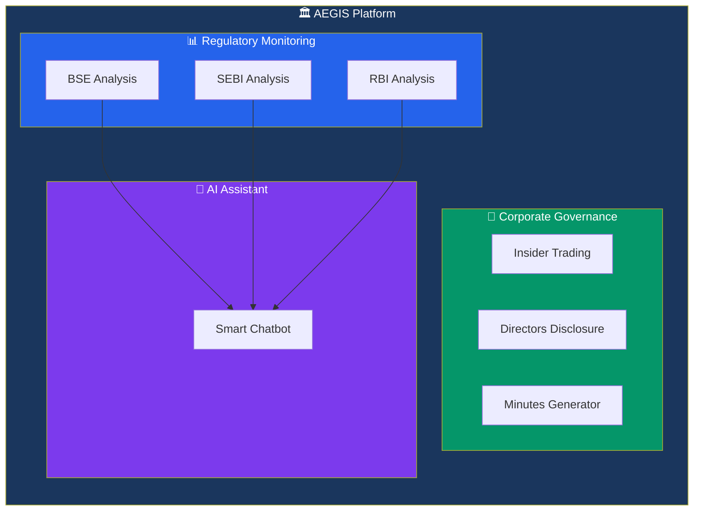

---

## 📈 Six Integrated Modules

### Complete Platform Flow

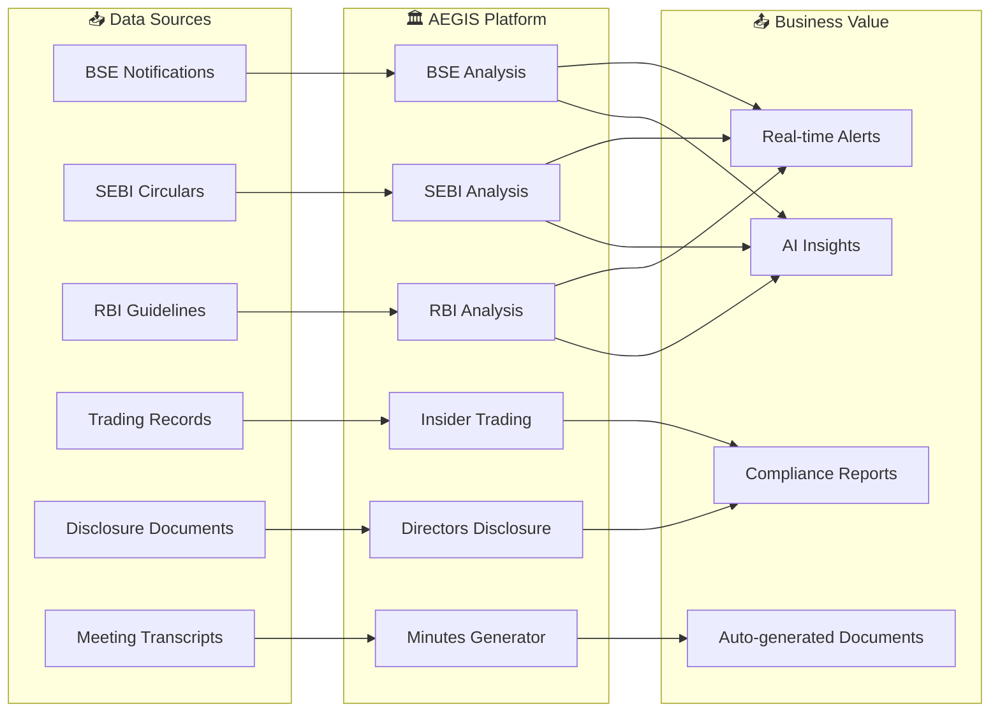

---

## 📊 Module 1: BSE Analysis

**Purpose**: Monitor and analyze notifications from Bombay Stock Exchange

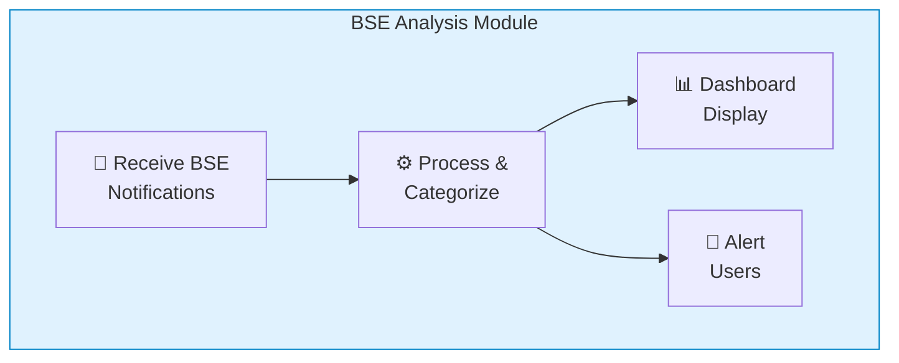

**Business Benefits:**
- ✅ Real-time market notifications
- ✅ Entity-wise filtering
- ✅ Trend analysis over time
- ✅ Email notification tracking

---

## 🏦 Module 2: RBI Analysis

**Purpose**: Track and analyze Reserve Bank of India regulatory updates

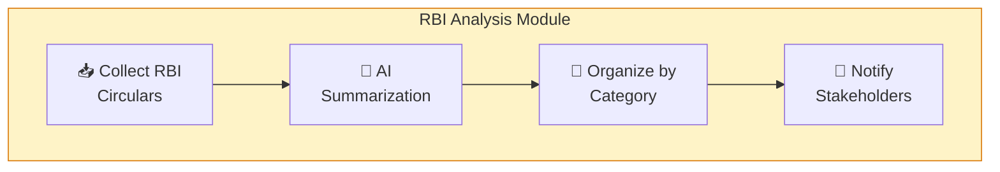

**Business Benefits:**
- ✅ Banking regulation tracking
- ✅ Monetary policy updates
- ✅ Compliance checklists
- ✅ PDF document access

---

## 📈 Module 3: SEBI Analysis

**Purpose**: Monitor Securities and Exchange Board of India notifications

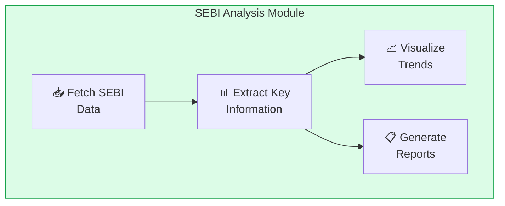

**Business Benefits:**
- ✅ Market regulation updates
- ✅ Compliance tracking
- ✅ Historical data analysis
- ✅ Export capabilities

---

## 🔍 Module 4: Insider Trading Surveillance

**Purpose**: Monitor and analyze insider trading activities across companies

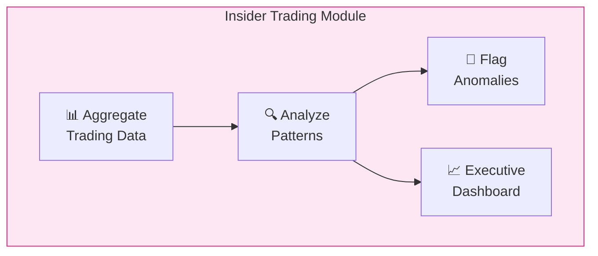

**Key Metrics Tracked:**
- 📊 New Investors Added
- 📊 Investors Exited
- 📊 Holdings Changed
- 📊 Unchanged Holdings

**Business Benefits:**
- ✅ Multi-company surveillance
- ✅ Depository-wise analysis (CDSL, NSDL)
- ✅ Trend identification
- ✅ Regulatory compliance support

---

## 👔 Module 5: Directors Disclosure Management

**Purpose**: Manage and process director disclosure documents (MBP-1 forms)

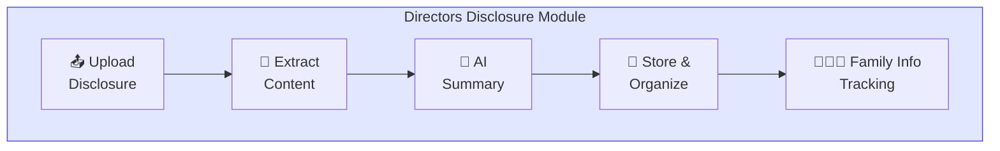

**Key Features:**
- 📋 Director master data management
- 📄 Document processing (DOCX)
- 🤖 AI-powered summarization
- 👨‍👩‍👧 Section 2(77) family tracking
- 📊 Disclosure analytics

**Business Benefits:**
- ✅ Centralized disclosure repository
- ✅ Automated document summarization
- ✅ Compliance with Companies Act
- ✅ Family relationship tracking

---

## 📝 Module 6: Meeting Minutes Generator

**Purpose**: Automate the creation of professional meeting minutes

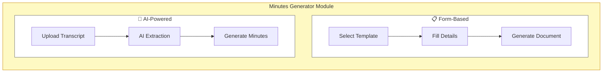

**Two Generation Methods:**

| Method | Best For | Input |
|--------|----------|-------|
| 📋 Form-Based | Structured board meetings | Fill-in form |
| 🤖 AI-Powered | Team meetings with transcripts | Teams recording |

**Business Benefits:**
- ✅ Consistent meeting documentation
- ✅ Time savings (90% faster)
- ✅ Professional formatting
- ✅ Template library

---

## 🤖 AI Chatbot - Smart Assistant

**Purpose**: Get instant answers about regulatory notifications

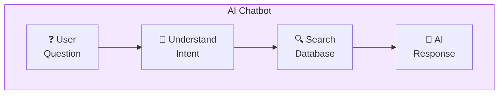

**Example Questions:**
- "What BSE notifications came yesterday?"
- "Show me SEBI circulars about mutual funds"
- "Any RBI updates on interest rates?"

---

## 🔄 End-to-End User Journey

### From Data to Decision

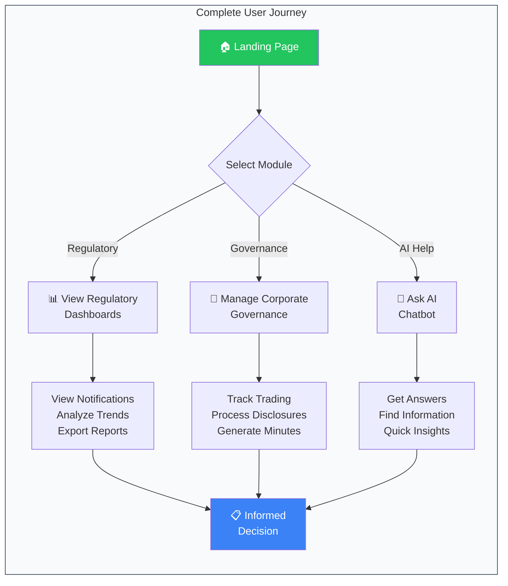

---

## 📊 Business Value Summary

### Time Savings

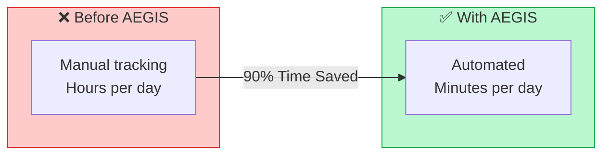

### Key Benefits by Role

| Role | Benefits |
|------|----------|
| 👔 **Compliance Officer** | Real-time regulatory alerts, Audit trails |
| 📊 **Company Secretary** | Automated minutes, Disclosure management |
| 💼 **Board Members** | Quick summaries, AI insights |
| 🔍 **Legal Team** | Insider trading surveillance, Documentation |

---

## 🏗️ How It All Connects

### Integration Overview

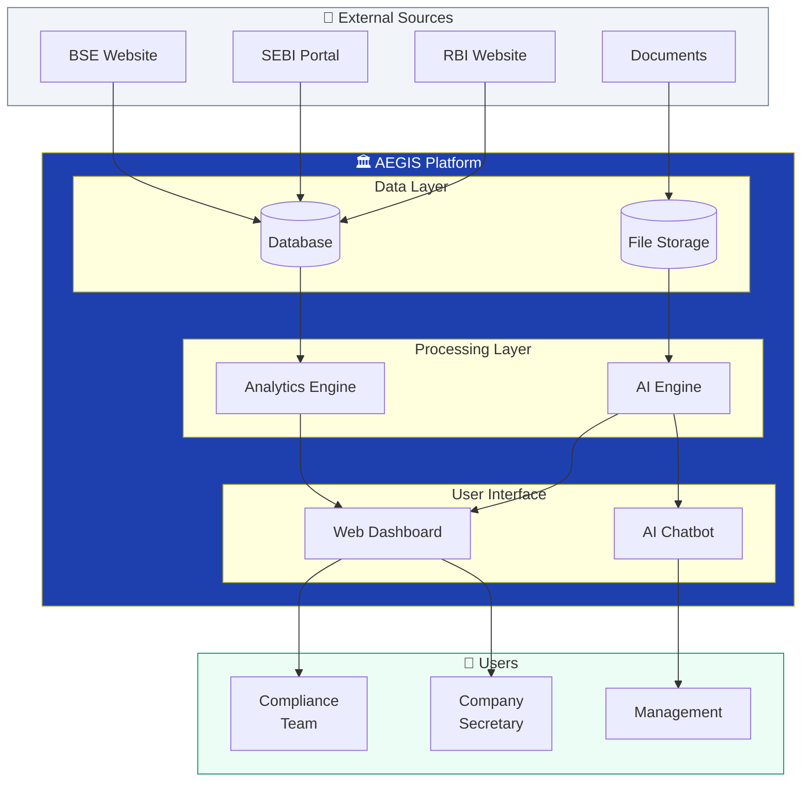

---

## 🎯 Quick Reference

### Module Summary Table

| Module | Icon | Purpose | Key Output |
|--------|------|---------|------------|
| BSE Analysis | 📊 | Track stock exchange notifications | Real-time alerts |
| SEBI Analysis | 📈 | Monitor securities regulations | Compliance reports |
| RBI Analysis | 🏦 | Track banking guidelines | Policy summaries |
| Insider Trading | 🔍 | Surveillance of trading patterns | Anomaly flags |
| Directors Disclosure | 👔 | Manage disclosure documents | AI summaries |
| Minutes Generator | 📝 | Automate meeting documentation | Professional minutes |
| AI Chatbot | 🤖 | Answer regulatory questions | Instant insights |

---

## 📞 Getting Help

- **Dashboard**: Click any module from the landing page
- **AI Chatbot**: Click the floating chat button (bottom-right)
- **Export**: Use download buttons on any report

---

*Document prepared for Business Stakeholders*  
*AEGIS Platform v1.0*  
*Adani Green Energy Limited*  
*December 2025*
