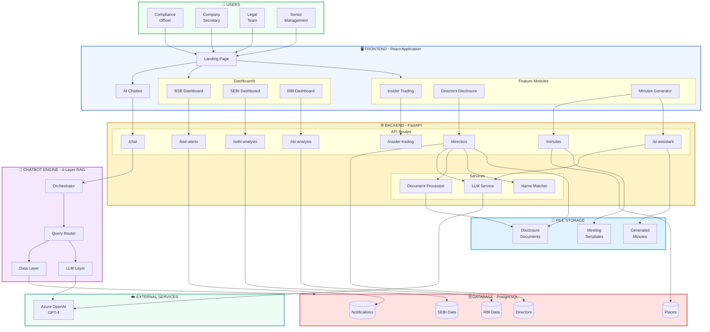
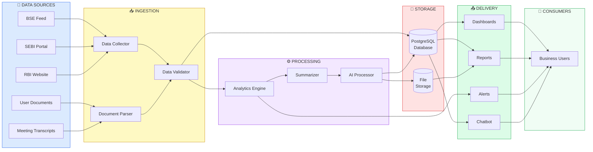
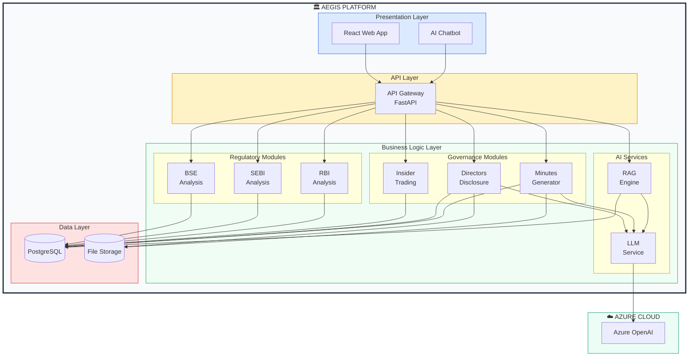
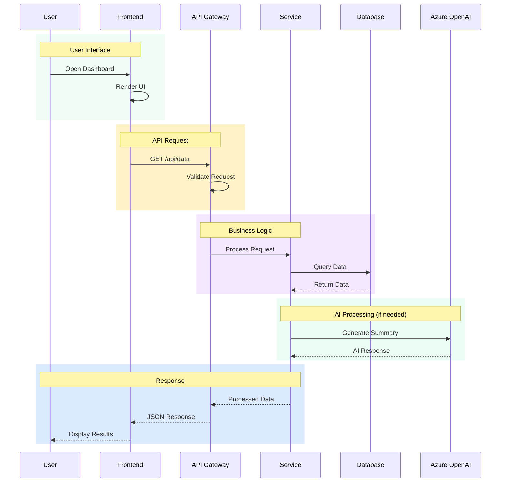
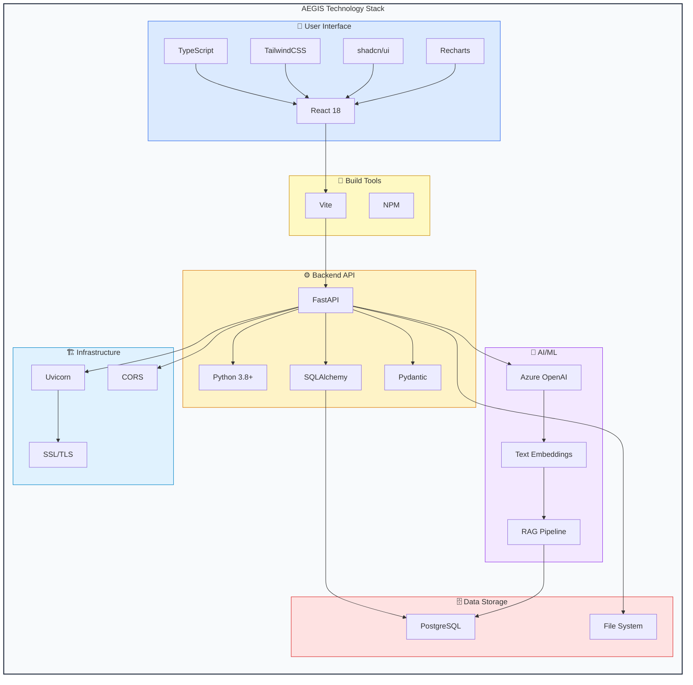
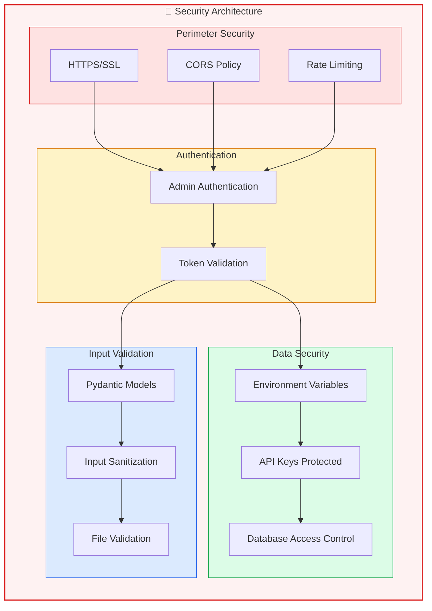
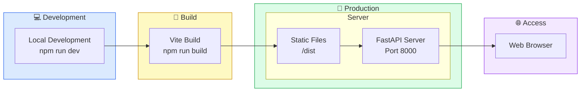
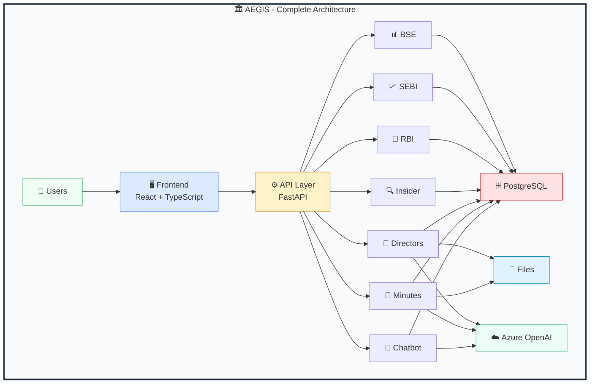

# AEGIS Platform - Complete System Architecture

## 🏛️ Enterprise Architecture Overview

---

## Complete System Architecture Diagram

---

## Data Flow Architecture

---

## Module Integration Architecture

---

## Request Flow Architecture

---

## Technology Stack Architecture

---

## Security Architecture

---

## Deployment Architecture

---

## Summary: Complete System View

---

*Complete System Architecture Document*  
*AEGIS Platform v1.0*  
*December 2025*
