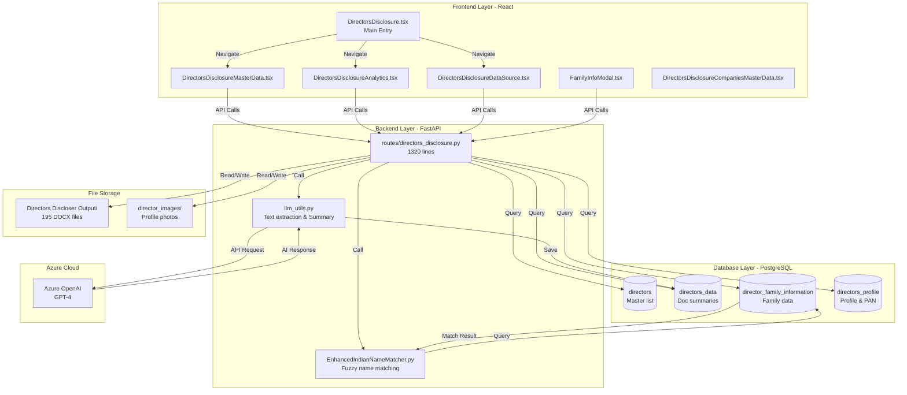
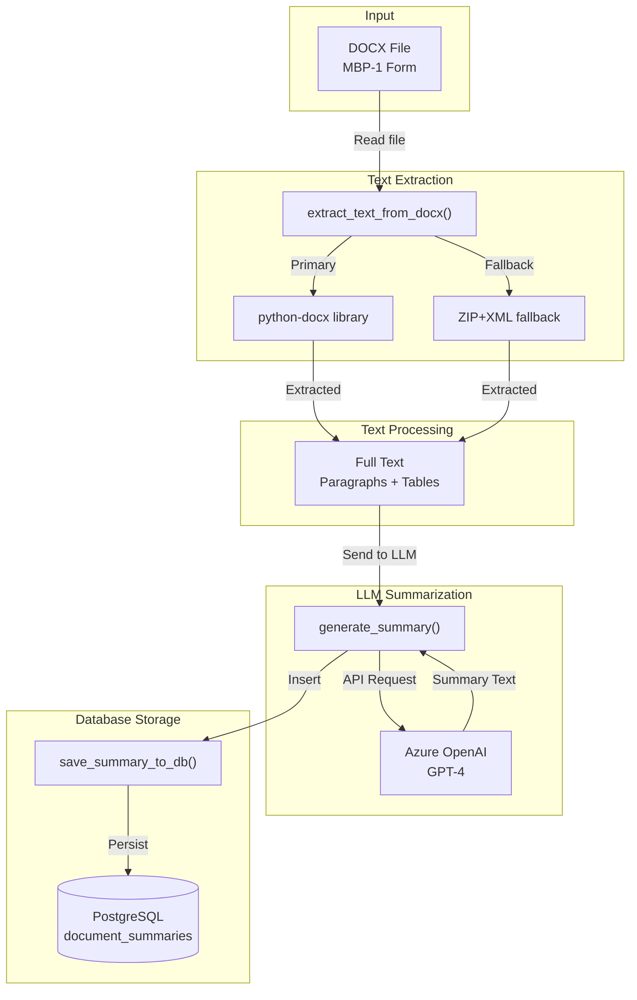
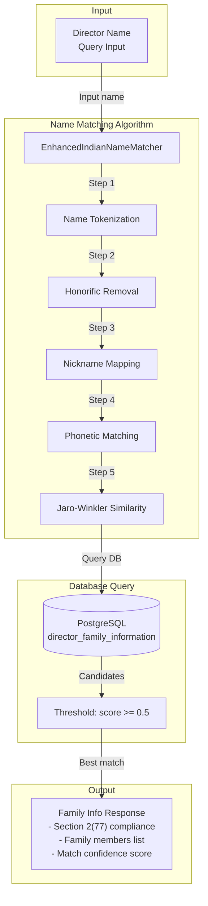

# Directors' Disclosure Module - Detailed Architecture

## 📋 Module Overview

The **Directors' Disclosure Module** is a comprehensive system for managing, processing, and analyzing disclosure documents from company directors. It handles MBP-1 forms (mandatory disclosure forms under Companies Act, 2013), extracts information using LLM technology, manages director profiles, and tracks family relationships as required by Section 2(77) of the Companies Act.

---

## 🎯 Business Requirements

### Primary Functions
1. **Director Master Data Management** - CRUD operations for directors with DIN tracking
2. **Disclosure Document Processing** - Extract and store content from DOCX disclosure files
3. **AI-Powered Summarization** - Generate intelligent summaries of disclosure documents
4. **Family Information Tracking** - Manage related party information as per Section 2(77)
5. **Profile Management** - Director profile with images, qualifications, and addresses
6. **Analytics Dashboard** - Statistics on disclosures by type, date, and director

### Regulatory Context
- **MBP-1 Form**: Disclosure of interest by directors (Section 184)
- **Section 2(77)**: Definition of relatives for conflict of interest
- **DIN**: Director Identification Number (8-digit unique identifier)
- **PAN**: Permanent Account Number for financial tracking

---

## 🏗️ High-Level Architecture



---

## 🗄️ Database Schema

### 1. Directors Master (`directors` table)

```sql
CREATE TABLE directors (
    id SERIAL PRIMARY KEY,
    name VARCHAR(255) NOT NULL,
    din VARCHAR(8) UNIQUE,              -- 8-digit Director Identification Number
    created_at TIMESTAMP DEFAULT CURRENT_TIMESTAMP
);

-- Indexes for performance
CREATE INDEX idx_directors_name ON directors (name);
CREATE INDEX idx_directors_din ON directors (din);
```

### 2. Document Summaries (`document_summaries` table)

```sql
CREATE TABLE document_summaries (
    id SERIAL PRIMARY KEY,
    director_name VARCHAR(255) NOT NULL,
    din VARCHAR(8),
    file_path VARCHAR(500) NOT NULL UNIQUE,  -- Filename of DOCX document
    full_text TEXT,                          -- Extracted document text
    summary TEXT,                            -- LLM-generated summary
    created_at TIMESTAMP DEFAULT CURRENT_TIMESTAMP,
    updated_at TIMESTAMP DEFAULT CURRENT_TIMESTAMP
);

-- Indexes
CREATE INDEX idx_document_summaries_file_path ON document_summaries (file_path);
CREATE INDEX idx_document_summaries_director_name ON document_summaries (director_name);
```

### 3. Directors Profile (`directors_profile` table)

```sql
CREATE TABLE directors_profile (
    id SERIAL PRIMARY KEY,
    DIN VARCHAR(8) UNIQUE,
    PAN VARCHAR(10),
    Address TEXT,
    DateOfBirth DATE,
    Qualification TEXT,
    Experience TEXT
);
```

### 4. Family Information (`director_family_information` table)

```sql
CREATE TABLE director_family_information (
    Name VARCHAR(255) PRIMARY KEY,
    Section_2_77_i TEXT,              -- Relative category i
    Section_2_77_ii TEXT,             -- Relative category ii
    Section_2_77_iii TEXT,            -- Relative category iii (numeric)
    Father VARCHAR(255),
    Mother VARCHAR(255),
    Son VARCHAR(255),
    Sons_Wife VARCHAR(255),
    Daughter VARCHAR(255),
    Daughters_husband VARCHAR(255),
    Brother VARCHAR(255),
    Sister VARCHAR(255)
);
```

---

## 🔌 API Endpoints

### Director Master CRUD

| Method | Endpoint | Purpose | Request Body | Response |
|--------|----------|---------|--------------|----------|
| GET | `/api/directors-master` | List all directors | - | `{data: Director[], count: int}` |
| POST | `/api/directors-master` | Create director | `{name, din}` | `Director` |
| PUT | `/api/directors-master/{id}` | Update director | `{name, din}` | `Director` |
| DELETE | `/api/directors-master/{id}` | Delete director | - | `{message}` |
| PUT | `/api/directors-master/{id}/pan` | Update PAN | `{pan}` | `{message}` |

### Disclosure Documents

| Method | Endpoint | Purpose |
|--------|----------|---------|
| GET | `/api/directors-disclosures` | List all disclosure files |
| GET | `/api/directors-disclosures/{id}/content` | Get document content |
| GET | `/api/directors-disclosures/{id}/download` | Download DOCX file |
| POST | `/api/directors-disclosures/{id}/generate-summary` | Generate AI summary |
| GET | `/api/directors-disclosures/{id}/summary` | Get stored summary |
| GET | `/api/directors-disclosures/analytics` | Get analytics data |

### Family Information

| Method | Endpoint | Purpose |
|--------|----------|---------|
| GET | `/api/directors/{name}/family-info` | Get family info |
| PUT | `/api/directors/{name}/family-info` | Update family info |

### Profile Management

| Method | Endpoint | Purpose |
|--------|----------|---------|
| GET | `/api/directors/{name}/profile` | Get profile |
| PUT | `/api/directors/{name}/profile` | Update profile |
| POST | `/api/directors/{name}/image` | Upload image |
| GET | `/api/directors/{name}/image` | Get image |
| DELETE | `/api/directors/{name}/image` | Delete image |

---

## 🔄 Data Flow Diagrams

### 1. Document Processing Flow



### 2. Family Information Matching Flow



---

## 🧩 Component Details

### Backend Components

#### 1. `routes/directors_disclosure.py` (1,320 lines)

**Response Models (Pydantic)**:
```python
class DirectorMasterResponse(BaseModel):
    id: int
    name: str
    din: str
    pan: Optional[str]
    created_at: str

class DisclosureResponse(BaseModel):
    id: int
    director_name: str
    din: str
    disclosure_date: str
    disclosure_type: str
    file_path: str

class DocumentSummaryResponse(BaseModel):
    id: int
    director_name: str
    din: str
    file_path: str
    full_text: str
    summary: str
    created_at: str
    updated_at: str

class DirectorFamilyInfoResponse(BaseModel):
    director_name: str
    matched_family_name: str
    match_score: float
    section_2_77_i: Optional[str]
    section_2_77_ii: Optional[str]
    section_2_77_iii: Optional[str]
    family_members: List[FamilyMemberInfo]
```

#### 2. `llm_utils.py` (414 lines)

**Key Functions**:
```python
def extract_text_from_docx(file_path: str) -> str:
    """Extract text using python-docx with fallback to zip+xml"""

def generate_summary_with_azure_openai(content: str, max_tokens=1000) -> str:
    """Generate summary using Azure OpenAI GPT-4"""

def generate_summary(content: str, max_tokens=1000) -> str:
    """Wrapper - uses Azure OpenAI"""

def save_summary_to_db(director_name, din, file_path, full_text, summary) -> bool:
    """Persist to PostgreSQL directors_data"""

def get_summary_from_db(file_path: str) -> Optional[str]:
    """Retrieve cached summary"""

def generate_and_save_summary(director_name, din, file_path) -> Tuple[str, str]:
    """Full pipeline: extract -> summarize -> save"""
```

#### 3. `EnhancedIndianNameMatcher.py` (15,915 bytes)

**Algorithm Features**:
- Indian name normalization (honorifics, titles)
- Nickname/alias mapping
- Multi-part name handling
- Phonetic similarity (Soundex-like)
- Jaro-Winkler string distance
- Configurable matching threshold

### Frontend Components

#### 1. `DirectorsDisclosure.tsx` (Main Entry - 6,477 bytes)
- Navigation hub for the module
- Product overview and feature cards

#### 2. `DirectorsDisclosureMasterData.tsx` (41,927 bytes)
- Director CRUD operations
- Table with inline editing
- PAN management
- Profile picture upload
- Search and filter functionality

#### 3. `DirectorsDisclosureAnalytics.tsx` (23,583 bytes)
- Disclosure statistics by type
- Monthly distribution charts
- Top directors by disclosure count
- Recharts visualizations

#### 4. `DirectorsDisclosureDataSource.tsx` (17,452 bytes)
- Document list view
- Content viewer
- AI summary generation trigger
- Download functionality

#### 5. `FamilyInfoModal.tsx` (16,322 bytes)
- Modal for viewing/editing family info
- Section 2(77) compliance fields
- Family member CRUD

#### 6. `DirectorsDisclosureCompaniesMasterData.tsx` (13,874 bytes)
- Company-director mapping
- CIN (Corporate Identification Number) tracking

---

## 🤖 LLM Integration Details

### Summary Generation Prompt

```
You are an expert at summarizing corporate disclosure documents.
Provide concise, structured summaries that highlight:

Focus Areas:
- Director's name and DIN
- Companies and positions held
- Shareholding details
- Other significant disclosures
- Important declarations or concerns

Format Requirements:
1. Use plain text formatting only
2. Use section headers followed by colon
3. Use simple bullet points with dashes "-"
4. For long lists, show first few + "and X other companies"
5. Keep summary concise and well-structured
6. Use only standard ASCII characters

Output Structure:
Director's Information:
- Name: [Director Name]
- DIN: [DIN Number]

Companies and Positions Held:
- [Company Name] - [Position]

Shareholding Details:
[Information]

Other Significant Disclosures:
- [Disclosure 1]

Important Declarations or Concerns:
- [Declaration 1]
```

### LLM Configuration

| Provider | Model | Max Tokens | Temperature |
|----------|-------|------------|-------------|
| Azure OpenAI | GPT-4 | 1000 | 0.3 |

---

## 📁 File Storage Structure

```
Backend/aegis_backend/
├── public/
│   ├── Directors Discloser Output/    # MBP-1 DOCX files
│   │   ├── {DirectorName}_MBP.docx
│   │   ├── {DirectorName}_MBP.docx
│   │   └── ... (195 files)
│   └── director_images/               # Profile photos
│       └── {DirectorName}.jpg
└── routes/
    ├── directors_disclosure.py
    └── EnhancedIndianNameMatcher.py
```

---

## 🔐 Security Considerations

1. **Admin Authentication**: Required for CRUD operations
2. **File Access**: DOCX files served via FastAPI FileResponse
3. **Input Validation**: Pydantic models for request validation
4. **DIN Uniqueness**: Enforced at database level

---

## 📊 Analytics Metrics

The module tracks and displays:

| Metric | Description |
|--------|-------------|
| Total Disclosures | Count of all DOCX files |
| By Type | MBP-1, Shareholding, Transaction, Interest |
| By Month | Distribution over time |
| By Director | Top 10 directors by disclosure count |

---

## 🔄 Error Handling

1. **Document Not Found**: Return 404 with descriptive message
2. **LLM Failure**: Log error and return error message
3. **Database Errors**: Log and return 500 with details
4. **Name Matching Failure**: Return 404 if score < threshold

---

## 📝 Development Notes

### Adding a New Director
1. Frontend: `DirectorsDisclosureMasterData` → Add Dialog
2. API: `POST /api/directors-master`
3. DB: Insert into `directors` table
4. Optional: Add PAN via separate endpoint

### Processing New Disclosure
1. Place DOCX in `public/Directors Discloser Output/`
2. Frontend: Click "Generate Summary" button
3. API: `POST /api/directors-disclosures/{id}/generate-summary`
4. Backend: Extract text → LLM summary → Save to PostgreSQL

### Updating Family Information
1. Frontend: Click family icon → `FamilyInfoModal`
2. Name matching via `indian_name_similarity()`
3. API: `PUT /api/directors/{name}/family-info`
4. DB: Update `director_family_information` table

---

*Document Version: 2.0*
*Last Updated: December 11, 2025*
