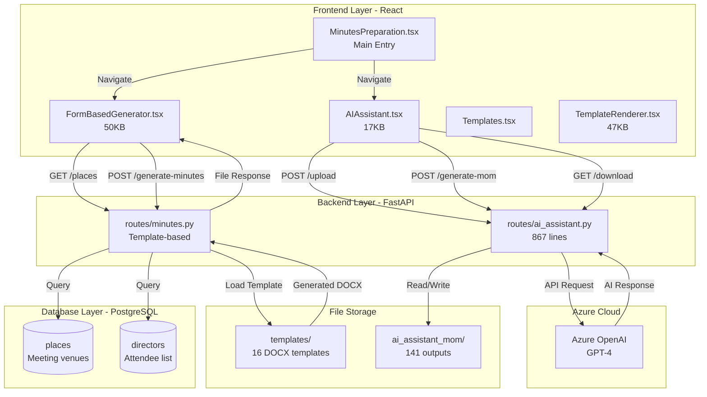
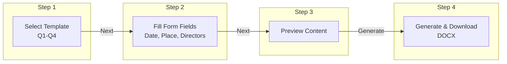
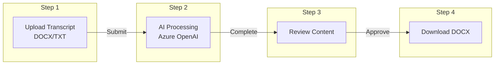
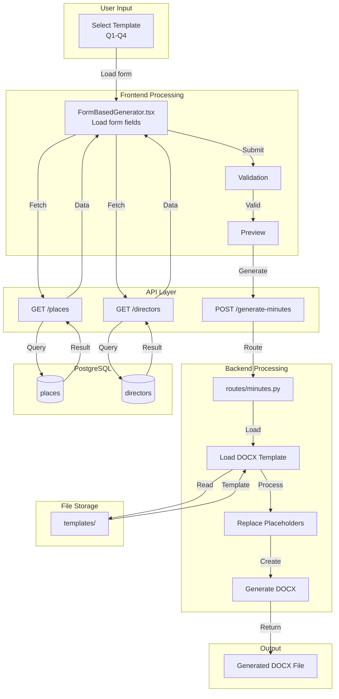
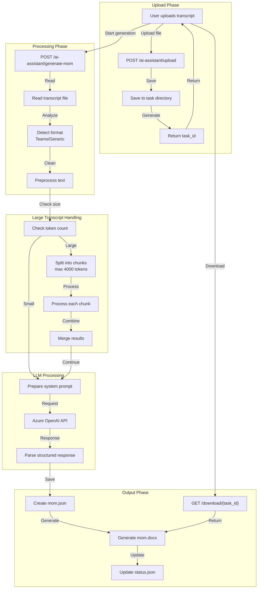

# Minutes Generation Module - Detailed Architecture

## 📋 Module Overview

The **Minutes Generation Module** is an automated meeting minutes preparation system that provides two distinct generation methods:

1. **Form-Based Generator** - Template-driven document generation using predefined forms
2. **AI-Powered Assistant** - LLM-based transcript processing for Microsoft Teams meetings

This module streamlines corporate governance by automating the creation of professional meeting minutes documents (DOCX format) for board meetings, committee meetings, and other corporate gatherings.

---

## 🎯 Business Requirements

### Primary Functions
1. **Template Management** - Quarterly meeting templates (Q1-Q4)
2. **Form-Based Generation** - Fill-in-the-blank document creation
3. **AI Transcript Processing** - Convert Teams transcripts to structured minutes
4. **Director Management** - Track attendees and their designations
5. **Place Management** - Manage meeting venues
6. **Document Download** - Generate and download DOCX files

### Use Cases
- **Board Meetings**: Quarterly and annual board meeting minutes
- **Committee Meetings**: Audit, Risk, CSR committee minutes
- **AGM/EGM**: General meeting documentation
- **Team Meetings**: Convert Microsoft Teams transcripts to formal minutes

---

## 🏗️ High-Level Architecture



---

## 📂 Two Generation Methods

### Method 1: Form-Based Generator



**Available Templates:**
- Q1 Board Meeting Minutes
- Q2 Board Meeting Minutes
- Q3 Board Meeting Minutes
- Q4 Board Meeting Minutes
- AGM Minutes
- Committee Meeting Minutes

**Form Fields (Dynamic based on template):**
- Meeting Date & Time
- Meeting Place (from PostgreSQL)
- Directors Present (multi-select)
- Directors Absent
- Chairman Name
- Company Secretary Name
- Agenda Items
- Resolution Details

### Method 2: AI-Powered Transcript Processing



**Supported Formats:**
- Microsoft Teams Transcript (.docx, .txt)
- Raw Text Transcript (.txt)

**AI Capabilities:**
- Speaker identification
- Key discussion point extraction
- Action item detection
- Decision summarization
- Resolution formatting

---

## 🗄️ Database Schema

### Places Database (`places` table)

```sql
CREATE TABLE places (
    id SERIAL PRIMARY KEY,
    name VARCHAR(255) NOT NULL UNIQUE,  -- Place name
    address TEXT,                        -- Full address
    city VARCHAR(100),                   -- City
    created_at TIMESTAMP DEFAULT CURRENT_TIMESTAMP
);

-- Sample Data
INSERT INTO places (name, address, city) VALUES
('Corporate Head Office', 'Adani House, Plot No. 1, Tower-2', 'Ahmedabad'),
('Registered Office', 'Adani Corporate House', 'Ahmedabad'),
('Virtual Meeting', 'Video Conference', 'Online');
```

### Directors for Meetings (uses `directors` table)

```sql
-- Same schema as directors_disclosure module
CREATE TABLE directors (
    id SERIAL PRIMARY KEY,
    name VARCHAR(255) NOT NULL,
    din VARCHAR(8) UNIQUE,
    created_at TIMESTAMP DEFAULT CURRENT_TIMESTAMP
);
```

---

## 🔌 API Endpoints

### Template-Based Generation (`routes/minutes.py`)

| Method | Endpoint | Purpose | Request Body | Response |
|--------|----------|---------|--------------|----------|
| GET | `/places` | List meeting places | - | `{data: Place[]}` |
| POST | `/places` | Create new place | `{name, address, city}` | `Place` |
| PUT | `/places/{id}` | Update place | `{name, address, city}` | `Place` |
| DELETE | `/places/{id}` | Delete place | - | `{message}` |
| GET | `/templates` | List available templates | - | `{templates: []}` |
| POST | `/generate-minutes` | Generate DOCX from template | `FormData` | `FileResponse` |
| GET | `/directors` | Get directors for meeting | - | `{data: Director[]}` |

### AI-Powered Generation (`routes/ai_assistant.py`)

| Method | Endpoint | Purpose | Request Body | Response |
|--------|----------|---------|--------------|----------|
| POST | `/ai-assistant/upload` | Upload transcript | `MultipartFile` | `{task_id, status}` |
| POST | `/ai-assistant/generate-mom` | Start AI generation | `{task_id}` | `{status}` |
| GET | `/ai-assistant/status/{task_id}` | Check generation status | - | `{status, progress}` |
| GET | `/ai-assistant/mom/{task_id}` | Get structured MoM JSON | - | `MeetingMinutes` |
| GET | `/ai-assistant/download/{task_id}` | Download generated DOCX | - | `FileResponse` |

---

## 🔄 Data Flow Diagrams

### Form-Based Generation Flow



### AI Transcript Processing Flow



---

## 🧩 Component Details

### Backend Components

#### 1. `routes/minutes.py` (309 lines)

**Key Functions**:
```python
@router.get("/places")
async def get_places():
    """Retrieve all meeting places from PostgreSQL"""

@router.post("/places")
async def create_place(name: str, address: str, city: str):
    """Create new meeting place"""

@router.post("/generate-minutes")
async def generate_minutes(form_data: MinutesFormData):
    """Generate DOCX from template with form data"""
    # 1. Load template from templates/
    # 2. Replace placeholders with form values
    # 3. Generate formatted DOCX
    # 4. Return FileResponse

@router.get("/directors")
async def get_directors():
    """Get directors list for meeting attendance"""
```

#### 2. `routes/ai_assistant.py` (867 lines)

**Key Functions**:
```python
@router.post("/ai-assistant/upload")
async def upload_transcript(file: UploadFile):
    """
    Upload meeting transcript for AI processing
    - Accepts: .docx, .txt files
    - Creates unique task directory
    - Returns task_id for tracking
    """

@router.post("/ai-assistant/generate-mom")
async def generate_mom(task_id: str):
    """
    Start AI-powered MoM generation
    - Reads uploaded transcript
    - Detects format (Teams/Generic)
    - Processes with Azure OpenAI
    - Generates structured output
    """

def detect_teams_format(content: str) -> bool:
    """Detect if transcript is Microsoft Teams format"""

def preprocess_transcript(content: str, is_teams: bool) -> str:
    """Clean and normalize transcript text"""

def chunk_transcript(content: str, max_tokens: int = 4000) -> List[str]:
    """Split large transcripts for LLM processing"""

def process_chunk_with_llm(chunk: str) -> dict:
    """Extract key points from transcript chunk"""

def merge_extracted_points(chunks: List[dict]) -> dict:
    """Combine outputs from multiple chunks"""

def generate_mom_docx(mom_data: dict, task_dir: str) -> str:
    """Create DOCX file from structured MoM data"""

@router.get("/ai-assistant/status/{task_id}")
async def get_status(task_id: str):
    """Check generation progress/status"""

@router.get("/ai-assistant/mom/{task_id}")
async def get_mom_content(task_id: str):
    """Get structured MoM JSON content"""

@router.get("/ai-assistant/download/{task_id}")
async def download_mom(task_id: str):
    """Download generated DOCX file"""
```

### Frontend Components

#### 1. `MinutesPreparation.tsx` (604 lines - Main Entry)

**Features**:
- Navigation hub for the module
- Admin authentication (login/logout)
- Director management (CRUD)
- Path-based sub-navigation

**Routes**:
- `/minutes-preparation` - Main landing
- `/minutes-preparation/directors` - Director management
- `/minutes-preparation/form-generator` - Form-based generation
- `/minutes-preparation/ai-assistant` - AI transcript processing

#### 2. `FormBasedGenerator.tsx` (50,491 bytes)

**Features**:
- Template selection dropdown
- Dynamic form field rendering
- Date/time pickers
- Place selector (from API)
- Director multi-select
- Agenda item builder
- Resolution editor
- Live preview
- Generate & download button

#### 3. `AIAssistant.tsx` (17,100 bytes)

**Features**:
- File upload (drag & drop)
- Upload progress indicator
- Processing status display
- Generated content preview
- Download button
- Error handling UI

#### 4. `TemplateRenderer.tsx` (47,095 bytes)

**Features**:
- Template preview rendering
- Dynamic placeholder replacement
- Print-friendly view
- Export options

---

## 🤖 LLM Integration - AI Assistant

### System Prompt for MoM Generation

```
You are a professional corporate secretary with expertise in drafting 
formal meeting minutes for board meetings and committee meetings.

Your task is to analyze the provided meeting transcript and extract:

1. **Meeting Information**:
   - Meeting title/type
   - Date and time (if mentioned)
   - Location/mode (physical/virtual)

2. **Attendees**:
   - List of participants
   - Chairman identification
   - Secretary identification

3. **Key Discussions**:
   - Main topics discussed
   - Important points raised
   - Debates and viewpoints

4. **Decisions Made**:
   - Formal decisions
   - Resolutions passed
   - Votes (if any)

5. **Action Items**:
   - Tasks assigned
   - Responsible persons
   - Deadlines mentioned

6. **Resolutions**:
   - Formal resolution text
   - Proposer/Seconder (if mentioned)

Format your output as a structured JSON object.
Use formal corporate language.
Be concise but comprehensive.
```

### Transcript Format Detection

```python
def detect_teams_format(content: str) -> bool:
    """
    Detect Microsoft Teams transcript patterns:
    - "Speaker X" or "Name (Speaker X)" patterns
    - Timestamp patterns: "0:00:00" or "[00:00:00]"
    - VTT/SRT subtitle markers
    - "Joined the meeting" / "Left the meeting" markers
    """
    teams_patterns = [
        r"Speaker \d+",
        r"\d+:\d+:\d+",
        r"\[SPEAKING\]",
        r"joined the meeting",
        r"left the meeting"
    ]
    # Check for pattern matches
    ...
```

### Large Transcript Chunking

```python
def chunk_transcript(content: str, max_tokens: int = 4000) -> List[str]:
    """
    Split large transcripts for LLM processing
    
    Strategy:
    1. Estimate tokens (~4 chars per token)
    2. Split at paragraph boundaries when possible
    3. Maintain speaker context across chunks
    4. Overlap last few sentences for continuity
    """
    chunks = []
    current_chunk = ""
    
    for paragraph in content.split("\n\n"):
        if estimate_tokens(current_chunk + paragraph) > max_tokens:
            chunks.append(current_chunk)
            current_chunk = paragraph
        else:
            current_chunk += "\n\n" + paragraph
    
    if current_chunk:
        chunks.append(current_chunk)
    
    return chunks
```

### LLM Configuration

| Provider | Model | Max Tokens | Temperature |
|----------|-------|------------|-------------|
| Azure OpenAI | GPT-4 | 4000 | 0.3 |

---

## 📁 File Storage Structure

```
Backend/aegis_backend/
├── public/
│   ├── templates/                    # Meeting minutes templates
│   │   ├── Q1_Board_Meeting.docx
│   │   ├── Q2_Board_Meeting.docx
│   │   ├── Q3_Board_Meeting.docx
│   │   ├── Q4_Board_Meeting.docx
│   │   ├── AGM_Minutes.docx
│   │   └── Committee_Meeting.docx
│   │
│   └── ai_assistant_mom/             # AI-generated outputs
│       ├── {task_id_1}/
│       │   ├── transcript.docx       # Uploaded transcript
│       │   ├── status.json           # Processing status
│       │   ├── mom.json              # Structured output
│       │   └── mom.docx              # Generated document
│       └── {task_id_2}/
│           └── ...
│
└── routes/
    ├── minutes.py                    # Template-based generation
    └── ai_assistant.py               # AI-powered processing
```

### Task Status JSON Structure

```json
{
    "task_id": "abc123-def456-ghi789",
    "status": "processing",
    "progress": 65,
    "step": "llm_extraction",
    "message": "Extracting key points...",
    "created_at": "2025-12-11T14:30:00",
    "completed_at": null,
    "error": null
}
```

**Status Values:**
- `pending` - Task created, awaiting processing
- `processing` - AI extraction in progress
- `completed` - Successfully generated DOCX
- `error` - Processing failed

---

## 🔐 Security Considerations

1. **Admin Authentication**: Required for all operations
2. **File Validation**: Only .docx and .txt allowed for upload
3. **File Size Limits**: Max 10MB for transcripts
4. **Task Isolation**: Each task in separate directory
5. **Input Sanitization**: Strip potentially malicious content

---

## 🚀 Performance Optimizations

1. **Async Processing**: Background task for LLM processing
2. **Chunking**: Handle large transcripts without timeout
3. **Caching**: Template loading cached in memory
4. **Status Polling**: Frontend polls status at intervals

---

## 📊 Error Handling

| Error Type | HTTP Code | Response |
|------------|-----------|----------|
| File not found | 404 | `{detail: "Task not found"}` |
| Invalid file format | 400 | `{detail: "Only .docx and .txt files are supported"}` |
| LLM failure | 500 | `{detail: "LLM processing failed"}` |
| Timeout | 408 | `{detail: "Processing timeout"}` |
| Generation failed | 500 | `{detail: "Failed to generate DOCX"}` |

---

## 📝 Development Notes

### Adding a New Template

1. Create DOCX template with placeholders:
   - `{{MEETING_DATE}}` - Date placeholder
   - `{{MEETING_PLACE}}` - Venue placeholder
   - `{{DIRECTORS_PRESENT}}` - Attendee list
   - `{{CHAIRMAN_NAME}}` - Chairman name
   - `{{AGENDA_ITEMS}}` - Agenda table
   - `{{RESOLUTIONS}}` - Resolution list

2. Place in `public/templates/` directory

3. Register in template list (backend)

4. Add form fields in `FormBasedGenerator.tsx`

### Processing Custom Transcript Formats

1. Add detection pattern in `detect_teams_format()`
2. Add preprocessing rules in `preprocess_transcript()`
3. Test with sample files

### Extending LLM Capabilities

1. Modify system prompt in `ai_assistant.py`
2. Update output JSON schema
3. Adjust DOCX generation logic

---

## 🔄 Integration Points

| Component | Integration |
|-----------|-------------|
| Directors Module | Shares `directors` table for attendee list |
| LLM Layer | Uses Azure OpenAI for all AI features |
| File Storage | Common `public/` directory structure |
| Authentication | Shared admin auth with other modules |

---

*Document Version: 2.0*
*Last Updated: December 11, 2025*
