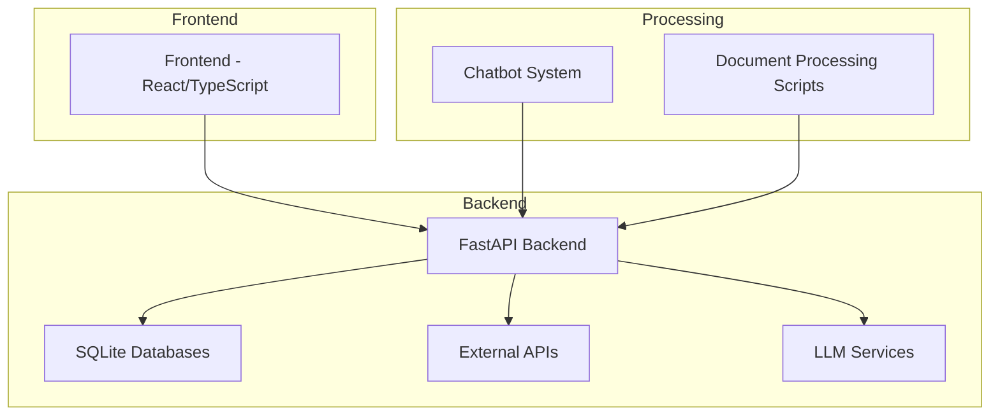
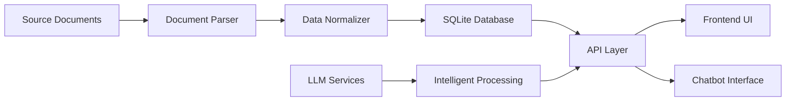
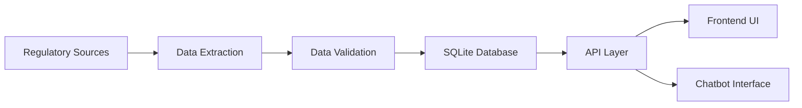
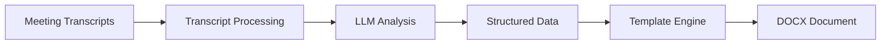
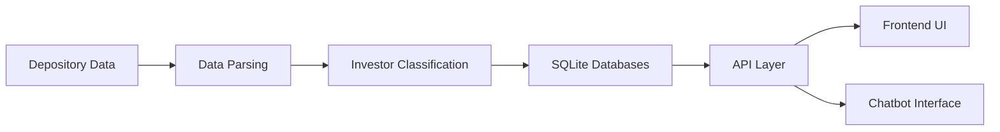

# AEGIS Platform - Technical Documentation

## Table of Contents
1. [Overview](#overview)
2. [System Architecture](#system-architecture)
3. [Technology Stack](#technology-stack)
4. [Project Structure](#project-structure)
5. [Backend Architecture](#backend-architecture)
6. [Frontend Architecture](#frontend-architecture)
7. [Database Schema](#database-schema)
8. [API Endpoints](#api-endpoints)
9. [Data Flow](#data-flow)
10. [Setup and Deployment](#setup-and-deployment)
11. [Development Guidelines](#development-guidelines)
12. [Glossary](#glossary)

## Overview

The AEGIS Platform is a comprehensive financial data analysis and visualization system designed to process, analyze, and present regulatory filings and corporate governance data. The platform specializes in parsing director disclosure documents, tracking insider trading activities, and providing insights into corporate networks and relationships.

The system consists of:
- A Python-based backend using FastAPI for RESTful API services
- A React/TypeScript frontend for interactive data visualization
- A chatbot system for natural language querying of data
- SQLite databases for data storage
- Integration with LLM providers (Groq, Azure OpenAI) for intelligent data processing

## System Architecture



The architecture follows a modular design pattern with clear separation of concerns:
- **Frontend**: Handles user interface and visualization
- **Backend API**: Provides RESTful endpoints and business logic
- **Data Layer**: Manages data storage and retrieval
- **Processing Layer**: Handles document parsing and data transformation
- **AI Layer**: Integrates with LLM services for intelligent processing

## Technology Stack

### Frontend
- **React 18**: Modern component-based UI library
- **TypeScript**: Type-safe JavaScript development
- **Vite**: Fast build tool and development server
- **Tailwind CSS**: Utility-first CSS framework
- **shadcn/ui**: Component library built on Tailwind CSS
- **Recharts**: Data visualization library
- **React Router**: Client-side routing
- **Framer Motion**: Animation library

### Backend
- **FastAPI**: Modern Python web framework
- **SQLite**: Lightweight relational database
- **Pandas**: Data manipulation and analysis
- **python-docx**: DOCX document processing
- **python-dotenv**: Environment variable management
- **Uvicorn**: ASGI server for FastAPI

### AI/ML Services
- **Groq**: Fast inference platform for LLMs
- **Azure OpenAI**: Enterprise-grade LLM services
- **Sentence Transformers**: Embedding generation

### DevOps
- **Docker**: Containerization platform
- **Nginx**: Web server and reverse proxy
- **Node.js/NPM**: Package management and build tools

## Project Structure

```
.
├── Knowledge_Transfer_Documents/
│   ├── AEGIS_PLATFORM_TECHNICAL_DOCUMENTATION.md (This document)
│   ├── Technical_Documentation.md
│   └── prompt.MD
├── Backend/aegis_backend/
│   ├── docs/                   # Documentation files
│   ├── public/                 # Static files and data
│   │   ├── Directors Discloser Output/  # Director disclosure documents
│   │   ├── AdaniInsiderTraders/        # Insider trading databases
│   │   ├── ai_assistant_mom/           # AI assistant Meeting Minutes
│   │   ├── templates/                  # Meeting minutes templates
│   │   ├── directors.db                # Directors master database
│   │   ├── directors_data.db           # Directors disclosure data
│   │   ├── directors_profile.db        # Directors profile information
│   │   ├── Director_Family_Information.db  # Director family data
│   │   ├── notifications.db            # BSE alerts
│   │   ├── sebi_excel_master.db        # SEBI filings
│   │   ├── rbi.db                      # RBI notifications
│   │   ├── places.db                   # Meeting places
│   │   └── visits.db                   # Visit tracking
│   ├── routes/                 # API route handlers
│   │   ├── health.py           # Health check endpoints
│   │   ├── excel.py            # Excel processing endpoints
│   │   ├── bse.py              # BSE data endpoints
│   │   ├── sebi.py             # SEBI data endpoints
│   │   ├── rbi.py              # RBI data endpoints
│   │   ├── analytics.py        # Analytics endpoints
│   │   ├── admin.py            # Admin endpoints
│   │   ├── directors.py        # Directors data endpoints
│   │   ├── directors_disclosure.py  # Directors disclosure endpoints
│   │   ├── director_analysis.py     # Director analysis endpoints
│   │   ├── minutes.py          # Meeting minutes endpoints
│   │   ├── ai_assistant.py     # AI assistant endpoints
│   │   ├── visit_tracking.py   # Visit tracking endpoints
│   │   ├── insider_trading.py  # Insider trading endpoints
│   │   └── chat.py             # Chatbot endpoints
│   ├── scripts/                # Data processing scripts
│   │   ├── director_data_analysis.py   # Director data analysis
│   │   ├── EnhancedIndianNameMatcher.py # Name matching utilities
│   │   └── fastapi_server_modular.py   # Modular server setup
│   ├── utils/                  # Utility functions
│   │   └── db_init.py          # Database initialization
│   ├── fastapi_server.py       # Main FastAPI application
│   └── llm_utils.py            # LLM utility functions
├── chatbot_backend/
│   ├── chat_orchestrator/      # Chat flow management
│   ├── config/                 # Configuration management
│   ├── data_layer/             # Data models and access
│   ├── indexing_layer/         # Data indexing and search
│   ├── llm_layer/              # LLM integration
│   └── utils/                  # Utility functions
├── src/                        # Frontend source code
│   ├── components/             # Reusable UI components
│   │   ├── ui/                 # Base UI elements
│   │   ├── layout/             # Page layout components
│   │   ├── charts/             # Data visualization components
│   │   └── ChatbotFab.tsx     # Chatbot floating action button
│   ├── pages/                  # Page components
│   │   ├── LandingPage.tsx    # Main landing page
│   │   ├── DirectorsDisclosurePage.tsx  # Directors disclosure analysis
│   │   ├── SebiAnalysisPage.tsx         # SEBI analysis
│   │   ├── BseAlertsPage.tsx            # BSE alerts
│   │   ├── RbiNotificationsPage.tsx     # RBI notifications
│   │   ├── MinutesPreparationPage.tsx   # Meeting minutes
│   │   ├── InsiderTradingPage.tsx       # Insider trading analysis
│   │   └── AnalyticsDashboard.tsx       # Analytics dashboard
│   ├── services/               # API service clients
│   │   ├── apiClient.ts        # Base API client
│   │   ├── directorsService.ts # Directors data service
│   │   ├── sebiService.ts      # SEBI data service
│   │   ├── bseService.ts       # BSE data service
│   │   ├── rbiService.ts       # RBI data service
│   │   ├── analyticsService.ts # Analytics service
│   │   ├── minutesService.ts   # Meeting minutes service
│   │   ├── insiderTradingService.ts     # Insider trading service
│   │   └── chatService.ts      # Chatbot service
│   ├── hooks/                  # Custom React hooks
│   └── utils/                  # Frontend utility functions
├── README.md                   # Project overview
└── package.json                # Frontend dependencies
```

### Backend Architecture

#### Core Components

##### FastAPI Server (`Backend/aegis_backend/fastapi_server.py`)
The main entry point for the backend application that:
- Initializes the FastAPI application with title "Financial Data API" and version "1.0.0"
- Configures CORS middleware with permissive settings for localhost development
- Mounts all route modules with proper error handling
- Sets up static file serving for the React frontend with SPA routing support
- Initializes database connections on startup
- Implements custom thread pool for handling blocking operations (4 workers)

#### Route Modules (`Backend/aegis_backend/routes/`)
Modular API endpoints organized by functionality with specific responsibilities:

- `health.py`: System health checks
  - Provides `/health` endpoint for monitoring API status
  - Returns JSON with status, service name, and timestamp

- `excel.py`: Excel data processing
  - Handles processing of Excel files containing director disclosure information
  - Parses and normalizes data from structured Excel formats
  - Stores processed data in SQLite databases

- `directors.py`: Director information APIs
  - Provides endpoints for accessing director data
  - Implements `/api/companies-with-director-count` for company director statistics
  - Uses thread pool for database operations to prevent blocking

- `directors_disclosure.py`: Director disclosure document processing
  - Processes DOCX documents containing director disclosure information
  - Extracts director names, DINs, and company affiliations
  - Generates document summaries using LLM integration
  - Manages director master data and family information

- `director_analysis.py`: Director network analysis
  - Analyzes cross-directorship patterns between companies
  - Identifies clustering of directors across organizations
  - Generates network visualization data for relationship mapping
  - Calculates whole-time director counts and company statistics

- `minutes.py`: Meeting minutes processing
  - Manages predefined meeting places with addresses
  - Generates DOCX documents from templates with dynamic placeholder replacement
  - Handles complex placeholder mappings including director names and DIN numbers
  - Supports both board meetings and committee meetings

- `ai_assistant.py`: AI-powered assistance endpoints
  - Processes meeting transcripts for automated Meeting Minutes generation
  - Supports both DOCX and TXT transcript formats
  - Integrates with LLM providers (Groq, Azure OpenAI) for intelligent processing
  - Handles large transcript processing through chunking and synthesis

- `bse.py`: BSE regulatory data processing
  - Retrieves BSE alerts and notifications from notifications.db
  - Filters out NIL or empty entries
  - Provides chronological listing of alerts with pagination support
  - Offers analytics on alert frequency by month

- `sebi.py`: SEBI regulatory data processing
  - Processes SEBI database containing regulatory notifications
  - Extracts summaries and PDF links for regulatory filings
  - Provides chronological listing of regulatory alerts with pagination

- `rbi.py`: RBI regulatory data processing
  - Processes RBI database containing regulatory summaries
  - Extracts run dates, PDF links, and summaries of notifications
  - Filters out NIL entries to focus on substantive content

- `analytics.py`: Data analytics endpoints
  - Provides aggregated analytics across all data sources
  - Calculates monthly counts for BSE alerts
  - Computes total counts for regulatory notifications
  - Generates distribution data for companies and directors

- `insider_trading.py`: Insider trading data processing
  - Processes insider trading databases organized by company and depository
  - Categorizes investor activities into four statuses (ADDED, REMOVED, CHANGED, UNCHANGED)
  - Identifies top new investors, exits, buyers, and sellers
  - Supports filtering by company and depository (CDSL, NSDL, PHY)

- `visit_tracking.py`: Visit tracking functionality
  - Tracks platform usage through visit counting
  - Provides endpoints for getting and incrementing visit counts
  - Maintains timestamp of last visit update

- `chat.py`: Chatbot integration endpoints
  - Processes natural language queries using the separate chatbot_backend system
  - Supports both direct responses and streaming for different use cases
  - Handles session management and database selection
  - Integrates with all platform databases (SEBI, BSE, RBI, Directors, etc.)

#### Data Processing Scripts (`Backend/aegis_backend/scripts/`)
Standalone scripts for batch processing and data management:
- Document parsing and normalization
- Database initialization and maintenance
- Data validation and quality checks
- Summary generation and optimization

### Database Design

The platform uses multiple SQLite databases for data persistence, each serving specific functionality:

#### Directors Database (`Backend/aegis_backend/directors_data.db`)
Stores parsed director disclosure information and document summaries:

```sql
-- Directors table
CREATE TABLE directors (
    din TEXT PRIMARY KEY,       -- Director Identification Number
    name TEXT,                  -- Director name
    source_file TEXT            -- Source document filename
);

-- Companies table
CREATE TABLE companies (
    id INTEGER PRIMARY KEY AUTOINCREMENT,
    name TEXT UNIQUE,           -- Company name
    type TEXT                   -- Company type classification
);

-- Directorships table
CREATE TABLE directorships (
    id INTEGER PRIMARY KEY AUTOINCREMENT,
    din TEXT REFERENCES directors(din),
    company_id INTEGER REFERENCES companies(id),
    position TEXT,              -- Director position type
    appointment_date TEXT       -- Appointment date
);

-- Document summaries table
CREATE TABLE document_summaries (
    id INTEGER PRIMARY KEY AUTOINCREMENT,
    director_name TEXT NOT NULL,
    din TEXT,
    file_path TEXT NOT NULL UNIQUE,
    full_text TEXT,
    summary TEXT,
    created_at TIMESTAMP DEFAULT CURRENT_TIMESTAMP,
    updated_at TIMESTAMP DEFAULT CURRENT_TIMESTAMP
);
```

#### Notifications Database (`Backend/aegis_backend/public/notifications.db`)
Stores BSE alerts and notifications:

```sql
-- DailyLogs table
CREATE TABLE DailyLogs (
    SrNo INTEGER PRIMARY KEY,   -- Serial number
    EntityName TEXT,            -- Entity name
    Link TEXT,                  -- PDF link
    Nature TEXT,                -- Nature of alert
    Summary TEXT,               -- Alert summary
    Date TEXT                   -- Alert date
);
```

#### SEBI Database (`Backend/aegis_backend/public/sebi_excel_master.db`)
Stores SEBI regulatory filings:

```sql
-- excel_summaries table
CREATE TABLE excel_summaries (
    id INTEGER PRIMARY KEY AUTOINCREMENT,
    date_key TEXT,              -- Date identifier
    row_index INTEGER,          -- Row index
    pdf_link TEXT,              -- PDF link
    summary TEXT,               -- Filing summary
    inserted_at TEXT            -- Insertion timestamp
);
```

#### RBI Database (`Backend/aegis_backend/public/rbi.db`)
Stores RBI notifications:

```sql
-- master_summaries table
CREATE TABLE master_summaries (
    id INTEGER PRIMARY KEY AUTOINCREMENT,
    run_date TEXT,              -- Run date
    pdf_link TEXT,              -- PDF link
    summary TEXT,               -- Notification summary
    created_at TEXT             -- Creation timestamp
);
```

#### Places Database (`Backend/aegis_backend/public/places.db`)
Stores meeting places for minutes generation:

```sql
-- places table
CREATE TABLE places (
    id INTEGER PRIMARY KEY AUTOINCREMENT,
    name TEXT NOT NULL,         -- Place name
    address TEXT NOT NULL,      -- Place address
    is_default BOOLEAN,         -- Default place flag
    created_at TEXT             -- Creation timestamp
);
```

#### Visits Database (`Backend/aegis_backend/public/visits.db`)
Tracks platform usage:

```sql
-- visits table
CREATE TABLE visits (
    id INTEGER PRIMARY KEY,
    count INTEGER DEFAULT 0,    -- Visit count
    last_updated TEXT           -- Last update timestamp
);
```

#### Insider Trading Databases (`Backend/aegis_backend/public/AdaniInsiderTraders/*.db`)
Multiple databases storing insider trading data for different companies and depositories (CDSL, NSDL, PHY):

```sql
-- Common tables across databases
-- All_Data table
CREATE TABLE All_Data (
    PANGIR1 TEXT,               -- PAN/GIR number
    NAME1_latest TEXT,          -- Latest name
    EMAIL1_latest TEXT,         -- Latest email
    POSITION_latest INTEGER,    -- Latest position
    POSITION_older INTEGER,     -- Older position
    POSITION_DIFFERENCE INTEGER, -- Position difference
    STATUS TEXT                 -- Status (ADDED, REMOVED, CHANGED, UNCHANGED)
);

-- Added table
CREATE TABLE Added (
    PANGIR1 TEXT,
    NAME1_latest TEXT,
    EMAIL1_latest TEXT,
    POSITION_latest INTEGER,
    POSITION_older INTEGER,
    POSITION_DIFFERENCE INTEGER,
    STATUS TEXT
);

-- Removed table
CREATE TABLE Removed (
    PANGIR1 TEXT,
    NAME1_older TEXT,
    EMAIL1_older TEXT,
    POSITION_latest INTEGER,
    POSITION_older INTEGER,
    POSITION_DIFFERENCE INTEGER,
    STATUS TEXT
);

-- Changed table
CREATE TABLE Changed (
    PANGIR1 TEXT,
    NAME1_latest TEXT,
    EMAIL1_latest TEXT,
    POSITION_latest INTEGER,
    POSITION_older INTEGER,
    POSITION_DIFFERENCE INTEGER,
    STATUS TEXT
);

-- Summary table
CREATE TABLE Summary (
    STATUS TEXT,                -- Status category
    COUNT INTEGER               -- Count of records
);
```

### Frontend Architecture

#### Component Structure

The frontend follows a component-based architecture with clear separation of concerns:

##### Pages (`src/pages/`)
High-level page components that compose the application views:
- LandingPage.tsx: Main landing page featuring the six core projects
- DirectorsDisclosurePage.tsx: Director relationship visualization and disclosure analysis
- SebiAnalysisPage.tsx: SEBI regulatory data analysis with chronological listings
- BseAlertsPage.tsx: BSE alerts monitoring with filtering and pagination
- RbiNotificationsPage.tsx: RBI notifications tracking with summary extraction
- MinutesPreparationPage.tsx: Meeting minutes generation with template support
- InsiderTradingPage.tsx: Insider trading activity tracking with KPIs
- AnalyticsDashboard.tsx: Consolidated analytics dashboard with visualizations

##### Components (`src/components/`)
Reusable UI components organized by functionality:
- UI Components (`src/components/ui/`): Base UI elements (buttons, cards, badges, etc.)
- Layout Components (`src/components/layout/`): Page structure components (headers, footers, navigation)
- Chart Components (`src/components/charts/`): Data visualization components (bar charts, line graphs, network diagrams)
- Specialized Components: ChatbotFab.tsx (floating action button for chatbot)

##### Services (`src/services/`)
API client modules that abstract backend communication:
- apiClient.ts: Base API client with common configuration
- directorsService.ts: Director data fetching and mutation
- sebiService.ts: SEBI data access with pagination support
- bseService.ts: BSE alerts data retrieval
- rbiService.ts: RBI notifications data access
- analyticsService.ts: Aggregated analytics data fetching
- minutesService.ts: Meeting minutes generation and place management
- insiderTradingService.ts: Insider trading data with filtering
- chatService.ts: Chatbot communication with streaming support

### State Management

The frontend uses React's built-in state management with:
- Local component state for UI interactions (useState, useReducer)
- Context API for global application state (Theme, User preferences)
- React Query (TanStack Query) for server state management with caching and background updates
- Custom hooks for encapsulating complex state logic

### Routing

The frontend implements client-side routing using React Router:
- Single-page application (SPA) architecture
- Dynamic route parameters for data-driven pages
- Nested routes for complex page structures
- Programmatic navigation between views
- Route protection for authenticated areas

## API Endpoints

The AEGIS Platform exposes a comprehensive set of RESTful API endpoints organized by functionality. All endpoints follow standard HTTP methods and status codes.

### Health Checks
- `GET /health`: System health status
  - **Description**: Returns the current health status of the API service
  - **Response**: JSON object with status, service name, and timestamp

### Director Data
- `GET /api/companies-with-director-count`: Companies with director counts
  - **Description**: Retrieves all companies with their director counts and types
  - **Response**: Array of companies with name, type, and director_count
- `GET /api/directors`: All directors information
  - **Description**: Retrieves all directors from the database
  - **Response**: Array of director objects with id, name, and DIN
- `GET /api/company-count`: Company statistics
  - **Description**: Gets statistics on company counts by type
  - **Response**: Object with counts for public, private subsidiary, and private non-subsidiary companies
- `GET /api/cross-directorship`: Cross-directorship analysis
  - **Description**: Analyzes cross-directorship patterns between companies
  - **Response**: Array of cross-directorship relationships
- `GET /api/clustering`: Director clustering data
  - **Description**: Identifies clustering patterns among directors
  - **Response**: Array of director clusters
- `GET /api/network`: Network visualization data
  - **Description**: Generates data for network visualization of director-company relationships
  - **Response**: Nodes and edges for network graph
- `GET /api/wtd-count`: Whole-time director counts
  - **Description**: Counts whole-time directors across companies
  - **Response**: Count of whole-time directors

### Document Processing
- `POST /api/process-director-docx`: Process director disclosure documents
  - **Description**: Processes uploaded DOCX documents containing director disclosure information
  - **Parameters**: File upload
  - **Response**: Processing status and results
- `GET /api/document-summaries`: Document summaries
  - **Description**: Retrieves summaries of processed documents
  - **Response**: Array of document summaries
- `POST /api/generate-summary`: Generate document summaries
  - **Description**: Generates summaries for specific documents using LLM
  - **Parameters**: Document identifier
  - **Response**: Generated summary

### Regulatory Data
- `GET /bse-data`: BSE regulatory filings
  - **Description**: Retrieves BSE (Bombay Stock Exchange) regulatory filings
  - **Parameters**: limit, offset for pagination
  - **Response**: Paginated list of BSE filings
- `GET /sebi-data`: SEBI regulatory filings
  - **Description**: Retrieves SEBI (Securities and Exchange Board of India) regulatory filings
  - **Parameters**: limit, offset for pagination
  - **Response**: Paginated list of SEBI filings
- `GET /rbi-data`: RBI regulatory filings
  - **Description**: Retrieves RBI (Reserve Bank of India) regulatory filings
  - **Parameters**: limit, offset for pagination
  - **Response**: Paginated list of RBI filings

### Analytics
- `GET /api/analytics/companies-by-type`: Companies by type distribution
  - **Description**: Gets distribution of companies by type
  - **Response**: Distribution data for company types
- `GET /api/analytics/directors-by-company-count`: Director distribution
  - **Description**: Analyzes director distribution by company count
  - **Response**: Distribution of directors by number of companies
- `GET /api/analytics/company-network`: Company relationship network
  - **Description**: Generates company relationship network data
  - **Response**: Network data showing company relationships

### Meeting Minutes
- `GET /places`: Retrieve all registered meeting places
  - **Description**: Gets all registered meeting places for minutes generation
  - **Response**: List of places with name, address, and default status
- `POST /places`: Create a new meeting place
  - **Description**: Creates a new meeting place
  - **Parameters**: name, address, is_default
  - **Response**: Created place object
- `POST /generate-minutes`: Generate meeting minutes document from template
  - **Description**: Generates meeting minutes document from template with provided data
  - **Parameters**: Template data including company name, meeting details, attendees, etc.
  - **Response**: Generated DOCX document

### Insider Trading
- `GET /api/insider-trading/enhanced-details`: Detailed insider trading information with filters
  - **Description**: Gets enhanced insider trading details with KPIs and specific tables
  - **Parameters**: company, depository filters
  - **Response**: Summary data and categorized investor information
- `GET /api/insider-trading/filter-options`: Available companies and depositories
  - **Description**: Gets available filter options for insider trading data
  - **Response**: Lists of companies and depositories
- `GET /api/insider-trading/summary`: Summary of insider trading data
  - **Description**: Gets summary of insider trading data across all companies
  - **Response**: Summary statistics

### Chatbot
- `POST /api/chat/message`: Process a chat message and return response
  - **Description**: Processes a chat message using the AI chatbot system
  - **Parameters**: message, session_id, database, limit, last_n_days
  - **Response**: Chat response with database used
- `POST /api/chat/stream`: Stream chat responses for real-time interaction
  - **Description**: Streams chat responses for real-time interaction
  - **Parameters**: message, session_id, database, limit, last_n_days
  - **Response**: Streaming text response

### Visit Tracking
- `GET /visits/count`: Get current visit count
  - **Description**: Gets the current visit count for the platform
  - **Response**: Current visit count
- `POST /visits/increment`: Increment visit count
  - **Description**: Increments the visit count by 1
  - **Response**: New visit count

### AI Assistant
- `POST /ai-assistant/upload`: Upload a transcript file for processing
  - **Description**: Uploads a transcript file (DOCX or TXT) for Meeting Minutes generation
  - **Parameters**: File upload
  - **Response**: Task ID for tracking processing status
- `POST /ai-assistant/generate-mom`: Generate Meeting Minutes from uploaded transcript
  - **Description**: Generates Meeting Minutes from uploaded transcript using LLM
  - **Parameters**: task_id
  - **Response**: Processing status
- `GET /ai-assistant/status/{task_id}`: Get status of Meeting Minutes generation
  - **Description**: Gets the status of Meeting Minutes generation task
  - **Response**: Task status information
- `GET /ai-assistant/mom/{task_id}`: Get structured Meeting Minutes content
  - **Description**: Gets the structured Meeting Minutes content
  - **Response**: JSON structure of Meeting Minutes
- `GET /ai-assistant/download/{task_id}`: Download generated Meeting Minutes DOCX
  - **Description**: Downloads the generated Meeting Minutes DOCX file
  - **Response**: DOCX file download

## Data Flow

The AEGIS Platform implements a multi-source data flow architecture that processes various types of financial and regulatory data:

### Primary Data Flow



1. **Document Ingestion**: Director disclosure documents (DOCX format) are ingested from various sources
2. **Parsing**: Documents are parsed using python-docx to extract structured data
3. **Normalization**: Extracted data is normalized and classified into company types
4. **Storage**: Normalized data is stored in SQLite databases
5. **API Access**: Data is exposed through RESTful API endpoints
6. **Visualization**: Frontend consumes APIs to create interactive visualizations
7. **Intelligence**: LLM services enhance data with summaries and insights

### Regulatory Data Flow

Regulatory data from SEBI, BSE, and RBI follows a specialized flow:



1. **Data Collection**: Regulatory filings are collected from official sources
2. **Extraction**: Relevant information is extracted from structured formats (Excel, PDF)
3. **Validation**: Data is validated and cleaned to ensure quality
4. **Storage**: Validated data is stored in specialized SQLite databases
5. **Access**: Data is made available through dedicated API endpoints
6. **Presentation**: Frontend displays data in chronological and categorized views

### Meeting Minutes Flow

Meeting minutes generation follows a distinct workflow:



1. **Transcript Input**: Meeting transcripts (DOCX/TXT) are uploaded to the system
2. **Processing**: Transcripts are processed to extract key information
3. **Analysis**: LLM services analyze content to identify agenda items, decisions, and action items
4. **Structuring**: Information is structured into Meeting Minutes format
5. **Template Application**: Structured data is applied to customizable templates
6. **Output**: Final DOCX document is generated and made available for download

### Insider Trading Data Flow

Insider trading data has a specialized processing pipeline:



1. **Data Sources**: Insider trading data from CDSL, NSDL, and physical records
2. **Parsing**: Data is parsed from various formats into structured records
3. **Classification**: Investors are classified by status (ADDED, REMOVED, CHANGED, UNCHANGED)
4. **Storage**: Classified data is stored in company-specific SQLite databases
5. **Access**: APIs provide categorized access to investor data
6. **Analysis**: Frontend presents KPIs and categorized investor lists

## Setup and Deployment

### Prerequisites
- Node.js 16+
- Python 3.8+
- pip (Python package manager)
- Git for version control

### Installation

1. **Clone the Repository**:
   ```bash
   git clone <repository-url>
   cd aegis-platform
   ```

2. **Frontend Setup**:
   ```bash
   npm install
   ```

3. **Backend Setup**:
   ```bash
   npm run backend:install-deps
   ```

4. **Chatbot Backend Setup** (if using separate chatbot system):
   ```bash
   # Navigate to chatbot_backend directory
   cd chatbot_backend
   # Install Python dependencies
   pip install -r requirements.txt
   ```

### Running the Application

#### Development Mode
```bash
npm run dev:all:fastapi
```

This command starts both the frontend development server (Vite) and the FastAPI backend concurrently. The frontend will be available at `http://localhost:5173` and the backend API at `http://localhost:8000`.

Alternative development commands:
- `npm run dev:frontend`: Start only the frontend development server
- `npm run dev:backend:fastapi`: Start only the FastAPI backend

#### Production Build
```bash
npm run build
npm run serve:ssl
```

Builds the React application and serves it through FastAPI with SSL support. The production build will be available at `https://localhost:8000`.

Alternative production commands:
- `npm run build`: Build the frontend application only
- `npm run serve`: Serve the built frontend through FastAPI without SSL
- `npm run backend:fastapi`: Run the FastAPI backend only

### Environment Configuration

Create a `.env` file in the `aegis_backend` directory:

```env
# SharePoint Configuration (optional)
SHAREPOINT_TENANT_ID="your-tenant-id"
SHAREPOINT_CLIENT_ID="your-client-id"
SHAREPOINT_CLIENT_SECRET="your-client-secret"
SHAREPOINT_SITE_NAME="your-site-name"
SHAREPOINT_FILE_URL="/sites/yoursite/Shared Documents/your-file.xlsx"

# LLM Configuration
LLM_PROVIDER="azure"  # or "groq"
AZURE_OPENAI_KEY="your-azure-key"
AZURE_OPENAI_ENDPOINT="your-azure-endpoint"
GROQ_API_KEY="your-groq-key"

# Database Configuration
DIRECTORS_DB_PATH="./public/directors_data.db"
NOTIFICATIONS_DB_PATH="./public/notifications.db"
SEBI_DB_PATH="./public/sebi_excel_master.db"
RBI_DB_PATH="./public/rbi.db"

# Server Configuration
HOST="0.0.0.0"
PORT=8000
DEBUG=false

# Logging Configuration
LOG_LEVEL="INFO"
LOG_FILE="./logs/app.log"

# Feature Flags
ENABLE_CHATBOT=true
ENABLE_INSIDER_TRADING=true
ENABLE_MEETING_MINUTES=true
```

### SSL Configuration

For production deployments with SSL:

1. Generate SSL certificates:
   ```bash
   # Generate private key
   openssl genrsa -out ssl/key.pem 2048
   
   # Generate certificate signing request
   openssl req -new -key ssl/key.pem -out ssl/csr.pem
   
   # Generate self-signed certificate
   openssl x509 -req -days 365 -in ssl/csr.pem -signkey ssl/key.pem -out ssl/cert.pem
   ```

2. Place certificates in the `ssl/` directory
3. The FastAPI server will automatically use these certificates when running with SSL support

### Database Initialization

The platform automatically initializes required databases on startup, but manual initialization can be performed:

1. **Directors Database**:
   - Contains directors, companies, and directorships tables
   - Initialized from `routes/director_data_analysis.py`
   - Populated through document processing workflows

2. **Places Database**:
   - Contains meeting places for minutes generation
   - Automatically initialized with default place
   - Can be managed through API endpoints

3. **Visits Database**:
   - Tracks platform usage statistics
   - Initialized with default counter
   - Updated through visit tracking endpoints

### Data Population

To populate the platform with initial data:

1. **Director Disclosure Documents**:
   - Place DOCX files in `Backend/aegis_backend/public/Directors Discloser Output/`
   - Process through the Directors Disclosure page or API

2. **Regulatory Data**:
   - Place SEBI data in `Backend/aegis_backend/public/sebi_excel_master.db`
   - Place BSE data in `Backend/aegis_backend/public/notifications.db`
   - Place RBI data in `Backend/aegis_backend/public/rbi.db`

3. **Insider Trading Data**:
   - Place company-specific databases in `Backend/aegis_backend/public/AdaniInsiderTraders/`
   - Each database should follow the standardized schema

### Deployment Options

#### Local Development
- Ideal for development and testing
- Runs on localhost with hot reloading
- Uses development SSL certificates

#### Production Server
- Optimized for performance
- Uses production SSL certificates
- Enables all platform features
- Requires proper environment configuration

#### Docker Deployment (Planned)
- Containerized deployment option
- Simplified setup and scaling
- Consistent environments across deployments

## Development Guidelines

### Code Organization
- Follow modular design patterns with clear separation of concerns
- Organize code by feature/domain rather than technology
- Use descriptive naming conventions that reflect business domain
- Document complex logic with inline comments and docstrings
- Maintain consistent code formatting using project-standard linters

### Backend Development
- Use type hints for all function signatures and return types
- Implement proper error handling with specific HTTP status codes
- Use structured logging with appropriate log levels (DEBUG, INFO, WARNING, ERROR)
- Validate input data at API boundaries with Pydantic models
- Follow RESTful API design principles with proper resource naming
- Implement asynchronous operations for I/O-bound tasks using thread pools
- Handle database connections properly with context managers or try/finally blocks

### Frontend Development
- Use TypeScript for type safety with strict mode enabled
- Implement responsive design principles using Tailwind CSS utility classes
- Follow React best practices including component composition and state management
- Optimize performance with React.memo for pure components and useCallback for stable callbacks
- Use React Query for server state management with proper caching strategies
- Implement proper error boundaries for graceful error handling
- Follow accessibility guidelines for inclusive user experiences

### Database Management
- Use migrations for schema changes (when implemented)
- Implement proper indexing for performance on frequently queried columns
- Follow normalization principles to reduce data redundancy
- Backup databases regularly using automated scripts
- Use parameterized queries to prevent SQL injection attacks
- Implement connection pooling for better performance
- Monitor database performance and optimize slow queries

### Testing
- Write unit tests for critical functionality using pytest for backend
- Perform integration testing for API endpoints with test databases
- Test edge cases and error conditions thoroughly
- Validate data integrity after processing with assertion checks
- Implement end-to-end tests for critical user flows
- Use mocking for external dependencies in unit tests
- Test both successful and failure scenarios

### Security Considerations
- Validate and sanitize all input data
- Use environment variables for sensitive configuration
- Implement proper CORS policies
- Use HTTPS in production environments
- Sanitize user-generated content before rendering
- Implement rate limiting for API endpoints
- Keep dependencies up to date with security patches

### Performance Optimization
- Use database indexes for frequently queried fields
- Implement caching for expensive operations
- Use async/await for I/O-bound operations
- Profile code to identify bottlenecks
- Optimize database queries with proper WHERE clauses and JOINs
- Implement pagination for large dataset responses
- Use connection pooling for database operations

### Code Review Process
- All code changes must be reviewed before merging
- Follow the established pull request template
- Ensure tests pass before requesting review
- Address all reviewer comments before merging
- Squash commits when merging to maintain clean history

## Glossary

- **DIN**: Director Identification Number - Unique identifier for company directors in India
- **MBP**: Master Block Position - Disclosure document filed by company directors
- **SEBI**: Securities and Exchange Board of India - Primary securities market regulator
- **BSE**: Bombay Stock Exchange - India's oldest stock exchange
- **RBI**: Reserve Bank of India - Central banking institution
- **LLM**: Large Language Model - AI models for natural language processing
- **API**: Application Programming Interface - Interface for software communication
- **REST**: Representational State Transfer - Architectural style for web services
- **SPA**: Single Page Application - Web application that loads once and updates dynamically
