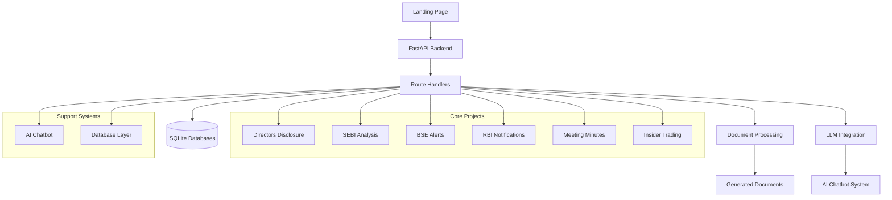

# AEGIS Platform - Landing Page Projects and Chatbot Documentation

## Overview

The AEGIS Platform landing page showcases six core projects and an integrated AI chatbot, each serving distinct purposes in financial data analysis, corporate governance monitoring, and regulatory compliance tracking. These components work together to provide a comprehensive solution for analyzing corporate relationships, regulatory filings, and governance structures.

## Architecture Overview



## The Six Core Projects

### 1. Directors Disclosure Analysis

**Purpose**: Process and analyze director disclosure documents (MBP-1 forms) to map corporate relationships and governance structures.

**Key Features**:
- Parses DOCX documents containing director disclosure information using python-docx
- Extracts director identification numbers (DIN), company affiliations, and appointment details
- Classifies companies into three categories:
  - Public Limited Companies
  - Private Limited Companies (subsidiary of public companies)
  - Private Limited Companies (not subsidiary of public companies)
- Stores data in a normalized SQLite database structure with directors, companies, and directorships tables
- Provides network visualization of director-company relationships
- Identifies cross-directorships and clustering patterns
- Generates document summaries using LLM integration
- Manages director master data and family information
- Supports document upload and processing through web interface

**Technical Implementation**:
- Uses `routes/directors_disclosure.py` for primary API endpoints
- Implements `routes/director_data_analysis.py` for data processing logic
- Employs `routes/director_analysis.py` for network analysis algorithms
- Integrates with LLM services for document summarization
- Uses threading for non-blocking database operations
- Implements proper error handling and logging

**Database Schema**:
```sql
-- Directors table
CREATE TABLE directors (
    din TEXT PRIMARY KEY,
    name TEXT,
    source_file TEXT
);

-- Companies table
CREATE TABLE companies (
    id INTEGER PRIMARY KEY AUTOINCREMENT,
    name TEXT UNIQUE,
    type TEXT
);

-- Directorships table
CREATE TABLE directorships (
    id INTEGER PRIMARY KEY AUTOINCREMENT,
    din TEXT REFERENCES directors(din),
    company_id INTEGER REFERENCES companies(id),
    position TEXT,
    appointment_date TEXT
);
```

**API Endpoints**:
- `GET /api/directors` - Retrieve all directors from the database
  - Returns array of director objects with id, name, and DIN
- `GET /api/company-count` - Get company count statistics
  - Returns counts for public, private subsidiary, and private non-subsidiary companies
- `GET /api/cross-directorship` - Analyze cross-directorship information
  - Returns array of cross-directorship relationships between companies
- `GET /api/clustering` - Identify director clustering patterns
  - Returns array of director clusters based on shared company affiliations
- `GET /api/network` - Generate network data for visualization
  - Returns nodes and edges for network graph visualization
- `GET /api/wtd-count` - Count whole-time directors
  - Returns count of whole-time directors across all companies
- `GET /api/companies-with-director-count` - List companies with director counts
  - Returns array of companies with name, type, and director_count
- `POST /api/process-director-docx` - Process uploaded director disclosure document
  - Accepts DOCX file upload and processes content
  - Returns processing status and results
- `GET /api/document-summaries` - Retrieve document summaries
  - Returns array of processed document summaries
- `POST /api/generate-summary` - Generate document summary using LLM
  - Triggers LLM-based summary generation for specific document

### 2. SEBI Regulatory Analysis

**Purpose**: Monitor and analyze regulatory filings from the Securities and Exchange Board of India (SEBI).

**Key Features**:
- Processes SEBI database containing regulatory notifications from `sebi_excel_master.db`
- Extracts summaries and PDF links for regulatory filings
- Provides chronological listing of regulatory alerts
- Supports pagination for handling large datasets
- Implements data filtering to exclude NIL or empty entries
- Offers sorting by date for chronological presentation

**Technical Implementation**:
- Uses `routes/sebi.py` for API endpoints
- Queries `excel_summaries` table in SEBI database
- Implements pagination with limit and offset parameters
- Uses threading for non-blocking database operations
- Provides proper error handling for missing database files

**Database Schema**:
```sql
-- excel_summaries table
CREATE TABLE excel_summaries (
    id INTEGER PRIMARY KEY AUTOINCREMENT,
    date_key TEXT,
    row_index INTEGER,
    pdf_link TEXT,
    summary TEXT,
    inserted_at TEXT
);
```

**API Endpoints**:
- `GET /sebi-analysis-data` - Retrieve SEBI analysis data with pagination support
  - Parameters: `limit` (default: 100), `offset` (default: 0)
  - Returns paginated list of SEBI filings with date, PDF link, and summary
  - Response includes total count for pagination controls

### 3. BSE Alerts Monitoring

**Purpose**: Track Bombay Stock Exchange (BSE) alerts and notifications for listed companies.

**Key Features**:
- Processes BSE notifications database from `notifications.db`
- Extracts entity names, nature of alerts, summaries, and PDF links
- Filters out NIL or empty entries to focus on substantive content
- Provides chronological listing of alerts sorted by date
- Offers analytics on alert frequency by month
- Implements data validation to ensure quality

**Technical Implementation**:
- Uses `routes/bse.py` for primary API endpoints
- Queries `DailyLogs` table in notifications database
- Implements filtering to exclude records with NULL or 'NIL' links
- Uses threading for non-blocking database operations
- Provides proper error handling for missing database files
- Implements pagination with limit and offset parameters

**Database Schema**:
```sql
-- DailyLogs table
CREATE TABLE DailyLogs (
    SrNo INTEGER PRIMARY KEY,
    EntityName TEXT,
    Link TEXT,
    Nature TEXT,
    Summary TEXT,
    Date TEXT
);
```

**API Endpoints**:
- `GET /bse-alerts` - Retrieve BSE alerts data with pagination
  - Parameters: `limit` (default: 1000), `offset` (default: 0)
  - Returns paginated list of BSE alerts with entity name, link, nature, summary, and date
  - Response includes total count for pagination controls
- `GET /bse-monthly-count` - Get current month BSE notification count
  - Returns count of BSE notifications for the current month
- `GET /api/bse-alerts-monthly-count` - Monthly count of BSE alerts
  - Returns monthly distribution data for BSE alerts
  - Includes total count and average notifications per month
- `GET /api/bse-alerts-monthly-total` - Current month total BSE alerts
  - Returns total count of BSE alerts for the current month

### 4. RBI Notifications Tracking

**Purpose**: Monitor Reserve Bank of India (RBI) notifications affecting financial institutions.

**Key Features**:
- Processes RBI database containing regulatory summaries from `rbi.db`
- Extracts run dates, PDF links, and summaries of notifications
- Filters out NIL entries to focus on substantive content
- Provides chronological listing of notifications sorted by run date
- Implements data validation to ensure quality

**Technical Implementation**:
- Uses `routes/rbi.py` for API endpoints
- Queries `master_summaries` table in RBI database
- Implements filtering to exclude records with both 'NIL' pdf_link and summary
- Uses threading for non-blocking database operations
- Provides proper error handling for missing database files
- Implements pagination with limit and offset parameters

**Database Schema**:
```sql
-- master_summaries table
CREATE TABLE master_summaries (
    id INTEGER PRIMARY KEY AUTOINCREMENT,
    run_date TEXT,
    pdf_link TEXT,
    summary TEXT,
    created_at TEXT
);
```

**API Endpoints**:
- `GET /rbi-analysis-data` - Retrieve RBI analysis data with pagination
  - Parameters: `limit` (default: 100), `offset` (default: 0)
  - Returns paginated list of RBI notifications with run date, PDF link, and summary
  - Response includes total count for pagination controls
- `GET /api/rbi-total-count` - Get total count of RBI notifications
  - Returns total count of non-NIL RBI notifications

### 5. Meeting Minutes Generation

**Purpose**: Automate the creation of professional meeting minutes from various templates and inputs.

**Key Features**:
- Manages predefined meeting places with addresses in `places.db`
- Supports multiple meeting minute templates stored in `public/templates/`
- Generates DOCX documents from templates with dynamic placeholder replacement
- Handles complex placeholder mappings including director names and DIN numbers
- Supports both board meetings and committee meetings
- Processes meeting transcripts for automated Meeting Minutes generation
- Integrates with LLM providers (Groq, Azure OpenAI) for intelligent processing
- Handles large transcript processing through chunking and synthesis

**Technical Implementation**:
- Uses `routes/minutes.py` for place management and document generation
- Uses `routes/ai_assistant.py` for transcript processing and AI-powered generation
- Implements template engine for dynamic placeholder replacement
- Uses python-docx for DOCX document manipulation
- Integrates with LLM services for intelligent transcript analysis
- Implements task management for asynchronous processing
- Uses threading for non-blocking operations

**Database Schema**:
```sql
-- places table
CREATE TABLE places (
    id INTEGER PRIMARY KEY AUTOINCREMENT,
    name TEXT NOT NULL,
    address TEXT NOT NULL,
    is_default BOOLEAN,
    created_at TEXT
);
```

**API Endpoints**:
- `GET /places` - Retrieve all registered meeting places
  - Returns list of places with name, address, and default status
- `POST /places` - Create a new meeting place
  - Parameters: name, address, is_default
  - Returns created place object
- `POST /generate-minutes` - Generate meeting minutes document from template
  - Parameters: Template data including company name, meeting details, attendees, etc.
  - Returns generated DOCX document
- `POST /ai-assistant/upload` - Upload a transcript file for processing
  - Parameters: File upload (DOCX or TXT)
  - Returns task ID for tracking processing status
- `POST /ai-assistant/generate-mom` - Generate Meeting Minutes from uploaded transcript
  - Parameters: task_id
  - Returns processing status
- `GET /ai-assistant/status/{task_id}` - Get status of Meeting Minutes generation
  - Returns task status information
- `GET /ai-assistant/mom/{task_id}` - Get structured Meeting Minutes content
  - Returns JSON structure of Meeting Minutes
- `GET /ai-assistant/download/{task_id}` - Download generated Meeting Minutes DOCX
  - Returns DOCX file download

### 6. Insider Trading Analysis

**Purpose**: Track and analyze insider trading activities across companies, particularly focusing on Adani Group entities.

**Key Features**:
- Processes insider trading databases organized by company and depository in `AdaniInsiderTraders/`
- Categorizes investor activities into four statuses:
  - ADDED (New investors)
  - REMOVED (Exited investors)
  - CHANGED (Position modifications)
  - UNCHANGED (No change in position)
- Identifies top new investors, exits, buyers, and sellers
- Supports filtering by company and depository (CDSL, NSDL, PHY)
- Provides comprehensive KPIs including net investor and share changes
- Implements data validation to ensure quality
- Offers categorized investor lists for analysis

**Technical Implementation**:
- Uses `routes/insider_trading.py` for API endpoints
- Processes multiple SQLite databases organized by company and depository
- Implements filtering logic for company and depository parameters
- Uses threading for non-blocking database operations
- Provides proper error handling for missing database files
- Implements data aggregation for summary statistics

**Database Schema**:
```sql
-- Common tables across databases
-- All_Data table
CREATE TABLE All_Data (
    PANGIR1 TEXT,
    NAME1_latest TEXT,
    EMAIL1_latest TEXT,
    POSITION_latest INTEGER,
    POSITION_older INTEGER,
    POSITION_DIFFERENCE INTEGER,
    STATUS TEXT
);

-- Added table
CREATE TABLE Added (
    PANGIR1 TEXT,
    NAME1_latest TEXT,
    EMAIL1_latest TEXT,
    POSITION_latest INTEGER,
    POSITION_older INTEGER,
    POSITION_DIFFERENCE INTEGER,
    STATUS TEXT
);

-- Removed table
CREATE TABLE Removed (
    PANGIR1 TEXT,
    NAME1_older TEXT,
    EMAIL1_older TEXT,
    POSITION_latest INTEGER,
    POSITION_older INTEGER,
    POSITION_DIFFERENCE INTEGER,
    STATUS TEXT
);

-- Changed table
CREATE TABLE Changed (
    PANGIR1 TEXT,
    NAME1_latest TEXT,
    EMAIL1_latest TEXT,
    POSITION_latest INTEGER,
    POSITION_older INTEGER,
    POSITION_DIFFERENCE INTEGER,
    STATUS TEXT
);

-- Summary table
CREATE TABLE Summary (
    STATUS TEXT,
    COUNT INTEGER
);
```

**API Endpoints**:
- `GET /api/insider-trading/enhanced-details` - Detailed insider trading information with filters
  - Parameters: company (filter by company name), depository (filter by CDSL, NSDL, PHY)
  - Returns summary data and categorized investor information (top new investors, exits, buyers, sellers)
- `GET /api/insider-trading/filter-options` - Available companies and depositories
  - Returns lists of companies and depositories for filtering
- `GET /api/insider-trading/summary` - Summary of insider trading data
  - Returns summary statistics including total companies, investors, shares, and net changes
- `GET /api/insider-trading/details` - Detailed insider trading data
  - Returns comprehensive insider trading data across all companies
- `GET /api/insider-trading/companies` - List of companies with insider trading data
  - Returns list of all companies with insider trading data

## Integrated AI Chatbot

**Purpose**: Provide natural language querying capabilities across all platform data sources.

**Key Features**:
- Processes user queries using natural language understanding
- Integrates with all platform databases (SEBI, BSE, RBI, Directors, etc.)
- Supports streaming responses for real-time interaction
- Allows database-specific queries with configurable result limits
- Can filter results by time periods (last N days)
- Implements context-aware responses based on query history
- Supports multiple LLM providers (Groq, Azure OpenAI)

**Technical Implementation**:
- Uses orchestration layer to route queries to appropriate data sources
- Implements module importing from the separate chatbot_backend system
- Supports both direct responses and streaming for different use cases
- Handles session management and database selection
- Integrates with LLM services for natural language processing
- Uses dynamic database routing based on query content
- Implements response caching for improved performance
- Supports configurable result limits and time-based filtering

**API Endpoints**:
- `POST /api/chat/message` - Process a chat message and return response
  - Parameters: message (user query), session_id (optional), database (optional), limit (optional), last_n_days (optional)
  - Returns structured response with answer and database used
- `POST /api/chat/stream` - Stream chat responses for real-time interaction
  - Parameters: message (user query), session_id (optional), database (optional), limit (optional), last_n_days (optional)
  - Returns streaming text response for real-time display

**Chatbot Backend Architecture**:

The chatbot system is implemented as a separate backend component with the following structure:

```
chatbot_backend/
├── chat_orchestrator/      # Chat flow management
│   └── orchestrator.py     # Main orchestration logic
├── config/                 # Configuration management
│   └── settings.py         # Chatbot configuration
├── data_layer/             # Data models and access
│   └── data_access.py      # Database access layer
├── indexing_layer/         # Data indexing and search
│   └── indexer.py          # Data indexing utilities
├── llm_layer/              # LLM integration
│   └── llm_client.py       # LLM client implementations
└── utils/                  # Utility functions
    └── helpers.py          # Helper functions
```

**Key Components**:
1. **Orchestration Layer**: Routes queries to appropriate data sources and manages conversation flow
2. **Data Layer**: Provides unified access to all platform databases
3. **Indexing Layer**: Optimizes data retrieval through indexing mechanisms
4. **LLM Layer**: Integrates with LLM providers for natural language processing
5. **Configuration**: Manages chatbot settings and behavior

**Supported Databases**:
- Directors Disclosure Database
- SEBI Regulatory Filings Database
- BSE Alerts Database
- RBI Notifications Database
- Insider Trading Databases
- Meeting Minutes Data

**Query Processing Flow**:
1. User submits natural language query
2. Chatbot analyzes query intent and identifies relevant data sources
3. Data is retrieved from appropriate databases
4. LLM processes data to generate natural language response
5. Response is returned to user either directly or through streaming

## Data Flow Architecture

The AEGIS Platform implements a comprehensive data flow architecture that connects user interactions with backend processing and data storage:


### Component Interactions

1. **User Interface**: React frontend that provides interactive dashboards and forms for user interactions
2. **FastAPI Backend**: Central API server that handles all incoming requests and routes them to appropriate handlers
3. **Route Handlers**: Modular API endpoints that implement specific functionality for each project
4. **SQLite Databases**: Persistent storage layer for all structured data
5. **Document Processing**: Handles parsing and processing of unstructured documents (DOCX, TXT)
6. **LLM Integration**: Interfaces with LLM providers for intelligent data processing and summarization
7. **AI Chatbot System**: Natural language processing system that enables conversational data querying
8. **Generated Documents**: Output layer for processed documents and reports

### Data Flow Patterns

#### Read Operations
1. User requests data through UI
2. Request routed to appropriate API endpoint
3. Handler queries relevant SQLite database
4. Data returned to frontend for visualization

#### Write Operations
1. User submits data through UI (e.g., document upload)
2. Request routed to processing endpoint
3. Document processing module parses and normalizes data
4. Normalized data stored in SQLite database
5. Confirmation returned to user

#### AI-Assisted Operations
1. User submits query through chat interface
2. Chatbot analyzes query and identifies relevant data sources
3. Data retrieved from appropriate databases
4. LLM processes data to generate natural language response
5. Response returned to user

#### Document Generation
1. User initiates document generation (e.g., meeting minutes)
2. Request routed to document generation endpoint
3. Template engine applies user data to document template
4. Generated document returned to user for download

## Database Structure Overview

The platform utilizes multiple SQLite databases for different functionalities, each optimized for specific use cases:

1. **directors_data.db** - Director disclosure information
   - Stores parsed director disclosure data from MBP-1 forms
   - Contains directors, companies, and directorships tables
   - Used by Directors Disclosure Analysis project

2. **notifications.db** - BSE alerts and notifications
   - Stores BSE regulatory alerts and notifications
   - Contains DailyLogs table with entity names, links, and summaries
   - Used by BSE Alerts Monitoring project

3. **sebi_excel_master.db** - SEBI regulatory filings
   - Stores SEBI regulatory filing data
   - Contains excel_summaries table with filing details
   - Used by SEBI Regulatory Analysis project

4. **rbi.db** - RBI notifications
   - Stores RBI regulatory notifications
   - Contains master_summaries table with notification details
   - Used by RBI Notifications Tracking project

5. **places.db** - Meeting locations
   - Stores predefined meeting places for minutes generation
   - Contains places table with name, address, and default status
   - Used by Meeting Minutes Generation project

6. **visits.db** - Platform usage tracking
   - Tracks platform visit counts and usage statistics
   - Contains visits table with count and last_updated fields
   - Used across the entire platform for analytics

7. **AdaniInsiderTraders/** - Directory structure for insider trading data
   - Contains multiple SQLite databases organized by company and depository
   - Each database contains All_Data, Added, Removed, Changed, and Summary tables
   - Used by Insider Trading Analysis project

8. **directors.db** - Directors master data
   - Stores master list of directors with DIN and names
   - Contains directors table with id, name, and DIN
   - Used by Directors Disclosure Analysis project

9. **directors_profile.db** - Directors profile information
   - Stores additional director profile data including PAN numbers
   - Contains directors_profile table with DIN and PAN
   - Used by Directors Disclosure Analysis project

10. **Director_Family_Information.db** - Director family data
    - Stores family relationship information for directors
    - Contains Sheet1 table with family member details
    - Used by Directors Disclosure Analysis project

## Integration Points

All projects are integrated through the FastAPI backend, which provides a unified interface for all platform functionality:

### API Integration
- Provides unified RESTful API access through modular route handlers
- Implements asynchronous processing for database operations using thread pools
- Utilizes thread pools (4 workers) for handling blocking I/O operations
- Maintains consistent error handling and logging across all endpoints
- Supports CORS for frontend integration with permissive development settings
- Implements proper HTTP status codes for different response scenarios

### Database Integration
- All projects share common database access patterns
- Implements connection pooling for efficient database operations
- Uses parameterized queries to prevent SQL injection
- Provides consistent data models across projects
- Implements proper indexing for performance optimization

### Frontend Integration
- React frontend consumes all API endpoints through service layers
- Implements consistent data fetching patterns using React Query
- Uses TypeScript for type safety across API contracts
- Implements proper error boundaries for graceful failure handling
- Supports real-time updates through polling mechanisms

### Chatbot Integration
- AI chatbot system integrates with all platform databases
- Implements dynamic database routing based on query content
- Supports both synchronous and streaming response modes
- Integrates with LLM providers for natural language processing
- Maintains session context for conversational continuity

### Document Processing Integration
- All document processing workflows follow consistent patterns
- Implements template-based generation for standardized outputs
- Uses LLM integration for intelligent document summarization
- Supports multiple document formats (DOCX, TXT)
- Implements proper error handling for malformed documents

## Technical Implementation Details

### Asynchronous Processing
- All database operations are performed asynchronously using thread pools
- Blocking I/O operations are isolated from the main event loop
- Thread pool size is configured for optimal performance (4 workers)

### Error Handling
- Comprehensive exception handling with detailed logging
- HTTP error codes for different failure scenarios
- Graceful degradation when optional features are unavailable

### Data Consistency
- Transactional database operations where appropriate
- Data validation at API boundaries
- Proper indexing for performance optimization

This documentation provides a comprehensive overview of the six core projects and integrated chatbot featured on the AEGIS Platform landing page, detailing their purpose, functionality, and technical implementation.
