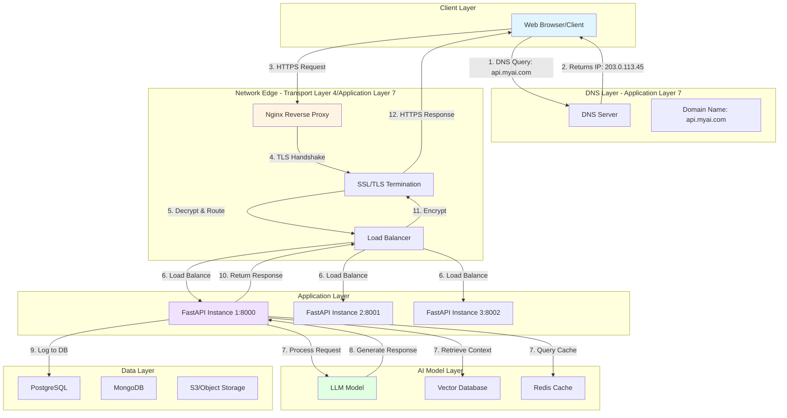
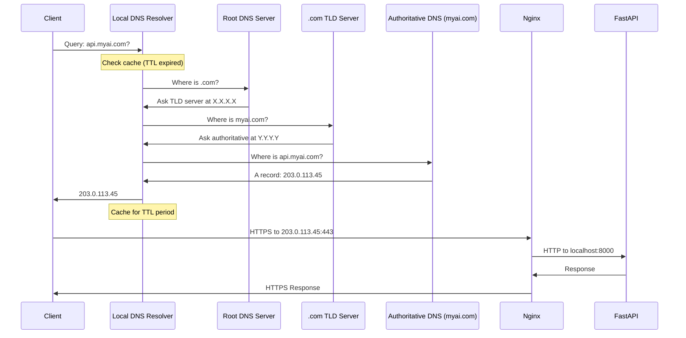
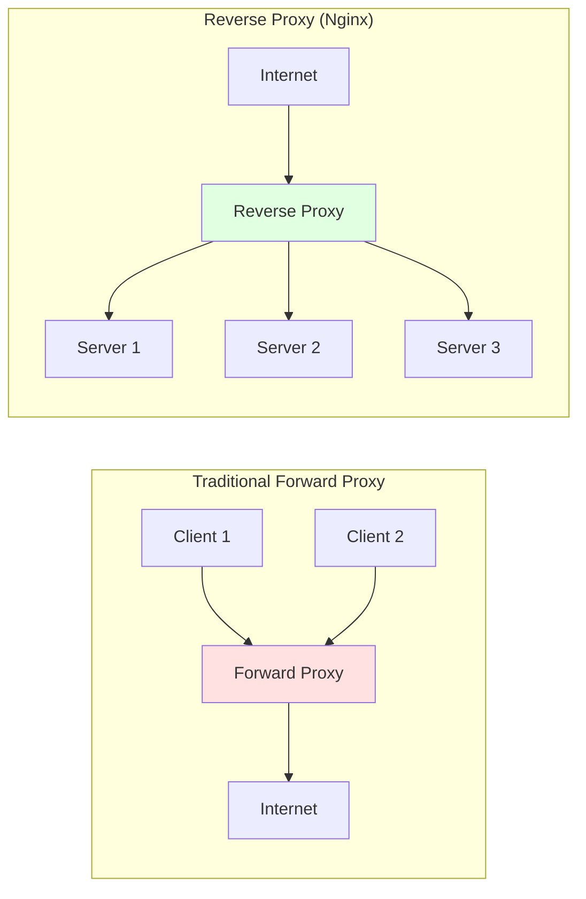
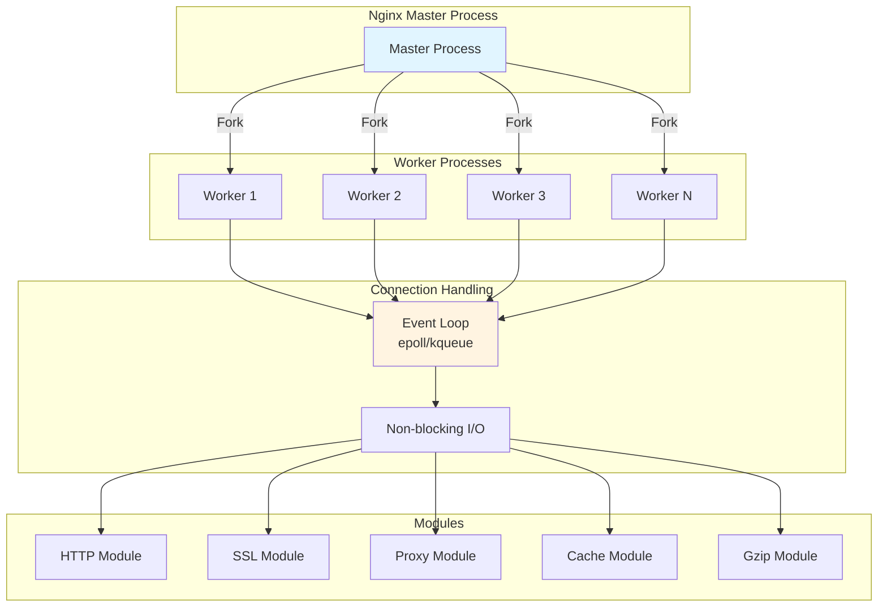
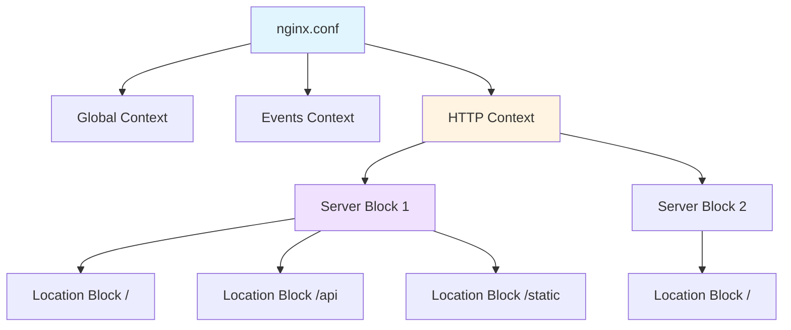
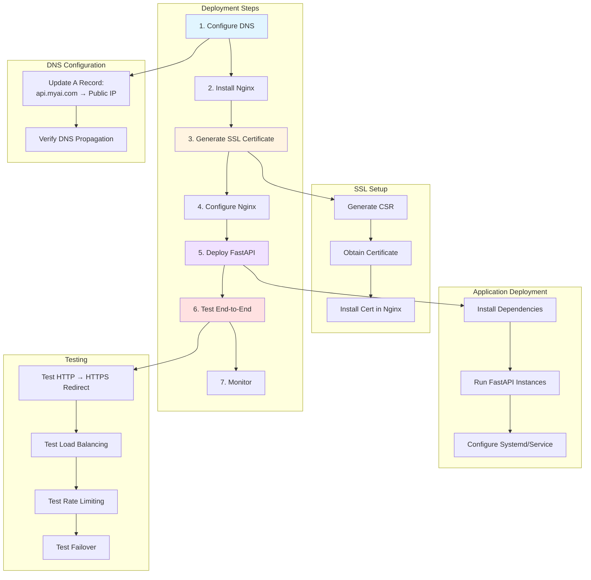

# System Architecture for Production AI Applications: Complete Guide to Nginx, FastAPI, and DNS Integration

## Introduction: The Architect's Perspective

As an AI architect, your responsibility extends far beyond writing Python code that works on localhost:8000. You must design systems that are secure, scalable, observable, and maintainable. A production AI application is a distributed system with multiple layers: the application layer (FastAPI), the reverse proxy layer (Nginx), the DNS layer, load balancing, SSL/TLS termination, monitoring, and more.

This comprehensive guide takes you through every component of a production AI architecture, from theoretical foundations to practical Windows implementation. We'll build a complete system where FastAPI serves your AI models at port 8000, Nginx acts as a reverse proxy and load balancer, and proper DNS configuration makes your service accessible via a clean domain name.

By the end of this guide, you'll understand not just *how* to configure each component, but *why* these architectural decisions matter and how they interact to create a robust, production-ready system.

## Architectural Foundations: The Layered Approach

### The OSI Model and Modern Web Architecture

Before diving into implementation, let's understand where each component sits in the architectural stack:



### Why This Architecture?

**Separation of Concerns**: Each layer has a single, well-defined responsibility:
- **DNS**: Name resolution (domain → IP address)
- **Nginx**: Reverse proxy, SSL termination, load balancing, static file serving
- **FastAPI**: Application logic, AI model inference, business rules
- **Data Layer**: Persistent storage, caching, vector search

**Scalability**: Nginx can distribute traffic across multiple FastAPI instances, allowing horizontal scaling.

**Security**: SSL/TLS termination at Nginx protects data in transit. Nginx also acts as a security barrier, filtering malicious requests before they reach your application.

**Observability**: Each layer generates logs and metrics, creating a complete picture of system health.

**Resilience**: If one FastAPI instance fails, Nginx routes traffic to healthy instances.

## Deep Dive: DNS Architecture and Configuration

### Understanding DNS Resolution

DNS (Domain Name System) is often called the "phone book of the internet." When a user types `api.myai.com`, DNS translates this human-readable name into an IP address that computers can route to.



### DNS Record Types for AI Applications

```mermaid
graph LR
    subgraph "DNS Zone: myai.com"
        A[@ A Record<br/>203.0.113.45] 
        B[api A Record<br/>203.0.113.45]
        C[www CNAME<br/>myai.com]
        D[api-lb A Record<br/>203.0.113.46]
        E[MX Record<br/>mail.myai.com]
        F[TXT Record<br/>SPF/DKIM]
    end
    
    style A fill:#e1f5ff
    style B fill:#fff4e1
    style C fill:#f0e1ff
    style D fill:#ffe1e1
```

**A Record**: Maps hostname to IPv4 address
```
api.myai.com.    3600    IN    A    203.0.113.45
```

**AAAA Record**: Maps hostname to IPv6 address
```
api.myai.com.    3600    IN    AAAA    2001:db8::1
```

**CNAME Record**: Alias from one name to another
```
www.myai.com.    3600    IN    CNAME    myai.com.
```

**TTL (Time To Live)**: How long resolvers cache this record (3600 = 1 hour)

### Configuring DNS for Your AI Service

**Option 1: Cloud DNS (AWS Route 53)**

```python
# Using boto3 to configure Route 53 programmatically
import boto3

route53 = boto3.client('route53')

# Create hosted zone
response = route53.create_hosted_zone(
    Name='myai.com',
    CallerReference=str(hash('myai.com')),
    HostedZoneConfig={
        'Comment': 'AI API hosted zone',
        'PrivateZone': False
    }
)

zone_id = response['HostedZone']['Id']

# Create A record for API endpoint
route53.change_resource_record_sets(
    HostedZoneId=zone_id,
    ChangeBatch={
        'Changes': [{
            'Action': 'CREATE',
            'ResourceRecordSet': {
                'Name': 'api.myai.com',
                'Type': 'A',
                'TTL': 300,  # 5 minutes for faster updates
                'ResourceRecords': [
                    {'Value': '203.0.113.45'}
                ]
            }
        }]
    }
)

# Create CNAME for www
route53.change_resource_record_sets(
    HostedZoneId=zone_id,
    ChangeBatch={
        'Changes': [{
            'Action': 'CREATE',
            'ResourceRecordSet': {
                'Name': 'www.myai.com',
                'Type': 'CNAME',
                'TTL': 300,
                'ResourceRecords': [
                    {'Value': 'myai.com'}
                ]
            }
        }]
    }
)
```

**Option 2: Cloudflare DNS (with CDN and DDoS protection)**

Cloudflare provides DNS, CDN, and security in one package. Configuration via API:

```python
import requests

CLOUDFLARE_API_TOKEN = "your-api-token"
ZONE_ID = "your-zone-id"

headers = {
    "Authorization": f"Bearer {CLOUDFLARE_API_TOKEN}",
    "Content-Type": "application/json"
}

# Create DNS record
dns_record = {
    "type": "A",
    "name": "api",
    "content": "203.0.113.45",
    "ttl": 1,  # Auto TTL
    "proxied": True  # Enable Cloudflare proxy (CDN + security)
}

response = requests.post(
    f"https://api.cloudflare.com/client/v4/zones/{ZONE_ID}/dns_records",
    headers=headers,
    json=dns_record
)
```

**Option 3: Local Hosts File (Development Only)**

For local development/testing:

**Windows**: `C:\Windows\System32\drivers\etc\hosts`
```
127.0.0.1    api.myai.local
127.0.0.1    myai.local
```

**Linux/Mac**: `/etc/hosts`
```
127.0.0.1    api.myai.local
127.0.0.1    myai.local
```

## Nginx: The Reverse Proxy Architecture

### What is a Reverse Proxy?

A reverse proxy sits between clients and your application servers, forwarding client requests to the appropriate backend.



**Benefits of Reverse Proxy:**

1. **Load Balancing**: Distribute traffic across multiple backends
2. **SSL/TLS Termination**: Handle encryption/decryption at the edge
3. **Caching**: Cache static content and API responses
4. **Compression**: Reduce bandwidth with gzip/brotli
5. **Security**: Hide backend infrastructure, filter malicious traffic
6. **Rate Limiting**: Protect against abuse
7. **Static File Serving**: Offload static assets from application

### Nginx Architecture Patterns



**Key Architectural Concepts:**

**Master-Worker Model**: The master process manages worker processes, which handle actual client connections.

**Event-Driven Architecture**: Each worker uses an event loop (epoll on Linux, kqueue on BSD/Mac) to handle thousands of concurrent connections efficiently.

**Non-blocking I/O**: Workers never block waiting for I/O, making Nginx extremely efficient for high-concurrency scenarios.

## Installing and Configuring Nginx on Windows

### Step 1: Installation

Download Nginx for Windows from nginx.org:

```powershell
# Using PowerShell (as Administrator)

# Download Nginx
Invoke-WebRequest -Uri "http://nginx.org/download/nginx-1.24.0.zip" `
    -OutFile "$env:TEMP\nginx.zip"

# Extract to C:\nginx
Expand-Archive -Path "$env:TEMP\nginx.zip" -DestinationPath "C:\"
Rename-Item -Path "C:\nginx-1.24.0" -NewName "nginx"

# Verify installation
cd C:\nginx
.\nginx.exe -v
```

### Step 2: Directory Structure Understanding

```
C:\nginx\
├── conf\                   # Configuration files
│   ├── nginx.conf         # Main configuration
│   ├── mime.types         # MIME type mappings
│   └── sites-enabled\     # Site configurations (we'll create this)
├── html\                  # Default static files
│   ├── index.html
│   └── 50x.html
├── logs\                  # Access and error logs
│   ├── access.log
│   └── error.log
├── temp\                  # Temporary files
└── nginx.exe              # Main executable
```

### Step 3: Core Configuration Architecture

The main `nginx.conf` follows a hierarchical structure:



**Configuration Hierarchy:**

```nginx
# Global context: affects entire Nginx
user  nginx;
worker_processes  auto;

# Events context: connection processing
events {
    worker_connections  1024;
}

# HTTP context: all HTTP-related settings
http {
    # HTTP-level directives
    include       mime.types;
    default_type  application/octet-stream;
    
    # Server context: virtual host
    server {
        listen       80;
        server_name  api.myai.com;
        
        # Location context: URI-specific settings
        location / {
            proxy_pass http://localhost:8000;
        }
    }
}
```

### Step 4: Production-Grade Nginx Configuration

Let's build a complete, production-ready Nginx configuration for our AI FastAPI service:

**C:\nginx\conf\nginx.conf**

```nginx
# ============================================
# GLOBAL CONTEXT
# ============================================
# Windows doesn't support 'user' directive
# user nginx;

# Auto-detect number of CPU cores
worker_processes  auto;

# Error log configuration
error_log  logs/error.log warn;
pid        logs/nginx.pid;

# ============================================
# EVENTS CONTEXT
# ============================================
events {
    # Maximum simultaneous connections per worker
    worker_connections  1024;
    
    # Optimize for Windows (use default method)
    # Linux would use: epoll
    # BSD would use: kqueue
}

# ============================================
# HTTP CONTEXT
# ============================================
http {
    # ---------------------------------------
    # MIME Types and Charset
    # ---------------------------------------
    include       mime.types;
    default_type  application/octet-stream;
    charset       utf-8;
    
    # ---------------------------------------
    # Logging Configuration
    # ---------------------------------------
    log_format main '$remote_addr - $remote_user [$time_local] '
                    '"$request" $status $body_bytes_sent '
                    '"$http_referer" "$http_user_agent" '
                    '$request_time $upstream_response_time';
    
    access_log  logs/access.log  main;
    
    # ---------------------------------------
    # Performance Optimization
    # ---------------------------------------
    sendfile           on;      # Efficient file transfer
    tcp_nopush         on;      # Send headers in one packet
    tcp_nodelay        on;      # Don't buffer small packets
    keepalive_timeout  65;      # Keep connections alive
    
    # Gzip compression
    gzip              on;
    gzip_vary         on;
    gzip_proxied      any;
    gzip_comp_level   6;
    gzip_types        text/plain text/css text/xml text/javascript
                      application/json application/javascript
                      application/xml+rss application/rss+xml
                      image/svg+xml;
    
    # ---------------------------------------
    # Connection and Request Limits
    # ---------------------------------------
    client_max_body_size       100M;   # Max request body size
    client_body_buffer_size    128k;
    client_header_buffer_size  1k;
    large_client_header_buffers 4 8k;
    
    # Timeouts
    client_body_timeout   12;
    client_header_timeout 12;
    send_timeout          10;
    
    # ---------------------------------------
    # Upstream Backend Configuration
    # ---------------------------------------
    # Define backend FastAPI instances
    upstream fastapi_backend {
        # Load balancing algorithm
        # Options: round_robin (default), least_conn, ip_hash
        least_conn;  # Send to server with fewest connections
        
        # FastAPI instance 1
        server 127.0.0.1:8000 weight=1 max_fails=3 fail_timeout=30s;
        
        # FastAPI instance 2 (if running multiple)
        # server 127.0.0.1:8001 weight=1 max_fails=3 fail_timeout=30s;
        
        # FastAPI instance 3 (if running multiple)
        # server 127.0.0.1:8002 weight=1 max_fails=3 fail_timeout=30s;
        
        # Connection pooling
        keepalive 32;
    }
    
    # ---------------------------------------
    # Rate Limiting Configuration
    # ---------------------------------------
    # Define rate limit zones
    limit_req_zone $binary_remote_addr zone=api_limit:10m rate=10r/s;
    limit_req_zone $binary_remote_addr zone=general_limit:10m rate=100r/s;
    
    # ---------------------------------------
    # SSL/TLS Configuration (for HTTPS)
    # ---------------------------------------
    # SSL session cache
    ssl_session_cache   shared:SSL:10m;
    ssl_session_timeout 10m;
    
    # Modern TLS configuration
    ssl_protocols       TLSv1.2 TLSv1.3;
    ssl_prefer_server_ciphers on;
    ssl_ciphers         'ECDHE-ECDSA-AES128-GCM-SHA256:ECDHE-RSA-AES128-GCM-SHA256';
    
    # ============================================
    # HTTP SERVER (Port 80) - Redirect to HTTPS
    # ============================================
    server {
        listen       80;
        listen       [::]:80;  # IPv6
        server_name  api.myai.com myai.com;
        
        # Redirect all HTTP to HTTPS
        return 301 https://$server_name$request_uri;
        
        # Alternative: Serve only ACME challenge for Let's Encrypt
        # location /.well-known/acme-challenge/ {
        #     root /var/www/certbot;
        # }
    }
    
    # ============================================
    # HTTPS SERVER (Port 443) - Main Application
    # ============================================
    server {
        listen       443 ssl http2;
        listen       [::]:443 ssl http2;  # IPv6
        server_name  api.myai.com;
        
        # =======================================
        # SSL Certificate Configuration
        # =======================================
        # Path to SSL certificate and key
        # For development: use self-signed
        # For production: use Let's Encrypt or commercial cert
        ssl_certificate      cert/api.myai.com.crt;
        ssl_certificate_key  cert/api.myai.com.key;
        
        # =======================================
        # Security Headers
        # =======================================
        add_header Strict-Transport-Security "max-age=31536000; includeSubDomains" always;
        add_header X-Frame-Options "SAMEORIGIN" always;
        add_header X-Content-Type-Options "nosniff" always;
        add_header X-XSS-Protection "1; mode=block" always;
        add_header Referrer-Policy "strict-origin-when-cross-origin" always;
        
        # =======================================
        # CORS Configuration (if needed)
        # =======================================
        # Allow specific origins
        # add_header Access-Control-Allow-Origin "https://myai.com" always;
        # add_header Access-Control-Allow-Methods "GET, POST, PUT, DELETE, OPTIONS" always;
        # add_header Access-Control-Allow-Headers "Authorization, Content-Type" always;
        
        # =======================================
        # Root Location - Proxy to FastAPI
        # =======================================
        location / {
            # Apply rate limiting
            limit_req zone=general_limit burst=20 nodelay;
            
            # Proxy to upstream backend
            proxy_pass http://fastapi_backend;
            
            # Proxy headers
            proxy_set_header Host $host;
            proxy_set_header X-Real-IP $remote_addr;
            proxy_set_header X-Forwarded-For $proxy_add_x_forwarded_for;
            proxy_set_header X-Forwarded-Proto $scheme;
            proxy_set_header X-Forwarded-Host $server_name;
            
            # Timeouts for AI inference (may be long)
            proxy_connect_timeout  300s;
            proxy_send_timeout     300s;
            proxy_read_timeout     300s;
            
            # WebSocket support (if using streaming)
            proxy_http_version 1.1;
            proxy_set_header Upgrade $http_upgrade;
            proxy_set_header Connection "upgrade";
            
            # Buffering (disable for streaming responses)
            proxy_buffering off;
            proxy_request_buffering off;
        }
        
        # =======================================
        # API-Specific Location
        # =======================================
        location /api/ {
            # Stricter rate limiting for API
            limit_req zone=api_limit burst=5 nodelay;
            
            # Proxy to FastAPI
            proxy_pass http://fastapi_backend/api/;
            
            # Headers
            proxy_set_header Host $host;
            proxy_set_header X-Real-IP $remote_addr;
            proxy_set_header X-Forwarded-For $proxy_add_x_forwarded_for;
            proxy_set_header X-Forwarded-Proto $scheme;
            
            # Extended timeout for LLM inference
            proxy_read_timeout 600s;
        }
        
        # =======================================
        # Static Files Location
        # =======================================
        location /static/ {
            alias C:/nginx/html/static/;
            
            # Caching for static files
            expires 30d;
            add_header Cache-Control "public, immutable";
            
            # Security
            add_header X-Content-Type-Options "nosniff" always;
        }
        
        # =======================================
        # Health Check Endpoint
        # =======================================
        location /health {
            access_log off;  # Don't log health checks
            
            proxy_pass http://fastapi_backend/health;
            proxy_set_header Host $host;
        }
        
        # =======================================
        # Nginx Status (for monitoring)
        # =======================================
        location /nginx_status {
            stub_status on;
            access_log off;
            
            # Restrict access to localhost
            allow 127.0.0.1;
            deny all;
        }
        
        # =======================================
        # Error Pages
        # =======================================
        error_page 404 /404.html;
        location = /404.html {
            root C:/nginx/html;
            internal;
        }
        
        error_page 500 502 503 504 /50x.html;
        location = /50x.html {
            root C:/nginx/html;
            internal;
        }
    }
}
```

### Understanding the Configuration

Let's break down the key sections:

**1. Upstream Block:**
```nginx
upstream fastapi_backend {
    least_conn;
    server 127.0.0.1:8000 weight=1 max_fails=3 fail_timeout=30s;
}
```
- `least_conn`: Sends requests to server with fewest active connections
- `weight=1`: Relative weight for load balancing
- `max_fails=3`: Mark server as down after 3 failed attempts
- `fail_timeout=30s`: How long to consider server down

**2. Rate Limiting:**
```nginx
limit_req_zone $binary_remote_addr zone=api_limit:10m rate=10r/s;
```
- `$binary_remote_addr`: Use client IP for limiting
- `zone=api_limit:10m`: Store state in 10MB memory zone
- `rate=10r/s`: Allow 10 requests per second per IP

**3. Proxy Headers:**
```nginx
proxy_set_header X-Real-IP $remote_addr;
proxy_set_header X-Forwarded-For $proxy_add_x_forwarded_for;
```
These headers pass client information to FastAPI, crucial for:
- Logging actual client IPs
- Security checks
- Rate limiting at application level

**4. Timeouts:**
```nginx
proxy_read_timeout 600s;
```
AI inference can take time (especially for large models). Extended timeouts prevent premature disconnections.

## FastAPI Application Architecture

Now let's build the FastAPI application that Nginx will proxy to.

### Step 1: Complete FastAPI Application

**app.py**

```python
from fastapi import FastAPI, HTTPException, Request, Header
from fastapi.middleware.cors import CORSMiddleware
from fastapi.middleware.gzip import GZipMiddleware
from fastapi.responses import StreamingResponse
from pydantic import BaseModel
from typing import Optional, List
import time
import logging
from datetime import datetime
import asyncio

# ============================================
# Logging Configuration
# ============================================
logging.basicConfig(
    level=logging.INFO,
    format='%(asctime)s - %(name)s - %(levelname)s - %(message)s',
    handlers=[
        logging.FileHandler('app.log'),
        logging.StreamHandler()
    ]
)
logger = logging.getLogger(__name__)

# ============================================
# FastAPI Application
# ============================================
app = FastAPI(
    title="AI API Service",
    description="Production AI API with Nginx integration",
    version="1.0.0",
    docs_url="/docs",
    redoc_url="/redoc",
)

# ============================================
# Middleware Configuration
# ============================================
# CORS Middleware
app.add_middleware(
    CORSMiddleware,
    allow_origins=["https://myai.com"],  # Production: specify allowed origins
    allow_credentials=True,
    allow_methods=["*"],
    allow_headers=["*"],
)

# GZip Compression
app.add_middleware(GZipMiddleware, minimum_size=1000)

# Custom Request Logging Middleware
@app.middleware("http")
async def log_requests(request: Request, call_next):
    start_time = time.time()
    
    # Log request
    logger.info(f"Request: {request.method} {request.url.path}")
    logger.info(f"Client IP: {request.client.host}")
    logger.info(f"Headers: {dict(request.headers)}")
    
    # Process request
    response = await call_next(request)
    
    # Calculate duration
    process_time = time.time() - start_time
    
    # Log response
    logger.info(f"Response: {response.status_code} - {process_time:.3f}s")
    
    # Add custom header
    response.headers["X-Process-Time"] = str(process_time)
    
    return response

# ============================================
# Request/Response Models
# ============================================
class ChatRequest(BaseModel):
    message: str
    max_tokens: int = 500
    temperature: float = 0.7
    stream: bool = False

class ChatResponse(BaseModel):
    response: str
    tokens_used: int
    latency_ms: float
    model: str

# ============================================
# Health Check Endpoint
# ============================================
@app.get("/health")
async def health_check():
    """Health check endpoint for load balancer."""
    return {
        "status": "healthy",
        "timestamp": datetime.now().isoformat(),
        "version": "1.0.0"
    }

# ============================================
# Root Endpoint
# ============================================
@app.get("/")
async def root(
    request: Request,
    x_real_ip: Optional[str] = Header(None),
    x_forwarded_for: Optional[str] = Header(None)
):
    """Root endpoint showing request details."""
    
    # Get real client IP (from Nginx headers)
    client_ip = x_real_ip or x_forwarded_for or request.client.host
    
    return {
        "message": "AI API Service",
        "version": "1.0.0",
        "client_ip": client_ip,
        "request_id": request.headers.get("X-Request-ID"),
        "timestamp": datetime.now().isoformat()
    }

# ============================================
# Chat Endpoint (Non-Streaming)
# ============================================
@app.post("/api/chat", response_model=ChatResponse)
async def chat(
    request: ChatRequest,
    x_real_ip: Optional[str] = Header(None)
):
    """AI chat endpoint."""
    
    start_time = time.time()
    
    # Log request
    logger.info(f"Chat request from IP: {x_real_ip}")
    logger.info(f"Message: {request.message[:100]}...")
    
    try:
        # Simulate AI processing
        # In production, this would call your LLM
        await asyncio.sleep(0.5)  # Simulate inference time
        
        response_text = f"AI Response to: {request.message}"
        tokens_used = len(response_text.split())
        
        latency = (time.time() - start_time) * 1000
        
        return ChatResponse(
            response=response_text,
            tokens_used=tokens_used,
            latency_ms=latency,
            model="llama-3.1-8b"
        )
        
    except Exception as e:
        logger.error(f"Error in chat endpoint: {str(e)}")
        raise HTTPException(status_code=500, detail=str(e))

# ============================================
# Streaming Chat Endpoint
# ============================================
@app.post("/api/chat/stream")
async def chat_stream(
    request: ChatRequest,
    x_real_ip: Optional[str] = Header(None)
):
    """Streaming AI chat endpoint."""
    
    async def generate():
        """Generate streaming response."""
        
        # Simulate streaming token generation
        response_text = f"Streaming response to: {request.message}"
        words = response_text.split()
        
        for word in words:
            # Yield each word with a small delay
            yield f"data: {word}\n\n"
            await asyncio.sleep(0.1)
        
        # End of stream
        yield "data: [DONE]\n\n"
    
    return StreamingResponse(
        generate(),
        media_type="text/event-stream",
        headers={
            "Cache-Control": "no-cache",
            "Connection": "keep-alive",
        }
    )

# ============================================
# Run Application
# ============================================
if __name__ == "__main__":
    import uvicorn
    
    uvicorn.run(
        app,
        host="127.0.0.1",  # Only listen on localhost (Nginx will proxy)
        port=8000,
        log_level="info",
        access_log=True
    )
```

### Step 2: Running Multiple FastAPI Instances

For high availability, run multiple FastAPI instances:

**run_instances.ps1** (PowerShell script)

```powershell
# Start FastAPI instances on different ports

# Instance 1
Start-Process python -ArgumentList "app.py --port 8000" -WindowStyle Minimized

# Instance 2
Start-Process python -ArgumentList "app.py --port 8001" -WindowStyle Minimized

# Instance 3
Start-Process python -ArgumentList "app.py --port 8002" -WindowStyle Minimized

Write-Host "FastAPI instances started on ports 8000, 8001, 8002"
```

## Complete Deployment Workflow

Now let's put everything together:



### Step-by-Step Deployment

**1. Start Nginx**

```powershell
# Windows
cd C:\nginx
.\nginx.exe

# Check if running
.\nginx.exe -t  # Test configuration
tasklist /FI "IMAGENAME eq nginx.exe"
```

**2. Start FastAPI**

```powershell
# Activate virtual environment
cd C:\projects\ai-api
.\venv\Scripts\Activate.ps1

# Start application
python app.py
```

**3. Test Local Access**

```powershell
# Test FastAPI directly
curl http://localhost:8000/health

# Test through Nginx (assuming DNS configured)
curl https://api.myai.com/health
```

**4. Monitor Logs**

**Nginx Access Log**: `C:\nginx\logs\access.log`
```
203.0.113.100 - - [01/Feb/2026:10:15:30 +0000] "POST /api/chat HTTP/2.0" 200 1234 "https://myai.com" "Mozilla/5.0" 0.523 0.498
```

**Nginx Error Log**: `C:\nginx\logs\error.log`
```
2026/02/01 10:15:30 [error] 1234#5678: *1 upstream timed out (110: Connection timed out) while reading response header from upstream
```

**FastAPI Log**: `app.log`
```
2026-02-01 10:15:30 - __main__ - INFO - Request: POST /api/chat
2026-02-01 10:15:30 - __main__ - INFO - Client IP: 203.0.113.100
2026-02-01 10:15:30 - __main__ - INFO - Response: 200 - 0.498s
```

## Production Best Practices

### 1. Security Hardening

```nginx
# Disable server tokens (hide Nginx version)
server_tokens off;

# Limit request methods
if ($request_method !~ ^(GET|POST|HEAD|OPTIONS)$) {
    return 405;
}

# Block certain user agents
if ($http_user_agent ~* (bot|crawler|spider)) {
    return 403;
}

# Add security headers
add_header X-Frame-Options "DENY" always;
add_header X-Content-Type-Options "nosniff" always;
add_header Content-Security-Policy "default-src 'self'" always;
```

### 2. Performance Tuning

```nginx
# Worker optimization
worker_processes auto;
worker_rlimit_nofile 65535;

events {
    worker_connections 4096;
    use epoll;  # Linux only
    multi_accept on;
}

# Buffer sizes
client_body_buffer_size 128k;
client_max_body_size 100M;
large_client_header_buffers 4 16k;

# Caching
proxy_cache_path /var/cache/nginx levels=1:2 keys_zone=api_cache:10m max_size=1g inactive=60m;

location /api/ {
    proxy_cache api_cache;
    proxy_cache_valid 200 5m;
    proxy_cache_key "$scheme$request_method$host$request_uri";
    add_header X-Cache-Status $upstream_cache_status;
}
```

### 3. Monitoring and Alerting

```python
# monitoring.py - FastAPI metrics endpoint

from prometheus_client import Counter, Histogram, generate_latest
from fastapi import Response

# Define metrics
request_count = Counter(
    'api_requests_total',
    'Total API requests',
    ['method', 'endpoint', 'status']
)

request_duration = Histogram(
    'api_request_duration_seconds',
    'API request duration',
    ['method', 'endpoint']
)

@app.get("/metrics")
async def metrics():
    """Prometheus metrics endpoint."""
    return Response(
        generate_latest(),
        media_type="text/plain"
    )

# Use in middleware
@app.middleware("http")
async def track_metrics(request: Request, call_next):
    start_time = time.time()
    
    response = await call_next(request)
    
    # Track metrics
    request_count.labels(
        method=request.method,
        endpoint=request.url.path,
        status=response.status_code
    ).inc()
    
    request_duration.labels(
        method=request.method,
        endpoint=request.url.path
    ).observe(time.time() - start_time)
    
    return response
```

## Conclusion

You now have a complete, production-ready architecture for deploying AI applications with Nginx, FastAPI, and proper DNS configuration. This architecture provides:

✅ **Scalability**: Load balancing across multiple FastAPI instances
✅ **Security**: SSL/TLS, rate limiting, security headers
✅ **Performance**: Caching, compression, optimized connections
✅ **Observability**: Comprehensive logging and metrics
✅ **Reliability**: Health checks, failover, graceful degradation

Key Architectural Principles:

1. **Separation of Concerns**: Each layer has a single responsibility
2. **Defense in Depth**: Multiple layers of security
3. **Fail Fast**: Validate early, fail gracefully
4. **Observability**: Log everything, monitor everything
5. **Scalability**: Horizontal scaling through load balancing

Remember: Architecture is not about making things complex. It's about making things reliable, maintainable, and scalable while keeping each component simple and focused.

---

*This is part 1 of the AI Architect series. Next: Context Engineering - The Art of Providing Perfect Information to AI Systems*
