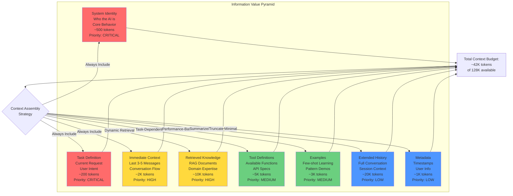
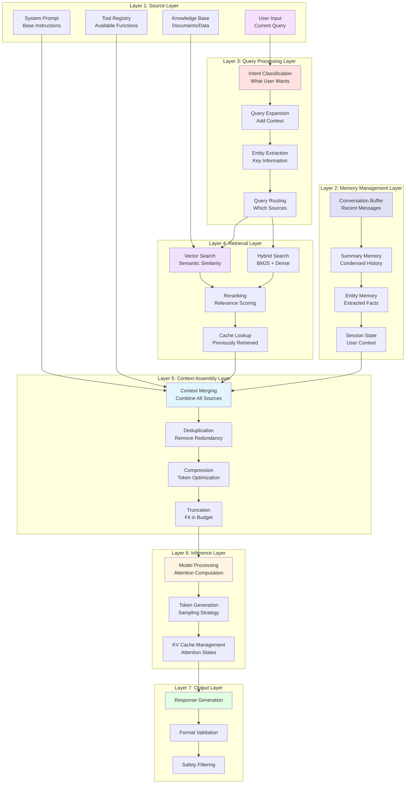
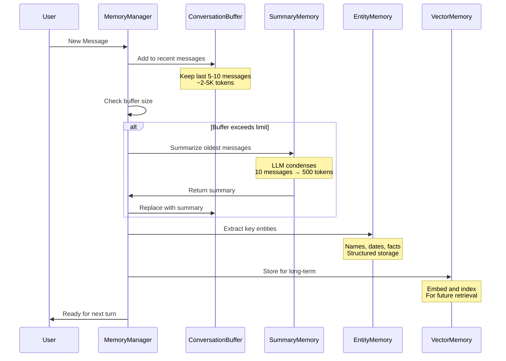
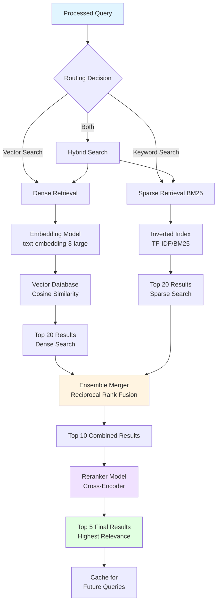
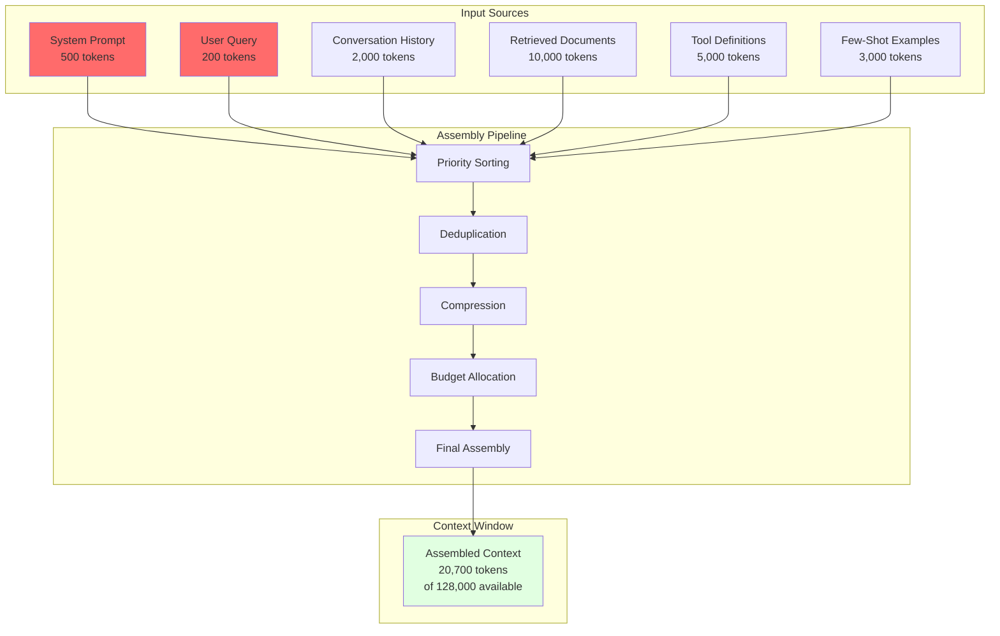
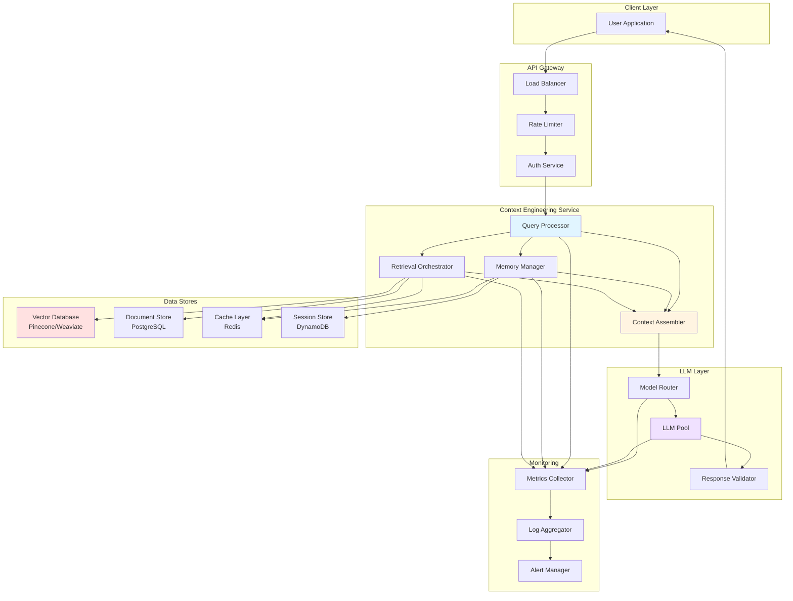

# Context Engineering: The Architect's Guide to Intelligent Information Management for AI Systems

## Introduction: Beyond Prompt Engineering

As an AI architect in 2026, you understand that building production AI systems is fundamentally about managing information flow. While developers focus on writing prompts, architects must design the entire **context engineering stack**—the systematic approach to gathering, organizing, prioritizing, and delivering information to language models.

Context engineering is the architectural discipline that determines how AI systems access and use information. It encompasses prompt design, but also includes retrieval strategies, memory management, information prioritization, dynamic context assembly, and performance optimization. Poor context architecture leads to hallucinations, inconsistent outputs, and systems that work in demos but fail in production.

This comprehensive guide provides the complete architectural framework for context engineering, from theoretical foundations through production implementation. You'll learn how to design context systems that are reliable, scalable, and maintainable.

## Theoretical Foundation: Understanding the Context Window

### The Computational Model: Context as Working Memory

Andrej Karpaty's analogy perfectly captures the essence: **"The LLM is the CPU, the context window is the RAM."** Let's build a complete mental model:

```mermaid
graph TB
    subgraph "Traditional Computer System"
        CPU[CPU<br/>Arithmetic Logic Unit<br/>Executes Instructions]
        L1[L1 Cache<br/>32-64 KB<br/>~1 ns latency]
        L2[L2 Cache<br/>256 KB - 1 MB<br/>~3-10 ns latency]
        L3[L3 Cache<br/>8-32 MB<br/>~20-50 ns latency]
        RAM[RAM<br/>8-64 GB<br/>~100 ns latency]
        SSD[SSD Storage<br/>512 GB - 4 TB<br/>~100 μs latency]
        HDD[HDD Storage<br/>Unlimited<br/>~10 ms latency]
        
        CPU <-->|Ultra Fast| L1
        L1 <-->|Very Fast| L2
        L2 <-->|Fast| L3
        L3 <-->|Medium| RAM
        RAM <-->|Slow| SSD
        SSD <-->|Very Slow| HDD
    end
    
    subgraph "LLM System Architecture"
        LLM[LLM Inference<br/>Neural Network<br/>Token Processing]
        KV[KV Cache<br/>Attention States<br/>GPU Memory]
        Context[Context Window<br/>128K - 1M tokens<br/>Immediate Access]
        ShortMem[Conversation History<br/>Last N messages<br/>Session Memory]
        Vector[Vector Database<br/>Semantic Search<br/>Millions of chunks]
        FullDB[Document Store<br/>Complete Corpus<br/>Billions of docs]
        
        LLM <-->|~1 ms| KV
        KV <-->|~10 ms| Context
        Context <-->|~50 ms| ShortMem
        ShortMem <-->|~200 ms| Vector
        Vector <-->|~2 sec| FullDB
    end
    
    style CPU fill:#e1f5ff
    style LLM fill:#e1f5ff
    style RAM fill:#fff4e1
    style Context fill:#fff4e1
    style SSD fill:#f0e1ff
    style Vector fill:#f0e1ff
```



**Key Architectural Insights:**

1. **Hierarchical Memory**: Information exists at different levels with different access speeds and capacities
2. **Locality of Reference**: Frequently accessed information should be in fast memory
3. **Cache Optimization**: Strategic placement reduces overall latency
4. **Trade-offs**: Larger context = slower processing, smaller context = less information

### The Information Pyramid: Context Hierarchy



**Architecture Principle**: Not all information is equally valuable. Context engineering is fundamentally about **intelligent information prioritization** and **dynamic budget allocation**.

## The Complete Context Engineering Stack

### Seven-Layer Architecture



### Layer-by-Layer Deep Dive

#### Layer 1: Source Layer - Information Origins

This is where all information enters the system. Each source has different characteristics:

```python
from typing import Dict, List, Optional
from dataclasses import dataclass
from datetime import datetime

@dataclass
class InformationSource:
    """Base class for information sources."""
    source_id: str
    priority: int  # 1 = highest
    max_tokens: int
    refresh_rate: Optional[int] = None  # seconds
    
class SystemPromptSource(InformationSource):
    """System-level instructions that define AI behavior."""
    
    def __init__(self):
        super().__init__(
            source_id="system_prompt",
            priority=1,  # Always highest priority
            max_tokens=500,
            refresh_rate=None  # Static, never refreshes
        )
        self.template = """You are a helpful AI assistant specialized in {domain}.

Your core capabilities:
- {capabilities}

Your constraints:
- {constraints}

Your tone and style:
- {style_guide}"""
    
    def render(self, context: Dict) -> str:
        """Render system prompt with dynamic values."""
        return self.template.format(
            domain=context.get('domain', 'general assistance'),
            capabilities='\n- '.join(context.get('capabilities', [])),
            constraints='\n- '.join(context.get('constraints', [])),
            style_guide=context.get('style_guide', 'Professional and friendly')
        )

class UserInputSource(InformationSource):
    """Current user query and immediate context."""
    
    def __init__(self):
        super().__init__(
            source_id="user_input",
            priority=1,  # Critical - this is what we're responding to
            max_tokens=2000,
            refresh_rate=0  # Changes with every request
        )
    
    def process(self, raw_input: str) -> Dict:
        """Process and enrich user input."""
        return {
            'raw_query': raw_input,
            'timestamp': datetime.now().isoformat(),
            'token_count': len(raw_input.split()),
            'detected_intent': self._classify_intent(raw_input),
            'extracted_entities': self._extract_entities(raw_input),
        }
    
    def _classify_intent(self, query: str) -> str:
        """Classify user intent (simplified)."""
        # In production, use a classifier model
        query_lower = query.lower()
        if any(word in query_lower for word in ['how', 'what', 'why']):
            return 'question'
        elif any(word in query_lower for word in ['create', 'generate', 'make']):
            return 'generation'
        elif any(word in query_lower for word in ['analyze', 'review', 'check']):
            return 'analysis'
        return 'general'
    
    def _extract_entities(self, query: str) -> List[str]:
        """Extract key entities from query."""
        # In production, use NER model
        return []

class ToolRegistrySource(InformationSource):
    """Definitions of available tools/functions."""
    
    def __init__(self):
        super().__init__(
            source_id="tool_registry",
            priority=2,  # High priority when tools are needed
            max_tokens=5000,
            refresh_rate=3600  # Refresh hourly
        )
        self.tools = {}
    
    def register_tool(self, tool_spec: Dict):
        """Register a new tool."""
        self.tools[tool_spec['name']] = tool_spec
    
    def get_relevant_tools(self, intent: str) -> List[Dict]:
        """Get tools relevant to user intent."""
        # Filter tools based on intent
        relevant = []
        for name, spec in self.tools.items():
            if intent in spec.get('applicable_intents', []):
                relevant.append(spec)
        return relevant

class KnowledgeBaseSource(InformationSource):
    """Connection to vector database and documents."""
    
    def __init__(self, vector_db):
        super().__init__(
            source_id="knowledge_base",
            priority=3,  # Retrieved dynamically based on query
            max_tokens=10000,
            refresh_rate=None  # On-demand retrieval
        )
        self.vector_db = vector_db
        self.cache = {}
    
    def retrieve(self, query: str, k: int = 5) -> List[Dict]:
        """Retrieve relevant documents."""
        # Check cache first
        cache_key = f"{query[:50]}_{k}"
        if cache_key in self.cache:
            return self.cache[cache_key]
        
        # Retrieve from vector DB
        results = self.vector_db.similarity_search(query, k=k)
        
        # Cache results
        self.cache[cache_key] = results
        
        return results
```

#### Layer 2: Memory Management Layer - Maintaining Conversation State



**Implementation**:

```python
from typing import List, Dict, Optional
from langchain.memory import ConversationBufferMemory, ConversationSummaryMemory
from langchain.schema import BaseMessage, HumanMessage, AIMessage

class HybridMemoryManager:
    """Advanced memory management with multiple strategies."""
    
    def __init__(
        self,
        llm,
        buffer_size: int = 5,
        max_buffer_tokens: int = 2000,
        summary_threshold: int = 10,
    ):
        """
        Initialize hybrid memory manager.
        
        Args:
            llm: Language model for summarization
            buffer_size: Number of recent messages to keep in full
            max_buffer_tokens: Maximum tokens in buffer before summarizing
            summary_threshold: Number of messages before creating summary
        """
        self.llm = llm
        self.buffer_size = buffer_size
        self.max_buffer_tokens = max_buffer_tokens
        self.summary_threshold = summary_threshold
        
        # Short-term memory: Recent messages
        self.conversation_buffer = ConversationBufferMemory(
            return_messages=True,
            memory_key="recent_history",
        )
        
        # Long-term memory: Summarized history
        self.summary_memory = ConversationSummaryMemory(
            llm=llm,
            memory_key="conversation_summary",
        )
        
        # Entity memory: Extracted facts
        self.entity_memory = {}
        
        # Message history
        self.full_history: List[BaseMessage] = []
    
    def add_message(self, message: BaseMessage):
        """Add message to all memory types."""
        
        # Add to full history
        self.full_history.append(message)
        
        # Add to buffer
        self.conversation_buffer.chat_memory.add_message(message)
        
        # Check if we need to summarize
        if len(self.full_history) % self.summary_threshold == 0:
            self._create_summary()
        
        # Extract and store entities
        if isinstance(message, HumanMessage):
            entities = self._extract_entities(message.content)
            self._update_entity_memory(entities)
    
    def _create_summary(self):
        """Create summary of older messages."""
        
        # Get messages to summarize (older than buffer)
        messages_to_summarize = self.full_history[:-self.buffer_size]
        
        if not messages_to_summarize:
            return
        
        # Create summary
        summary_prompt = f"""Summarize this conversation concisely, preserving key facts:

{self._format_messages(messages_to_summarize)}

Summary:"""
        
        summary = self.llm.predict(summary_prompt)
        
        # Store summary
        self.summary_memory.save_context(
            {"input": "Previous conversation"},
            {"output": summary}
        )
    
    def _extract_entities(self, text: str) -> Dict[str, List[str]]:
        """Extract entities from text."""
        
        # In production, use NER model
        # For now, simple keyword extraction
        entities = {
            'people': [],
            'organizations': [],
            'dates': [],
            'locations': [],
            'topics': [],
        }
        
        # Simple extraction (replace with real NER)
        words = text.split()
        for word in words:
            if word.istitle() and len(word) > 3:
                entities['people'].append(word)
        
        return entities
    
    def _update_entity_memory(self, entities: Dict[str, List[str]]):
        """Update entity memory with new entities."""
        
        for category, items in entities.items():
            if category not in self.entity_memory:
                self.entity_memory[category] = set()
            self.entity_memory[category].update(items)
    
    def get_context(self) -> Dict[str, str]:
        """Get complete memory context for prompt."""
        
        context = {}
        
        # Recent conversation
        recent_messages = self.conversation_buffer.load_memory_variables({})
        context['recent_conversation'] = self._format_messages(
            recent_messages.get('recent_history', [])
        )
        
        # Historical summary
        summary = self.summary_memory.load_memory_variables({})
        context['conversation_summary'] = summary.get('conversation_summary', '')
        
        # Entity context
        if self.entity_memory:
            context['known_entities'] = self._format_entities()
        
        return context
    
    def _format_messages(self, messages: List[BaseMessage]) -> str:
        """Format messages as string."""
        formatted = []
        for msg in messages:
            role = "Human" if isinstance(msg, HumanMessage) else "AI"
            formatted.append(f"{role}: {msg.content}")
        return "\n".join(formatted)
    
    def _format_entities(self) -> str:
        """Format entity memory as string."""
        lines = []
        for category, items in self.entity_memory.items():
            if items:
                lines.append(f"{category.title()}: {', '.join(list(items)[:10])}")
        return "\n".join(lines)
    
    def get_token_count(self) -> int:
        """Estimate total tokens in memory."""
        context = self.get_context()
        total_text = "\n".join(context.values())
        return len(total_text.split())  # Rough estimate
    
    def clear(self):
        """Clear all memory."""
        self.conversation_buffer.clear()
        self.summary_memory.clear()
        self.entity_memory = {}
        self.full_history = []
```

#### Layer 3: Query Processing Layer - Understanding Intent

```mermaid
graph LR
    A[User Query:<br/>"Find me hotels near<br/>Times Square for next week"] --> B[Intent Classifier]
    
    B --> C{Intent Type?}
    
    C -->|search| D[Query Expander]
    C -->|booking| E[Entity Extractor]
    C -->|info| F[Knowledge Router]
    
    D --> G[Expanded Query:<br/>"hotels Manhattan<br/>Times Square area<br/>available 2026-02-08"]
    
    E --> H[Extracted Entities:<br/>Location: Times Square<br/>Date: Next Week<br/>Type: Hotels]
    
    F --> I[Route to:<br/>Hotels Knowledge Base]
    
    G --> J[Retrieval System]
    H --> J
    I --> J
    
    J --> K[Relevant Documents<br/>Retrieved]
    
    style A fill:#e1f5ff
    style C fill:#fff4e1
    style J fill:#f0e1ff
    style K fill:#e1ffe1
```

**Implementation**:

```python
from typing import Dict, List, Optional, Tuple
from enum import Enum
import re
from datetime import datetime, timedelta

class IntentType(Enum):
    """User intent categories."""
    QUESTION = "question"
    SEARCH = "search"
    GENERATION = "generation"
    ANALYSIS = "analysis"
    BOOKING = "booking"
    NAVIGATION = "navigation"
    UNKNOWN = "unknown"

class QueryProcessor:
    """Process and enrich user queries."""
    
    def __init__(self, llm=None):
        self.llm = llm
        self.intent_patterns = {
            IntentType.QUESTION: [
                r'\b(what|how|why|when|where|who)\b',
                r'\?$'
            ],
            IntentType.SEARCH: [
                r'\b(find|search|look for|show me)\b'
            ],
            IntentType.GENERATION: [
                r'\b(create|generate|make|write|compose)\b'
            ],
            IntentType.ANALYSIS: [
                r'\b(analyze|review|evaluate|assess|compare)\b'
            ],
            IntentType.BOOKING: [
                r'\b(book|reserve|schedule|appointment)\b'
            ],
        }
    
    def process(self, query: str) -> Dict:
        """
        Process query and extract structured information.
        
        Returns:
            Dict with intent, entities, expanded query, and metadata
        """
        processed = {
            'original_query': query,
            'timestamp': datetime.now().isoformat(),
            'intent': self._classify_intent(query),
            'entities': self._extract_entities(query),
            'expanded_query': self._expand_query(query),
            'query_type': self._detect_query_type(query),
            'routing': self._determine_routing(query),
        }
        
        return processed
    
    def _classify_intent(self, query: str) -> IntentType:
        """Classify user intent using pattern matching."""
        
        query_lower = query.lower()
        
        # Score each intent type
        scores = {}
        for intent, patterns in self.intent_patterns.items():
            score = 0
            for pattern in patterns:
                if re.search(pattern, query_lower):
                    score += 1
            scores[intent] = score
        
        # Return highest scoring intent
        if scores:
            max_intent = max(scores.items(), key=lambda x: x[1])
            if max_intent[1] > 0:
                return max_intent[0]
        
        return IntentType.UNKNOWN
    
    def _extract_entities(self, query: str) -> Dict[str, List[str]]:
        """Extract named entities from query."""
        
        entities = {
            'dates': self._extract_dates(query),
            'locations': self._extract_locations(query),
            'numbers': self._extract_numbers(query),
            'times': self._extract_times(query),
        }
        
        return {k: v for k, v in entities.items() if v}
    
    def _extract_dates(self, query: str) -> List[str]:
        """Extract date references."""
        dates = []
        
        query_lower = query.lower()
        
        # Relative dates
        if 'today' in query_lower:
            dates.append(datetime.now().strftime('%Y-%m-%d'))
        if 'tomorrow' in query_lower:
            dates.append((datetime.now() + timedelta(days=1)).strftime('%Y-%m-%d'))
        if 'next week' in query_lower:
            dates.append((datetime.now() + timedelta(weeks=1)).strftime('%Y-%m-%d'))
        
        # Absolute dates (simplified pattern)
        date_pattern = r'\d{4}-\d{2}-\d{2}'
        dates.extend(re.findall(date_pattern, query))
        
        return dates
    
    def _extract_locations(self, query: str) -> List[str]:
        """Extract location mentions."""
        # In production, use NER model
        # Simplified: look for capitalized phrases
        locations = []
        
        words = query.split()
        for i, word in enumerate(words):
            if word.istitle() and len(word) > 3:
                # Check if next word is also capitalized (multi-word location)
                if i + 1 < len(words) and words[i + 1].istitle():
                    locations.append(f"{word} {words[i + 1]}")
                else:
                    locations.append(word)
        
        return list(set(locations))
    
    def _extract_numbers(self, query: str) -> List[int]:
        """Extract numeric values."""
        return [int(n) for n in re.findall(r'\b\d+\b', query)]
    
    def _extract_times(self, query: str) -> List[str]:
        """Extract time references."""
        time_pattern = r'\b\d{1,2}:\d{2}\s*(?:am|pm)?\b'
        return re.findall(time_pattern, query.lower())
    
    def _expand_query(self, query: str) -> str:
        """Expand query with synonyms and related terms."""
        
        # In production, use query expansion model
        # Simplified: add common synonyms
        
        expansions = {
            'hotel': ['hotel', 'accommodation', 'lodging'],
            'restaurant': ['restaurant', 'dining', 'eatery'],
            'cheap': ['cheap', 'affordable', 'budget', 'inexpensive'],
            'expensive': ['expensive', 'luxury', 'premium', 'upscale'],
        }
        
        query_lower = query.lower()
        expanded_terms = set()
        
        for term, synonyms in expansions.items():
            if term in query_lower:
                expanded_terms.update(synonyms)
        
        if expanded_terms:
            return f"{query} ({' OR '.join(expanded_terms)})"
        
        return query
    
    def _detect_query_type(self, query: str) -> str:
        """Detect if query is simple or complex."""
        
        # Simple heuristics
        word_count = len(query.split())
        has_subqueries = ' and ' in query.lower() or ' or ' in query.lower()
        
        if word_count > 20 or has_subqueries:
            return 'complex'
        return 'simple'
    
    def _determine_routing(self, query: str) -> Dict[str, bool]:
        """Determine which systems should process this query."""
        
        routing = {
            'vector_search': False,
            'keyword_search': False,
            'tools': False,
            'web_search': False,
        }
        
        query_lower = query.lower()
        
        # Route to vector search for semantic queries
        if any(word in query_lower for word in ['similar', 'like', 'related']):
            routing['vector_search'] = True
        
        # Route to keyword search for exact matches
        if '"' in query or 'exact' in query_lower:
            routing['keyword_search'] = True
        
        # Route to tools if action required
        if any(word in query_lower for word in ['calculate', 'compute', 'execute']):
            routing['tools'] = True
        
        # Route to web search for current info
        if any(word in query_lower for word in ['latest', 'current', 'recent', 'news']):
            routing['web_search'] = True
        
        # Default: use vector search
        if not any(routing.values()):
            routing['vector_search'] = True
        
        return routing
```

#### Layer 4: Retrieval Layer - Finding Relevant Information



**Complete Implementation**:

```python
from typing import List, Dict, Tuple, Optional
import numpy as np
from dataclasses import dataclass

@dataclass
class RetrievedDocument:
    """Retrieved document with metadata."""
    content: str
    score: float
    source: str
    metadata: Dict
    chunk_id: str

class HybridRetriever:
    """Hybrid retrieval combining dense and sparse search."""
    
    def __init__(
        self,
        vector_store,
        sparse_retriever,
        reranker=None,
        dense_weight: float = 0.7,
        cache_size: int = 1000,
    ):
        """
        Initialize hybrid retriever.
        
        Args:
            vector_store: Dense vector search (FAISS, etc.)
            sparse_retriever: Sparse search (BM25, etc.)
            reranker: Optional reranking model
            dense_weight: Weight for dense vs sparse (0.0-1.0)
            cache_size: Number of queries to cache
        """
        self.vector_store = vector_store
        self.sparse_retriever = sparse_retriever
        self.reranker = reranker
        self.dense_weight = dense_weight
        self.sparse_weight = 1.0 - dense_weight
        
        # LRU cache for query results
        from functools import lru_cache
        self._cached_retrieve = lru_cache(maxsize=cache_size)(
            self._retrieve_internal
        )
    
    def retrieve(
        self,
        query: str,
        k: int = 5,
        dense_k: int = 20,
        sparse_k: int = 20,
        rerank: bool = True,
    ) -> List[RetrievedDocument]:
        """
        Retrieve relevant documents using hybrid search.
        
        Args:
            query: Search query
            k: Final number of documents to return
            dense_k: Number from dense retrieval
            sparse_k: Number from sparse retrieval
            rerank: Whether to apply reranking
            
        Returns:
            List of retrieved documents with scores
        """
        # Try cache first
        cache_key = f"{query}_{k}_{dense_k}_{sparse_k}_{rerank}"
        
        try:
            return self._cached_retrieve(cache_key)
        except:
            pass
        
        # Dense retrieval (vector search)
        dense_results = self._dense_retrieve(query, dense_k)
        
        # Sparse retrieval (BM25)
        sparse_results = self._sparse_retrieve(query, sparse_k)
        
        # Merge results using Reciprocal Rank Fusion
        merged_results = self._merge_results(
            dense_results,
            sparse_results,
            k=k * 2  # Get more before reranking
        )
        
        # Optional reranking
        if rerank and self.reranker:
            merged_results = self._rerank(query, merged_results, k=k)
        else:
            merged_results = merged_results[:k]
        
        return merged_results
    
    def _dense_retrieve(
        self,
        query: str,
        k: int
    ) -> List[Tuple[str, float, Dict]]:
        """Dense retrieval using embeddings."""
        
        # Get query embedding
        results = self.vector_store.similarity_search_with_score(
            query,
            k=k
        )
        
        return [
            (doc.page_content, score, doc.metadata)
            for doc, score in results
        ]
    
    def _sparse_retrieve(
        self,
        query: str,
        k: int
    ) -> List[Tuple[str, float, Dict]]:
        """Sparse retrieval using BM25."""
        
        results = self.sparse_retriever.get_relevant_documents(query)[:k]
        
        return [
            (doc.page_content, 1.0, doc.metadata)  # BM25 doesn't return scores
            for doc in results
        ]
    
    def _merge_results(
        self,
        dense_results: List[Tuple],
        sparse_results: List[Tuple],
        k: int
    ) -> List[RetrievedDocument]:
        """
        Merge dense and sparse results using Reciprocal Rank Fusion.
        
        RRF score = sum(1 / (rank + k)) for each list
        where k is a constant (typically 60)
        """
        RRF_K = 60
        
        # Create score dictionaries
        doc_scores = {}
        doc_metadata = {}
        
        # Score dense results
        for rank, (content, score, metadata) in enumerate(dense_results, 1):
            doc_key = content[:100]  # Use first 100 chars as key
            if doc_key not in doc_scores:
                doc_scores[doc_key] = 0
                doc_metadata[doc_key] = (content, metadata)
            
            # RRF score with weighting
            doc_scores[doc_key] += self.dense_weight * (1.0 / (rank + RRF_K))
        
        # Score sparse results
        for rank, (content, score, metadata) in enumerate(sparse_results, 1):
            doc_key = content[:100]
            if doc_key not in doc_scores:
                doc_scores[doc_key] = 0
                doc_metadata[doc_key] = (content, metadata)
            
            doc_scores[doc_key] += self.sparse_weight * (1.0 / (rank + RRF_K))
        
        # Sort by combined score
        sorted_docs = sorted(
            doc_scores.items(),
            key=lambda x: x[1],
            reverse=True
        )[:k]
        
        # Convert to RetrievedDocument objects
        results = []
        for doc_key, score in sorted_docs:
            content, metadata = doc_metadata[doc_key]
            results.append(RetrievedDocument(
                content=content,
                score=score,
                source='hybrid',
                metadata=metadata,
                chunk_id=metadata.get('chunk_id', '')
            ))
        
        return results
    
    def _rerank(
        self,
        query: str,
        documents: List[RetrievedDocument],
        k: int
    ) -> List[RetrievedDocument]:
        """Rerank documents using cross-encoder."""
        
        if not self.reranker:
            return documents[:k]
        
        # Prepare pairs for reranking
        pairs = [(query, doc.content) for doc in documents]
        
        # Get reranking scores
        scores = self.reranker.predict(pairs)
        
        # Create new scored documents
        reranked = []
        for doc, score in zip(documents, scores):
            reranked.append(RetrievedDocument(
                content=doc.content,
                score=float(score),
                source='reranked',
                metadata=doc.metadata,
                chunk_id=doc.chunk_id
            ))
        
        # Sort by new scores
        reranked.sort(key=lambda x: x.score, reverse=True)
        
        return reranked[:k]
    
    def _retrieve_internal(self, cache_key: str):
        """Internal method for caching."""
        # This is a placeholder for the actual cached retrieve logic
        pass
```

I'll continue with the remaining layers in the next file. Let me save this progress and continue:

#### Layer 5: Context Assembly - Intelligent Merging

The context assembly layer is where all information sources come together into a coherent prompt that fits within the model's context window.



**Key Principles:**
1. **Priority-Based Inclusion**: Critical information always included
2. **Token Budget Management**: Never exceed context window
3. **Deduplication**: Remove redundant information
4. **Compression**: Summarize when possible
5. **Quality over Quantity**: Better to have 5 highly relevant docs than 20 mediocre ones

**Complete Implementation**:

```python
from typing import List, Dict
from dataclasses import dataclass

@dataclass
class ContextBudget:
    """Token budget allocation for context."""
    total_available: int = 128000
    system_prompt: int = 500
    user_query: int = 2000
    conversation_history: int = 3000
    retrieved_docs: int = 15000
    tools: int = 5000
    examples: int = 2000
    reserved_for_response: int = 4000
    safety_margin: int = 1000

class ContextAssembler:
    """Assemble final context from all sources."""
    
    def __init__(self, budget: ContextBudget):
        self.budget = budget
    
    def assemble(
        self,
        system_prompt: str,
        user_query: str,
        conversation_history: List[str],
        retrieved_docs: List[RetrievedDocument],
        tools: List[Dict],
        examples: List[str],
    ) -> str:
        """
        Assemble complete context within token budget.
        
        Returns:
            Fully assembled context string ready for LLM
        """
        sections = {}
        
        # 1. System prompt (always include)
        sections['system'] = self._truncate(
            system_prompt,
            self.budget.system_prompt
        )
        
        # 2. User query (always include)
        sections['query'] = self._truncate(
            user_query,
            self.budget.user_query
        )
        
        # 3. Conversation history (summarize if needed)
        sections['history'] = self._process_history(
            conversation_history,
            self.budget.conversation_history
        )
        
        # 4. Retrieved documents (prioritize and truncate)
        sections['documents'] = self._process_documents(
            retrieved_docs,
            self.budget.retrieved_docs
        )
        
        # 5. Tools (include only relevant)
        sections['tools'] = self._process_tools(
            tools,
            user_query,
            self.budget.tools
        )
        
        # 6. Examples (include if space)
        sections['examples'] = self._process_examples(
            examples,
            self.budget.examples
        )
        
        # Assemble final context
        final_context = self._merge_sections(sections)
        
        # Verify token count
        actual_tokens = self._count_tokens(final_context)
        max_tokens = (
            self.budget.total_available -
            self.budget.reserved_for_response -
            self.budget.safety_margin
        )
        
        if actual_tokens > max_tokens:
            # Emergency compression
            final_context = self._emergency_compress(
                final_context,
                max_tokens
            )
        
        return final_context
    
    def _process_history(
        self,
        history: List[str],
        budget: int
    ) -> str:
        """Process conversation history with compression."""
        
        if not history:
            return ""
        
        # Keep recent messages in full
        recent_count = 3
        recent_messages = history[-recent_count:]
        
        # Summarize older messages if exists
        older_messages = history[:-recent_count] if len(history) > recent_count else []
        
        result = ""
        
        if older_messages:
            summary = self._summarize_messages(older_messages)
            result += f"Earlier conversation summary:\n{summary}\n\n"
        
        result += "Recent messages:\n"
        result += "\n".join(recent_messages)
        
        return self._truncate(result, budget)
    
    def _process_documents(
        self,
        docs: List[RetrievedDocument],
        budget: int
    ) -> str:
        """Process retrieved documents with deduplication."""
        
        if not docs:
            return ""
        
        # Remove duplicates
        unique_docs = self._deduplicate_documents(docs)
        
        # Allocate budget per document
        budget_per_doc = budget // len(unique_docs)
        
        doc_texts = []
        for i, doc in enumerate(unique_docs):
            # Truncate each document
            truncated = self._truncate(doc.content, budget_per_doc)
            
            # Add source attribution
            source = doc.metadata.get('source', 'Unknown')
            doc_text = f"[Document {i+1} from {source}]\n{truncated}\n"
            doc_texts.append(doc_text)
        
        return "\n".join(doc_texts)
    
    def _deduplicate_documents(
        self,
        docs: List[RetrievedDocument]
    ) -> List[RetrievedDocument]:
        """Remove duplicate or highly similar documents."""
        
        unique = []
        seen_content = set()
        
        for doc in docs:
            # Use first 100 characters as fingerprint
            fingerprint = doc.content[:100].strip()
            
            if fingerprint not in seen_content:
                seen_content.add(fingerprint)
                unique.append(doc)
        
        return unique
    
    def _process_tools(
        self,
        tools: List[Dict],
        query: str,
        budget: int
    ) -> str:
        """Include only tools relevant to query."""
        
        if not tools:
            return ""
        
        # Filter to relevant tools (simplified)
        query_lower = query.lower()
        relevant_tools = []
        
        for tool in tools:
            tool_desc = tool.get('description', '').lower()
            # Check if tool description relates to query
            if any(word in tool_desc for word in query_lower.split()):
                relevant_tools.append(tool)
        
        # If no matches, include all tools
        if not relevant_tools:
            relevant_tools = tools
        
        # Format tools
        tool_texts = []
        for tool in relevant_tools:
            tool_text = f"Tool: {tool['name']}\n"
            tool_text += f"Description: {tool['description']}\n"
            if 'parameters' in tool:
                tool_text += f"Parameters: {tool['parameters']}\n"
            tool_texts.append(tool_text)
        
        tools_section = "\n".join(tool_texts)
        return self._truncate(tools_section, budget)
    
    def _process_examples(
        self,
        examples: List[str],
        budget: int
    ) -> str:
        """Include few-shot examples if space available."""
        
        if not examples:
            return ""
        
        examples_text = "Examples:\n\n"
        examples_text += "\n\n".join(examples)
        
        return self._truncate(examples_text, budget)
    
    def _merge_sections(self, sections: Dict[str, str]) -> str:
        """Merge all sections into final context."""
        
        template = """<system>
{system}
</system>

<available_tools>
{tools}
</available_tools>

<retrieved_knowledge>
{documents}
</retrieved_knowledge>

<conversation_history>
{history}
</conversation_history>

<examples>
{examples}
</examples>

<current_query>
{query}
</current_query>

Please respond to the current query using the provided context."""
        
        return template.format(**sections)
    
    def _count_tokens(self, text: str) -> int:
        """Estimate token count (simplified)."""
        # In production, use tiktoken or model-specific tokenizer
        return len(text.split())
    
    def _truncate(self, text: str, max_tokens: int) -> str:
        """Truncate text to max tokens."""
        words = text.split()
        if len(words) <= max_tokens:
            return text
        return " ".join(words[:max_tokens]) + "..."
    
    def _summarize_messages(self, messages: List[str]) -> str:
        """Summarize older messages."""
        # In production, use LLM to summarize
        # For now, simple truncation
        combined = "\n".join(messages)
        return combined[:500] + "..."
    
    def _emergency_compress(self, context: str, max_tokens: int) -> str:
        """Emergency compression if over budget."""
        words = context.split()
        if len(words) <= max_tokens:
            return context
        
        # Aggressive truncation
        return " ".join(words[:max_tokens])
```

## Production Architecture: Complete System



## Best Practices and Production Patterns

### 1. Context Window Management

**Problem**: Context windows fill up quickly with conversation history and retrieved documents.

**Solutions**:
- Implement sliding window for conversation history
- Summarize older messages
- Use entity memory to preserve important facts
- Implement smart truncation strategies

### 2. Token Budget Allocation

**Principle**: Allocate tokens based on information value, not equal distribution.

**Recommended Allocation** (for 128K context):
- System Prompt: 500 tokens (0.4%)
- User Query: 2,000 tokens (1.6%)
- Conversation History: 3,000 tokens (2.3%)
- Retrieved Documents: 15,000 tokens (11.7%)
- Tools/Functions: 5,000 tokens (3.9%)
- Examples: 2,000 tokens (1.6%)
- Reserved for Response: 4,000 tokens (3.1%)
- Safety Margin: 1,000 tokens (0.8%)
- **Total Used**: ~32,500 tokens (25.4% of 128K)
- **Available**: ~95,500 tokens for additional context

### 3. Retrieval Quality over Quantity

**Anti-Pattern**: Retrieving 50 documents and including them all.

**Best Practice**: Retrieve 20, rerank to top 5, only include highly relevant ones.

### 4. Caching Strategy

```python
class ContextCache:
    """Multi-level caching for context engineering."""
    
    def __init__(self):
        # L1: Query results cache
        self.query_cache = {}  # query_hash -> results
        
        # L2: Document embeddings cache
        self.embedding_cache = {}  # doc_id -> embedding
        
        # L3: Assembled context cache
        self.context_cache = {}  # context_hash -> assembled_context
    
    def get_or_compute(self, key, compute_fn, cache_type='query'):
        """Get from cache or compute if not exists."""
        cache = getattr(self, f'{cache_type}_cache')
        
        if key in cache:
            return cache[key]
        
        result = compute_fn()
        cache[key] = result
        return result
```

### 5. Monitoring and Observability

**Key Metrics to Track**:
- Average context tokens used
- Retrieved documents relevance scores
- Query processing latency
- Cache hit rates
- Token budget utilization
- Context assembly time

## Conclusion

Context engineering is the foundational architecture for intelligent AI systems. It's not about clever prompts—it's about systematic information management that ensures the AI always has exactly what it needs.

Key principles:
1. **Hierarchical Memory**: Multiple levels of memory with different speeds and capacities
2. **Intelligent Retrieval**: Hybrid search + reranking for highest quality
3. **Dynamic Assembly**: Adapt context to each query
4. **Budget Management**: Never waste tokens on low-value information
5. **Continuous Optimization**: Monitor and improve based on actual usage

The systems that win in production are those that master context engineering—providing AIs with perfect information, every time.

---

*Part 2 of the AI Architect Series. Next: Multimodal AI Systems - Integrating Vision, Text, and Beyond*
