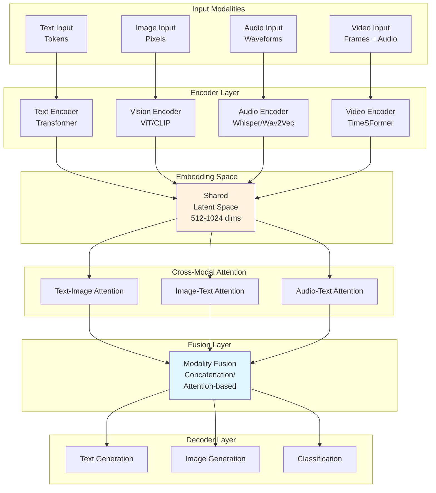
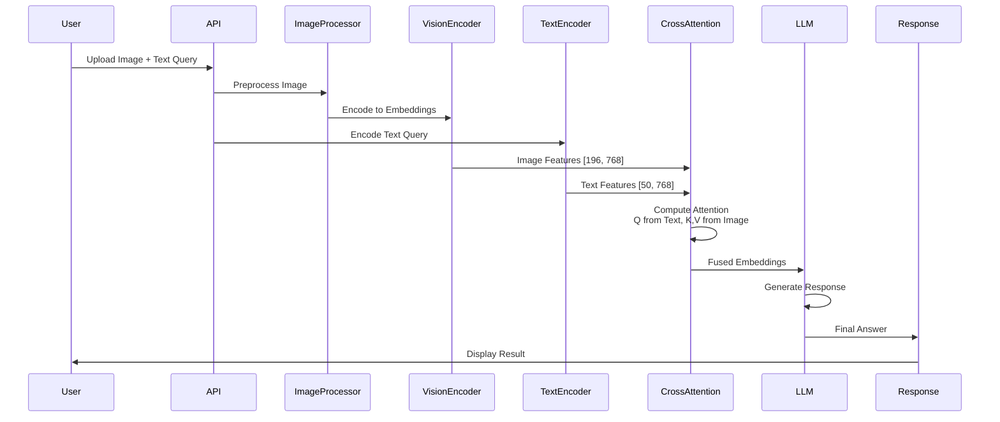
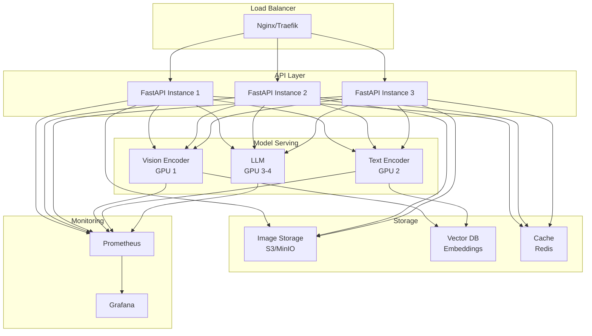

# Multimodal AI Systems: Architecture for Vision, Language, and Beyond

## Introduction: The Convergence of Modalities

Modern AI systems are no longer limited to text. They understand images, video, audio, and combine these modalities to reason about the world. As an architect, you must design systems that seamlessly integrate vision transformers, language models, and cross-modal attention mechanisms while maintaining performance and scalability.

This guide provides the complete architectural blueprint for building production multimodal AI systems.

## Theoretical Foundation: Understanding Multimodal Learning



## Architecture Pattern: Vision-Language Integration



## Complete Implementation

```python
from typing import Dict, List, Tuple
import torch
import torch.nn as nn
from transformers import CLIPVisionModel, CLIPTextModel, AutoModelForCausalLM
from PIL import Image

class MultimodalAISystem:
    """Production multimodal AI architecture."""
    
    def __init__(
        self,
        vision_model: str = "openai/clip-vit-large-patch14",
        text_model: str = "meta-llama/Llama-3.1-8B",
    ):
        # Vision encoder
        self.vision_encoder = CLIPVisionModel.from_pretrained(vision_model)
        self.vision_projection = nn.Linear(1024, 768)  # Project to LLM dim
        
        # Text encoder
        self.text_encoder = CLIPTextModel.from_pretrained(vision_model)
        
        # Language model
        self.llm = AutoModelForCausalLM.from_pretrained(text_model)
        
        # Cross-modal attention
        self.cross_attention = nn.MultiheadAttention(
            embed_dim=768,
            num_heads=12
        )
    
    def process_multimodal_input(
        self,
        image: Image.Image,
        text_query: str
    ) -> str:
        """Process image + text and generate response."""
        
        # Encode image
        image_features = self._encode_image(image)
        
        # Encode text query
        text_features = self._encode_text(text_query)
        
        # Cross-modal fusion
        fused_features = self._cross_modal_fusion(
            text_features,
            image_features
        )
        
        # Generate response
        response = self._generate_response(fused_features)
        
        return response
    
    def _encode_image(self, image: Image.Image) -> torch.Tensor:
        """Encode image to feature vectors."""
        # Preprocess
        inputs = self.vision_processor(images=image, return_tensors="pt")
        
        # Extract features
        with torch.no_grad():
            outputs = self.vision_encoder(**inputs)
            features = outputs.last_hidden_state  # [1, 196, 1024]
        
        # Project to LLM dimensions
        features = self.vision_projection(features)  # [1, 196, 768]
        
        return features
    
    def _encode_text(self, text: str) -> torch.Tensor:
        """Encode text to feature vectors."""
        inputs = self.text_processor(text, return_tensors="pt")
        
        with torch.no_grad():
            outputs = self.text_encoder(**inputs)
            features = outputs.last_hidden_state
        
        return features
    
    def _cross_modal_fusion(
        self,
        text_features: torch.Tensor,
        image_features: torch.Tensor
    ) -> torch.Tensor:
        """Fuse text and image features via cross-attention."""
        
        # text_features: [1, seq_len, 768]
        # image_features: [1, 196, 768]
        
        # Cross attention: Q from text, K,V from image
        fused, attention_weights = self.cross_attention(
            query=text_features.transpose(0, 1),
            key=image_features.transpose(0, 1),
            value=image_features.transpose(0, 1)
        )
        
        # fused: [seq_len, 1, 768]
        return fused.transpose(0, 1)  # [1, seq_len, 768]
    
    def _generate_response(self, features: torch.Tensor) -> str:
        """Generate text response from fused features."""
        
        # Convert features to LLM input
        # This is simplified - production needs proper integration
        outputs = self.llm.generate(
            inputs_embeds=features,
            max_length=512,
            do_sample=True,
            temperature=0.7
        )
        
        response = self.llm.tokenizer.decode(outputs[0])
        return response
```

## Production Deployment Architecture



## Key Architectural Decisions

### 1. Model Selection
- **Vision**: CLIP for general, SAM for segmentation, DINO for objects
- **Text**: LLaMA for generation, BERT for understanding
- **Audio**: Whisper for speech, Wav2Vec for features

### 2. Compute Optimization
- Separate GPU pools for each modality
- Model quantization (FP16/INT8)
- Batch processing for throughput
- KV caching for inference

### 3. Latency Requirements
- Vision encoding: ~50-100ms
- Text encoding: ~20-50ms
- Cross-attention: ~10-30ms
- LLM generation: ~2-5s (depends on length)
- **Total**: ~2-6 seconds

---

*Part 3 of AI Architect Series*
