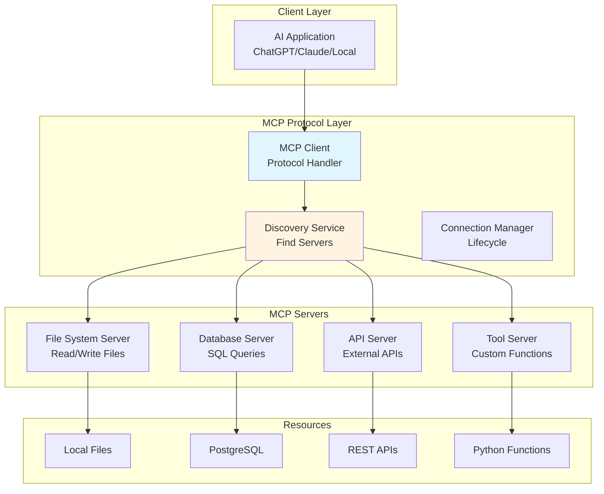
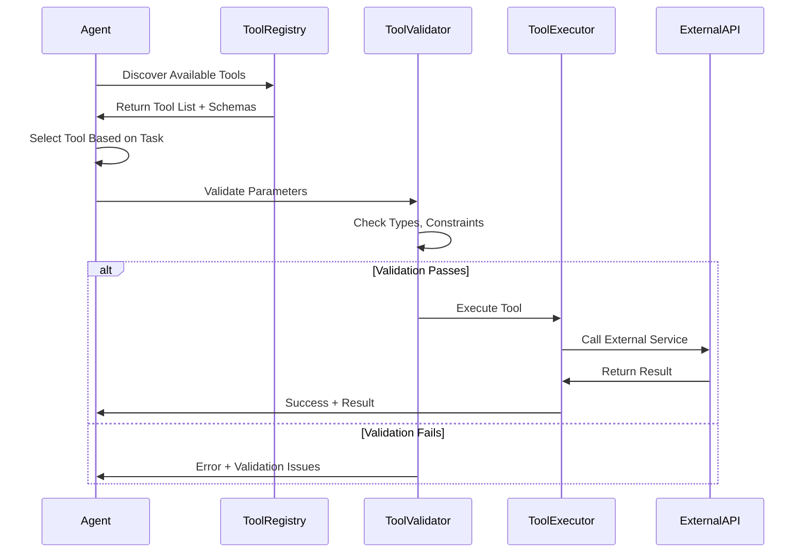

# AI Agent Communication Protocols: MCP, Tool Integration, and Standards

## Introduction: The Need for Agent Protocols

As AI systems evolve from single models to ecosystems of specialized agents, we need standardized communication protocols. The Model Context Protocol (MCP) and emerging agent standards define how AI systems discover capabilities, exchange information, and coordinate actions.

## Model Context Protocol (MCP) Architecture



## Complete Protocol Implementation

```python
from typing import Dict, List, Any, Optional
from dataclasses import dataclass
from enum import Enum
import json

class MCPMessageType(Enum):
    """MCP message types."""
    DISCOVER = "discover"
    CAPABILITIES = "capabilities"
    INVOKE = "invoke"
    RESULT = "result"
    ERROR = "error"

@dataclass
class MCPMessage:
    """MCP protocol message."""
    message_type: MCPMessageType
    message_id: str
    payload: Dict[str, Any]
    
class MCPServer:
    """MCP-compliant server implementation."""
    
    def __init__(self, name: str, version: str):
        self.name = name
        self.version = version
        self.capabilities = {}
        self.tools = {}
    
    def register_capability(
        self,
        capability_name: str,
        description: str,
        schema: Dict
    ):
        """Register a capability this server provides."""
        self.capabilities[capability_name] = {
            'description': description,
            'schema': schema,
            'version': '1.0'
        }
    
    def handle_discovery(self) -> Dict:
        """Handle discovery request."""
        return {
            'server_name': self.name,
            'version': self.version,
            'capabilities': list(self.capabilities.keys()),
            'protocol_version': 'MCP/1.0'
        }
    
    def handle_capabilities(self, capability_name: str) -> Dict:
        """Return detailed capability information."""
        if capability_name not in self.capabilities:
            return {'error': 'Capability not found'}
        
        return self.capabilities[capability_name]
    
    def handle_invoke(
        self,
        capability: str,
        parameters: Dict
    ) -> Dict:
        """Invoke a capability with parameters."""
        
        if capability not in self.tools:
            return {
                'status': 'error',
                'message': f'Unknown capability: {capability}'
            }
        
        try:
            result = self.tools[capability](parameters)
            return {
                'status': 'success',
                'result': result
            }
        except Exception as e:
            return {
                'status': 'error',
                'message': str(e)
            }
```

## Tool Protocol Design



---

*Part 4 of AI Architect Series*
